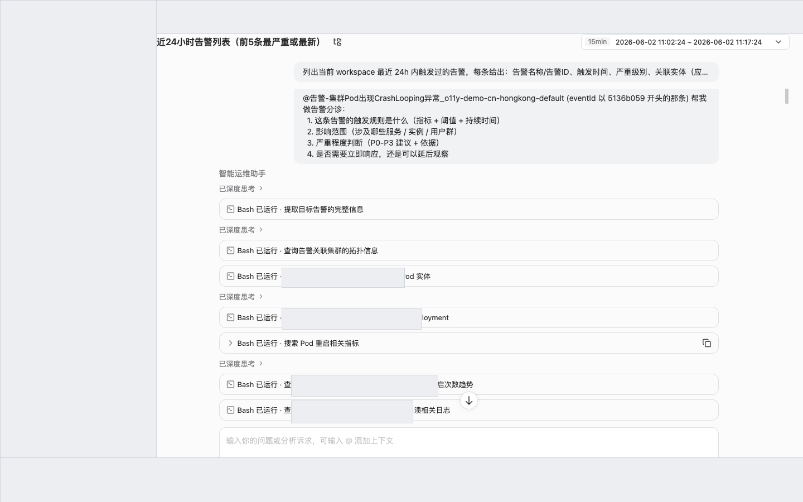
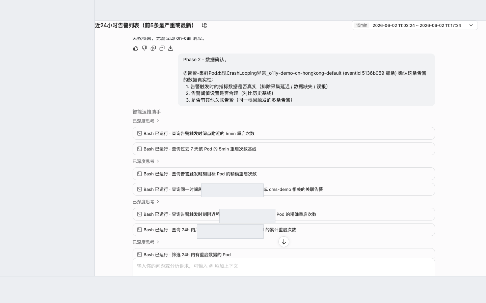
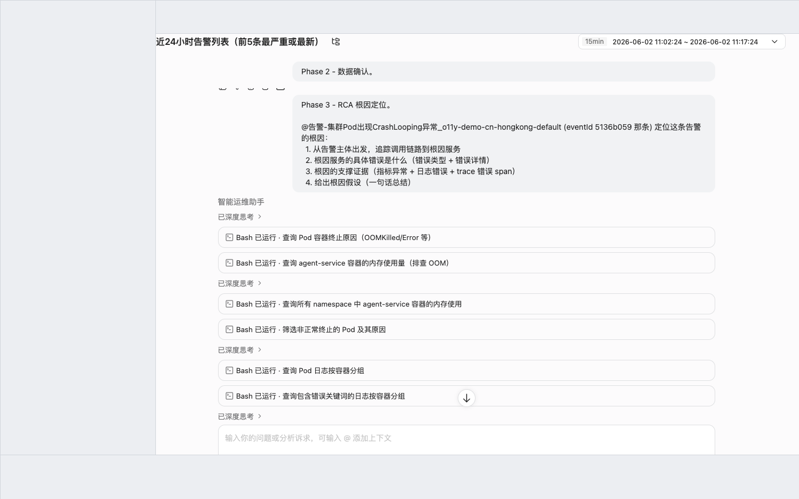
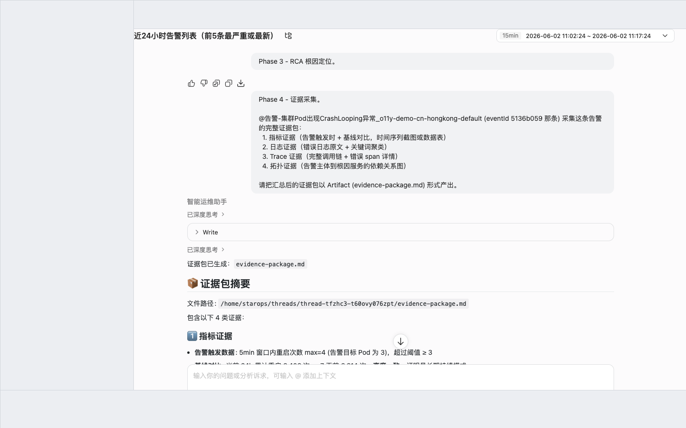
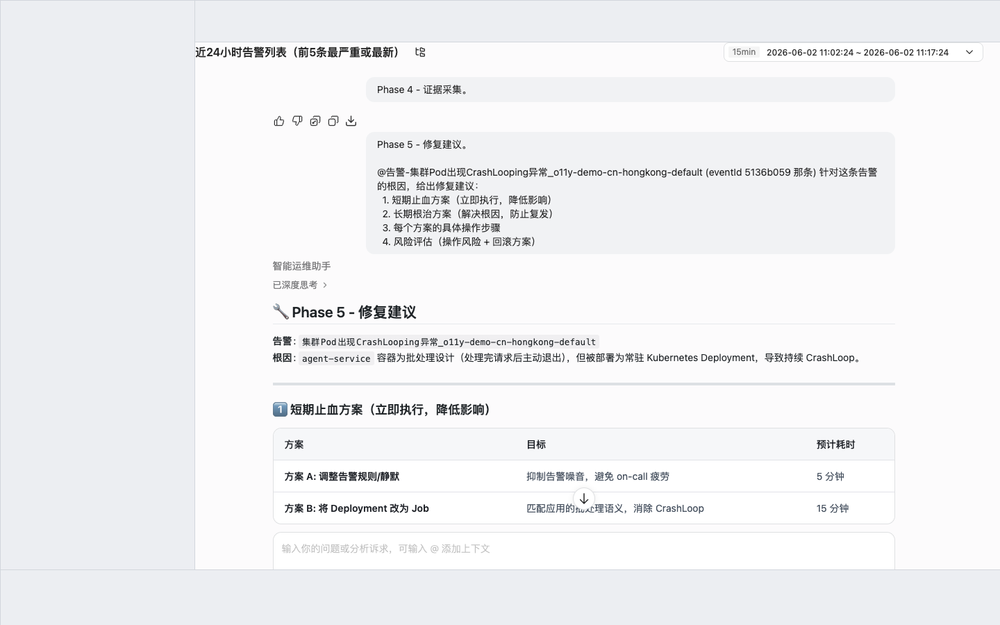
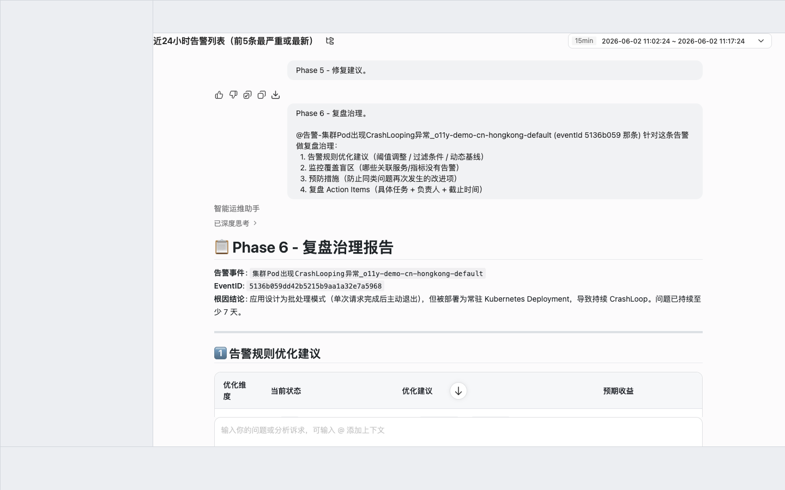

<div class="sls-starops-article-crumb">
  <a href="/doc/starops/starops.html">STAROps</a> <span class="sep">/</span> <span>告警追因</span>
</div>

# 告警 RCA 全链路分析

<div class="sls-starops-article-meta">
  <span>分类 · 告警追因</span>
</div>

> [查看对话回放内容演示](/playground/alert-rca-flow-replay.html)

当您的生产环境触发告警，需要在同一个会话窗口内完成「分诊 → 数据确认 → 根因定位 → 证据采集 → 修复建议 → 复盘治理」的端到端 RCA（Root Cause Analysis），可以使用 STAROps 智能会话按 6 个 Phase 串行执行。流程依赖 ARMS / CMS / 自定义指标告警、APM trace 与日志：取数、关联、归因均由 Agent 完成，同一 thread 内逐 Phase 累积上下文，最终产出含根因假设、证据包、修复方案与复盘 Action Items 的结构化 RCA 报告。

> 这是一条**被动响应**路径：从已触发的告警出发逐层下钻到根因，与"业务服务可靠性巡检"那种从业务指标主动发现风险的方向互补。

## 前提条件

- 已开通 STAROps，且当前账号可创建数字员工与对话。
- 告警规则已接入（ARMS / CMS / 自定义指标），告警已触发（真实或历史均可）。
- 告警触发时间窗内的指标、日志、trace 数据可查。
- 已确认告警名称或告警 ID，作为整条 thread 的 `@` 引用主体。

## 安装 Skill

完成本实践会落地一份 SOP Skill（本实践产物是 RCA 报告，无可执行业务 Skill）。安装方式任选其一：本地 Agent 走 [`npx skills`](https://www.npmjs.com/package/skills)，STAROps 数字员工下载 tar.gz 后在控制台「技能管理 → 上传技能」上传。

| Skill | 作用 | 本地 Agent（npx） | STAROps 控制台（tar.gz） |
|---|---|---|---|
| `alert-rca-flow-sop` | 引导 Skill：协助 Agent 按 6 个 Phase 完成"告警分诊 → 数据确认 → 根因定位 → 证据采集 → 修复建议 → 复盘治理"的端到端 RCA，最终在 STAROps 中产出含根因假设、证据包与 Action Items 的 RCA 报告。 | `npx skills add aliyun-sls/sls-doc-skills --skill alert-rca-flow-sop` | [alert-rca-flow-sop.tar.gz](https://starops-demo.oss-cn-beijing.aliyuncs.com/starops/demo/starops-best-practice/alert-rca-flow/docs/alert-rca-flow-sop.tar.gz) |

下文步骤一到步骤六的提问模板与闭环 checklist 与该 SOP 一一对应。

## 6 Phase 概览

| # | Phase | 输入 | 输出 |
|---|---|---|---|
| 1 | 告警分诊 | 告警 ID + 触发时间 | 分诊报告（触发规则 + 影响范围 + 严重程度 + 响应建议） |
| 2 | 数据确认 | Phase 1 输出 | 数据真实性 + 阈值合理性 + 关联告警排查 + 综合可信度 |
| 3 | RCA 根因定位 | Phase 1-2 输出 | 调用链追踪 + 根因服务错误 + 支撑证据 + 根因假设 |
| 4 | 证据采集 | Phase 1-3 已查证据 | 结构化证据包（指标 + 日志 + trace + 拓扑），以 Artifact 形式产出 |
| 5 | 修复建议 | Phase 3 根因 | 短期止血 + 长期根治 + 优先级表 + 验证清单 |
| 6 | 复盘治理 | Phase 1-5 全部产出 | 告警规则优化 + 监控盲区 + 预防措施 + Action Items |

6 个 Phase 串行执行、共享同一 thread，Agent 逐 Phase 累积上下文。新开 thread 会丢失累积上下文，每个 Phase 都需要重新提供前序信息。

## 步骤一：告警分诊

目标：判断告警是否值得查，给出 P 级别与响应建议。

1. 进入 STAROps 控制台 → 数字员工 → 新建对话。
2. 在会话框中发送以下提问（把 `<告警名称或ID>` 替换为实际告警标识）：

   ```
   @告警-<告警名称或ID> 帮我做告警分诊：
     1. 这条告警的触发规则是什么（指标 + 阈值 + 持续时间）
     2. 影响范围（涉及哪些服务 / 实例 / 用户群）
     3. 严重程度判断（P0-P3 建议 + 依据）
     4. 是否需要立即响应，还是可以延后观察
   ```

3. 等待 Agent 返回 4 段结构化分诊报告，确认包含：触发规则（指标 + 多级阈值 + 当前值 + 触发级别）；影响范围（调用链路 + 接口 + 用户 + Pod + 错误规模）；P0-P3 严重程度建议与依据；明确的响应建议。

::: details 查看图片



:::

> Phase 1 可能附带初步 RCA。Agent 在分诊时常顺手做 trace 诊断给出初步根因假设，超出分诊范围但有助于尽早判断；后续 Phase 3 可能推翻该初步结论，这是正常现象。

产出物：4 段结构化分诊报告，作为后续 5 个 Phase 的输入。

## 步骤二：数据确认

目标：确认告警数据真实性，排除误报，评估阈值合理性，排查关联告警。

1. 在**同一 thread** 内继续发送提问：

   ```
   @告警-<告警名称或ID> 确认这条告警的数据真实性：
     1. 告警触发时的指标数据是否真实（排除采集延迟 / 数据缺失 / 误报）
     2. 告警阈值设置是否合理（对比历史基线）
     3. 是否有其他关联告警（同一根因触发的多条告警）
   ```

2. 等待 Agent 返回 3 段分析 + 综合结论，确认包含：指标数据 4 维度验证（连续性 / 完整性 / 采集延迟 / 数值合理性）；基线对比表（历史 vs 告警时 + 变化幅度 + 当前阈值评估 + 调整建议）；关联告警 4 层排查（同规则 / 同实体 / 下游 / 根因服务）。

::: details 查看图片



:::

> 阈值偏低问题可作为步骤六复盘治理的输入，在此阶段标注即可，不需要立刻调整。

产出物：包含整体可信度结论的数据确认报告。

## 步骤三：RCA 根因定位

目标：从告警主体出发，追踪调用链路到根因服务，定位具体错误，收集支撑证据，给出根因假设。

1. 在**同一 thread** 内继续发送提问：

   ```
   @告警-<告警名称或ID> 定位这条告警的根因：
     1. 从告警主体出发，追踪调用链路到根因服务
     2. 根因服务的具体错误是什么（错误类型 + 错误详情）
     3. 根因的支撑证据(指标异常 + 日志错误 + trace 错误 span)
     4. 给出根因假设（一句话总结）
   ```

2. 等待 Agent 返回 4 段 + 后续动作建议，确认包含：调用链拓扑图（从告警主体缩进到根因服务）；根因服务的错误表（服务 + 错误类型 + 错误详情）；3 类支撑证据（trace 错误 span + 多服务指标对比 + 关键发现）；一句话根因假设。

::: details 查看图片



:::

> 根因类型包括系统故障（配置缺失、资源耗尽）与业务逻辑错误（库存不足、参数校验失败）。Phase 3 推翻 Phase 1 初步 RCA 属正常现象，以 Phase 3 为准。

产出物：含证据链的根因假设。

## 步骤四：证据采集

目标：将 Phase 1-3 已查到的证据整理成一个结构化证据包文档（指标 + 日志 + trace + 拓扑），作为 RCA 报告附件。

1. 在**同一 thread** 内继续发送提问：

   ```
   @告警-<告警名称或ID> 采集这条告警的完整证据包：
     1. 指标证据（告警触发时 + 基线对比，时间序列截图或数据表）
     2. 日志证据（错误日志原文 + 关键词聚类）
     3. Trace 证据（完整调用链 + 错误 span 详情）
     4. 拓扑证据（告警主体到根因服务的依赖关系图）
   ```

2. 等待 Agent 返回 4 类证据 + 一份 Artifact 形式的证据包文档，确认包含：基线 vs 告警时指标对比表；错误关键词聚类表 + 原始日志节选；完整调用链与错误 span 详情表（spanName / 耗时 / statusCode）；依赖关系图（缩进格式标注正常 / 错误）。

::: details 查看图片



:::

> Phase 4 与 Phase 3 的 trace 证据有重叠。Phase 4 定位是"整理汇总"，Phase 3 是"分析定位"。时间紧迫时可跳过直接进入 Phase 5。

产出物：以 Artifact 形式存放在会话中的 `evidence-package.md` 证据包文档。

## 步骤五：修复建议

目标：基于根因分析，给出分层修复方案（短期止血 + 长期根治），每个方案含具体操作步骤和风险评估。

1. 在**同一 thread** 内继续发送提问：

   ```
   @告警-<告警名称或ID> 针对这条告警的根因，给出修复建议：
     1. 短期止血方案（立即执行，降低影响）
     2. 长期根治方案（解决根因，防止复发）
     3. 每个方案的具体操作步骤
     4. 风险评估（操作风险 + 回滚方案）
   ```

2. 等待 Agent 返回分层方案 + 优先级表 + 验证清单，确认包含：每个方案含目标 + 具体操作步骤（SQL / kubectl / 代码）+ 风险评估表 + 回滚方案；执行优先级表（P0-P3 + 执行时间 + 负责人）；修复后验证项 + 预期结果 + 验证方法。

::: details 查看图片



:::

> 本流程为 L0 只读分析，STAROps 仅输出建议，不执行任何变更。所有 SQL / kubectl / 代码仅供参考，需人工确认后执行。

产出物：可直接交付给 oncall 的分层修复方案。

## 步骤六：复盘治理

目标：基于 Phase 1-5 的积累，给出告警治理层面的改进建议（告警规则优化 + 监控盲区识别 + 预防措施 + Action Items），形成闭环。

1. 在**同一 thread** 内继续发送提问：

   ```
   @告警-<告警名称或ID> 针对这条告警做复盘治理：
     1. 告警规则优化建议（阈值调整 / 过滤条件 / 动态基线）
     2. 监控覆盖盲区（哪些关联服务 / 指标没有告警）
     3. 预防措施（防止同类问题再次发生的改进项）
     4. 复盘 Action Items（具体任务 + 负责人 + 截止时间）
   ```

2. 等待 Agent 返回 4 段 + 复盘总结，确认包含：告警规则 4 维度优化表；监控覆盖 4 类盲区表；预防措施 4 维度表；10 条左右的 Action Items 表（任务 + 负责人 + 优先级 + 截止时间 + 验收标准）；4 个量化预期收益（告警准确率 / MTTR / 复发率 / 闭环建设）。

::: details 查看图片



:::

产出物：完整的告警 RCA 与复盘报告。建议另存或导出归档（截图、转 PDF、复制到飞书 / Wiki 均可）。

### 闭环验证 checklist

以下 6 件事全部为「是」才算闭环成立，任一为「否」回到对应步骤复查：

| # | 判据 | 不通过时回退到 |
|---|---|---|
| 1 | Phase 1 产出分诊报告，明确 P 级别与响应建议 | 步骤一（检查告警是否接入） |
| 2 | Phase 2 产出综合可信度结论，确认非误报 | 步骤二（检查指标采集与基线数据） |
| 3 | Phase 3 给出一句话根因假设，附调用链 + 证据 | 步骤三（检查 trace 采样率） |
| 4 | Phase 4 产出 Artifact 形式的证据包文档 | 步骤四（确认会话支持 Artifact） |
| 5 | Phase 5 给出短期止血 + 长期根治分层方案 | 步骤五（确认根因明确） |
| 6 | Phase 6 产出 Action Items，且引用了前 5 个 Phase 的真实数据 | 步骤六（确认 6 个 Phase 在同一 thread 内执行） |

## 已知限制

- **L0 只读**：本流程不执行任何变更操作；Phase 5 输出的 SQL / kubectl / 代码仅供人工执行参考。
- **数据源依赖**：未接入 ARMS / CMS / 自定义指标告警源时，Phase 1 无可分诊主体；未接入 trace 时 Phase 3 / Phase 4 的调用链与拓扑会残缺；未接入日志时 Phase 4 日志证据会缺失。
- **Artifact 访问通道**：Phase 4 证据包以 Artifact 形式存放在会话中，当前仅支持在 STAROps 控制台手动点开 Artifact 面板查看或下载；通过 API 批量拉取 Artifact 的能力 STAROps 尚未提供，自动化归档场景需人工导出后再供下游消费。
- **会话上下文**：6 个 Phase 必须在同一 thread 内执行；跨 thread 会丢失累积上下文，需在每个 Phase 重述前序结论，且 Phase 6 复盘易产出互不引用的报告。
- **不能替代深度故障演练**：本流程基于已触发告警的事后分析，不覆盖混沌工程、压测等主动故障注入场景。

## 常见问题

### Phase 1 的初步根因和 Phase 3 不一致，以哪个为准

以 Phase 3 为准。Phase 1 是分诊时顺手做的浅层 trace 诊断，Phase 3 是从告警主体逐层追踪调用链到根因服务的深度分析。Phase 3 推翻 Phase 1 是正常现象。

### Phase 4 和 Phase 3 的 trace 证据有重叠，是否可以跳过

可以跳过。Phase 4 定位是"整理汇总"（把 Phase 1-3 的证据整理成文档附件），Phase 3 是"分析定位"。时间紧迫时直接进入步骤五，但归档场景仍建议保留。

### 修复建议中的 SQL 和 kubectl 命令是否可以直接执行

不可以直接执行。STAROps 仅输出建议，不执行任何变更操作。所有 SQL / kubectl / 代码仅供参考，需人工确认后执行。特别是涉及数据库 UPDATE、ConfigMap 修改等操作，必须经过评审。

### 6 个 Phase 必须按顺序执行吗

建议按顺序。每个 Phase 的输出是下一个 Phase 的输入上下文，Agent 据此逐步收敛搜索范围。如果跳过某个 Phase（例如证据已完整、跳过 Phase 4），Agent 会在后续 Phase 中沿用前序累积上下文，不影响 Phase 6 的综合复盘。

### 跨 thread 执行会有什么问题

每个 Phase 的提问都依赖前序 Phase 沉淀的上下文。跨 thread 时 Agent 看不到历史，需要在每个 Phase 的 prompt 中重述前序结果，Phase 6 综合阶段也容易产出 6 个 Phase 互不引用的报告。

### 这个流程能定期自动跑吗

不建议。本流程是按需深度分析，每次执行依赖人对告警主体、时间范围、严重程度的判断。"定期检查是否有 P0/P1 告警未处理"更适合走告警通知或定时巡检，本流程作为告警触发后的深入诊断使用。

## 相关入口

- [返回 STAROps 最佳实践首页](/starops/starops.html)
- [打开 STAROps Playground](/playground/staropsdemo.html)
- [进入 STAROps 控制台](https://starops.console.aliyun.com)
