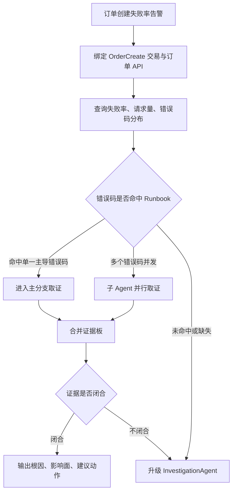

<div class="sls-starops-article-crumb">
  <a href="/doc/starops/starops.html">STAROps</a> <span class="sep">/</span> <span>告警追因</span>
</div>

# 告警 RCA：用 Skill 固化历史 Runbook

<div class="sls-starops-article-meta">
  <span>分类 · 告警追因</span>
</div>

> 对话回放：[Skill 诊断流程](/playground/alert-rca-flow-skill-replay.html) ｜ [InvestigationAgent 开放调查](/playground/alert-rca-flow-investigation-replay.html)

STAROps 内置 InvestigationAgent 适合处理根因方向未知的问题。它可以从一条告警出发，动态探索指标、日志、Trace、拓扑、资源、变更和关联实体，逐步补齐证据链。对于复杂故障、多因素叠加或告警主体不清晰的场景，InvestigationAgent 的泛化调查能力是默认入口。

在生产环境中，还有一类告警已经被团队反复处理过：触发条件明确，业务语义稳定，常见错误码和处置路径已经沉淀为 Runbook。继续让 Agent 每次从开放式调查开始，会增加工具调用和证据收集成本。STAROps 支持通过 DefaultRule 和 Skill 把这类特定诊断流程放进 Agent 上下文，让 Agent 命中特定告警后按 Runbook 分支快速取数、判断和汇总。

本实践以“订单创建失败率升高”为例。一次真实线上告警通常不会同时出现大量错误码，更常见的是 1 个主导错误码加 1 个伴随错误码。本实践默认使用两个经典分支：库存锁定失败和优惠价格校验失败，用它们说明如何把历史 Runbook 固化为 Agent 可执行流程。支付、幂等、数据库写入、配置缺失等分支可以作为客户后续扩展 Skill，而不是默认实验的一部分。

这个案例只是设计方法示例。实际生产中，客户应根据自己的业务交易、错误码体系、ARMS/APM 接入情况和历史 Runbook 选择适合固化的告警类型。

这类 Skill 的价值，是让 Agent 在告警触发后先按错误码快速分流，再调用子 Agent 并行取数，最后合并证据并给出可审计结论。InvestigationAgent 仍然作为兜底能力，用于处理错误码缺失、分支无法覆盖、证据互相矛盾或需要跨多跳关系继续调查的场景。

## 适用场景

| 场景 | 是否适用 | 说明 |
|---|---|---|
| 订单创建、支付、登录、加购等核心业务交易失败率升高 | 适用 | 交易链路稳定，错误码体系清晰，适合按错误码路由 |
| 企业历史上有明确 Runbook 的告警 | 适用 | 已知道常见原因、必查证据、停止条件和处置边界 |
| 只有“应用 5xx 升高”且缺少业务错误码 | 不优先 | 更适合先由 InvestigationAgent 动态调查，补齐主体、依赖和证据 |
| 全新故障、跨多个业务域、错误语义未知 | 建议启动 InvestigationAgent | 需要扩大搜索面，先判断问题类型 |

一条可落地的确定性诊断流程应满足三个条件：

1. 告警能绑定到稳定业务交易，例如 `OrderCreate`。
2. 失败请求能提取错误码或错误族，例如 `INV_LOCK_FAIL`、`PROMO_PRICE_MISMATCH`。
3. 每个高频错误码都能映射到一条 Runbook：查什么实体、看什么证据、什么情况下可下结论、什么情况下升级。

## 与 InvestigationAgent 的关系

| 对比维度 | InvestigationAgent 泛化调查 | 订单失败率诊断 Skill |
|---|---|---|
| 问题粒度 | 根因方向未知，需要动态判断问题类型 | 交易和告警类型已知，先按错误码进入分支 |
| 触发方式 | 用户提出开放式诊断目标 | 命中订单创建失败率告警、交易失败率阈值、DefaultRule 或对应 Skill |
| 路径选择 | Agent 根据证据逐步决定下一步 | Runbook 规定先看错误码分布，再并行取分支证据 |
| UModel 诊断深度 | 通过 UModel 持续扩展多跳拓扑和跨域实体 | 先聚焦 `OrderCreate` 的业务交易、API、服务、依赖和错误码证据 |
| 数据范围 | 可覆盖应用、资源、DevOps、业务指标和外部系统 | 默认聚焦订单链路：入口、order-service、库存、优惠；其它依赖作为扩展或兜底调查对象 |
| 并行策略 | 动态决定是否并行 | 错误码分支相互独立时，直接调用子 Agent 并行取数 |
| 结论标准 | 动态补证直到形成可信解释 | 每个分支预先定义证据闭合标准和升级条件 |
| 升级机制 | 持续探索 | 错误码缺失、分支不覆盖、证据冲突、多分支互相影响时升级 InvestigationAgent |

推荐策略：订单创建失败率这类核心交易告警，先由特定 Skill 快速路由到已知 Runbook；固定分支无法解释时，再升级 InvestigationAgent 做跨域动态调查。

## 数据与建模前提

订单创建失败率诊断的关键不在 Prompt 长度，而在 Agent 是否能拿到稳定的实体关系和错误码分布。

如果客户已经使用 ARMS/APM，应用、接口、实例、调用拓扑、上下游依赖、Trace 等对象通常已经具备定义。此时不建议把错误码建模成新的 UModel 对象；更适合把错误码作为告警、指标、日志或 Trace span 的维度直接上报，让 Agent 在告警触发时按 `error_code` 聚合并路由到对应 Runbook 分支。

建议准备的数据对象：

| 数据对象 | 示例 | 用途 |
|---|---|---|
| 应用与接口 | `order-service`、`POST /api/orders` | ARMS/APM 通常已经具备，用于绑定告警主体 |
| 调用拓扑 | `order-service -> inventory-service / promotion-service / payment-precheck` | ARMS/APM 通常已经具备，用于沿依赖取证 |
| 错误码维度 | 默认：`INV_LOCK_FAIL`、`PROMO_PRICE_MISMATCH` | 建议由应用直接上报到告警、指标、日志或 Trace 属性，用于分支路由 |
| 业务交易标识 | `OrderCreate`、入口渠道、租户、应用版本 | 用于聚合业务影响和定位适用范围 |
| 证据来源 | 指标、日志、Trace、发布/配置记录、业务状态表 | 支撑结论和反证 |

错误码必须进入指标、日志或 Trace 属性，至少包含 `error_code`、`order_id` 或 `request_id`、入口渠道、应用版本、依赖服务、时间窗。涉及用户、订单和金额等敏感字段时，只保留脱敏标识和聚合统计。

如果客户没有使用 ARMS/APM，也可以通过 UModel 自行建模业务交易、应用、接口、下游依赖和证据源。STAROps 支持这种扩展方式，但建议先从最小可用关系开始：应用、接口、调用拓扑、错误码维度和关键日志/Trace 链接。

Runbook 主导阈值应由客户基于历史告警配置。建议至少包含三类条件：错误码占比阈值、绝对失败量阈值、入口/渠道/租户等适用范围。文档中的错误码名称和阈值口径用于说明设计方法，正式发布前需要替换为客户 Workspace 中的真实枚举和规则。

## 推荐落地形态：DefaultRule + Skill

订单创建失败率诊断建议采用 `DefaultRule + Skill` 的组合，避免把全部规则写进唯一的 DefaultRule。

- DefaultRule：放在数字员工默认上下文中，定义通用原则，例如只读边界、优先识别告警主体、先看错误码分布、证据不足时升级 InvestigationAgent。
- Skill：承载特定告警类型的诊断流程，例如订单创建失败率、支付回调失败率、登录验证码失败率。一个告警 RCA 数字员工可以配置多个 Skill，后续按告警类型逐步扩展。

本实践建议把“订单创建失败率多分支诊断”做成一个 Guide Skill，并在 DefaultRule 中要求 Agent 命中订单失败类告警时优先加载该 Skill。

DefaultRule 示例：

:::: details 查看 DefaultRule 示例
```markdown
# 告警 RCA 数字员工 DefaultRule

当用户发起告警诊断时，先识别告警主体、时间窗、业务交易、应用、接口和错误码分布。
如果告警命中特定类型的诊断 Skill，优先加载对应 Skill 执行。
所有诊断保持 L0 只读，可以执行只读查询和取证，不执行写入 SQL、发布、配置修改、重启、扩缩容等生产变更。
当 Skill 分支无法覆盖、证据不足或证据冲突时，升级 InvestigationAgent 做动态调查。
```
::::

订单创建失败率 Skill 示例：

:::: details 查看 Skill 示例
```markdown
# 订单创建失败率多分支诊断 Skill

当用户提到订单创建失败率、下单失败、createOrder 失败、OrderCreate 失败、订单失败错误码聚集等告警诊断诉求时，优先执行本 Skill 的多分支诊断流程。

执行目标：
- 先确认告警是否真实、影响哪些入口和业务交易。
- 再按错误码分布进入企业历史 Runbook 分支。
- 对相互独立的错误码分支调用子 Agent 并行取数。
- 汇总各分支证据，输出主因、并发问题、证据缺口和是否升级 InvestigationAgent。

执行动作：
1. 读取告警事件和告警规则，确认指标、阈值、触发时间窗、当前值、持续时间和聚合方式。
2. 将告警主体绑定到 ARMS/APM 或 UModel 中的业务交易 `OrderCreate`、API `POST /api/orders`、`order-service`、入口渠道、运行实例。
3. 查询触发窗口和基线窗口的订单创建请求量、成功率、失败率、失败订单数，并按 `error_code`、入口渠道、应用版本、下游依赖聚合。
4. 生成错误码分布。如果 Top1 错误码占比达到 Runbook 主导阈值，先进入该分支；如果多个错误码同时超过分支阈值，按分支调用子 Agent 并行取数。
5. 对默认分支并行执行：
   - 库存分支子 Agent：查询库存锁定、SKU 维度、库存版本、锁等待、库存服务 Trace 和日志。
   - 优惠价格分支子 Agent：查询优惠规则、价格快照、券状态、规则发布时间和 promotion-service Trace。
   - 其它错误码：如果客户已配置扩展 Skill，则加载扩展 Skill；否则标记为未覆盖并升级 InvestigationAgent。
6. 每个子 Agent 只输出证据摘要、反证、缺口和分支结论，不直接给全局根因。
7. 主 Agent 合并分支结果，判断主因、并发问题、业务影响范围和建议动作。
8. 每个根因候选至少需要两类独立证据支撑，例如错误码分布 + Trace、日志 + 业务状态表。
9. 输出自然语言诊断报告，包含分诊结论、错误码分布、影响路径、分支证据、反证、证据缺口、建议动作和是否升级 InvestigationAgent。

停止与补充信息条件：
- 告警缺少时间窗时，先要求用户补充时间窗。
- 告警无法绑定 `OrderCreate` 或订单创建 API 时，先要求用户补充业务交易、接口或服务名。
- 失败请求无法提取错误码时，先尝试从 Trace span、日志关键词和返回码推断错误族；仍无法推断时升级 InvestigationAgent。
- 单一分支只有错误码占比，没有 Trace、日志、指标或配置证据时，不输出确定性根因结论。

升级 InvestigationAgent 条件：
- 错误码不在已登记 Runbook 分支内。
- 多个分支证据互相矛盾，无法判断主因和并发问题。
- 一跳订单链路无法解释异常，需要扩展到多跳依赖、DevOps 变更、业务活动或外部系统。
- 关键证据持续缺失，当前 Skill 无法形成可信结论。

执行边界：
- 仅做 L0 只读诊断。
- 可以执行只读查询和取证，不执行写入 SQL、发布、配置修改、重启、扩缩容等生产变更。
- 修复建议必须标注为建议，由用户进入自己的变更流程确认。
```
::::

用户触发示例：

```text
请按订单创建失败率多分支诊断 Skill 排查这条告警。
```

## 诊断流程总览

订单创建失败率 Skill 的最小诊断地图如下：

:::: details 查看诊断地图
```text
AlertEvent
  -> BusinessTransaction: OrderCreate
  -> API: POST /api/orders
  -> Service: order-service
  -> ErrorCode families
  -> Branch dependencies
      -> inventory-service
      -> promotion-service
      -> payment-precheck / risk-control
      -> order-db
      -> config-center
  -> Evidence sources
      -> metrics / logs / traces / release-config records / business state
```
::::

:::: details 查看诊断流程图

::::

## 错误码 Runbook 分支

以下错误码为示例分类，客户应替换为企业内部真实错误码和 Runbook 名称。关键点是让错误码分支足够具体，避免再次回到“应用错误率升高”的泛化诊断。

| 错误码族 | 进入条件 | 诊断路径 | 子 Agent 必查证据 | 可下结论条件 |
|---|---|---|---|---|
| 库存锁定失败：`INV_LOCK_FAIL`、`SKU_STOCK_NOT_ENOUGH`、`STOCK_VERSION_CONFLICT` | 订单失败 Top 错误码指向库存锁定、库存不足或库存版本冲突 | `OrderCreate -> order-service -> inventory-service -> inventory-db / cache` | SKU TopN、库存锁定成功率、库存服务错误日志、库存版本冲突、Trace 中 lockStock span、库存 DB 锁等待或缓存锁冲突 | 同一 SKU / SKU 组失败集中，Trace 指向库存锁定，库存服务或库存状态证据能解释失败 |
| 优惠/价格校验失败：`PROMO_PRICE_MISMATCH`、`COUPON_INVALID`、`PROMO_RULE_NOT_MATCH` | 错误码指向价格快照、优惠规则、券状态不一致 | `OrderCreate -> order-service -> promotion-service -> rule/config store` | 优惠规则 ID、价格快照版本、券状态、promotion-service Trace、规则发布时间、配置灰度范围 | 失败请求集中在特定规则/券/渠道，且规则发布或价格快照差异与失败窗口重合 |

分支之间没有依赖顺序时，应并行取证。典型并行方式：

| 子 Agent | 负责范围 | 输出 |
|---|---|---|
| 错误码分布 Agent | 失败请求按错误码、渠道、版本、SKU、租户聚合 | 主导错误码、并发错误码、是否命中 Runbook |
| 库存证据 Agent | 库存锁定、库存状态、SKU 集中度、库存服务 Trace | 库存分支证据和反证 |
| 优惠证据 Agent | 价格快照、优惠规则、券状态、配置发布 | 优惠分支证据和反证 |
| 变更证据 Agent | 发布、配置、灰度、规则变更 | 与时间窗重合的变更证据 |

主 Agent 只在所有必要分支返回后汇总，不让单个子 Agent 直接给全局根因。

## 诊断报告结构

Agent 最终输出应是自然语言诊断报告，而非 YAML 或字段清单。

建议结构：

:::: details 查看诊断报告结构示例
```text
诊断结论：
<主因、并发问题、置信度，或升级 InvestigationAgent 的原因>

业务影响：
<订单创建失败率、失败订单数、影响入口、影响渠道、影响时间窗>

错误码分布：
<Top 错误码、占比、同比/环比基线、命中的 Runbook 分支>

影响路径：
<OrderCreate -> API -> order-service -> 分支依赖 -> 证据来源>

分支证据板：
- 库存分支：<证据 / 反证 / 缺口 / 结论>
- 优惠价格分支：<证据 / 反证 / 缺口 / 结论>
- 其它错误码：<是否有扩展 Skill / 是否升级 InvestigationAgent>

建议动作：
<只读建议、需要人工确认的止血动作、后续治理动作>

升级判断：
<是否需要 InvestigationAgent 继续动态调查，以及原因>
```
::::

报告样例参考同目录 [`assets/sample-report.md`](./assets/sample-report.md)。

## 示例：库存锁定失败主导的订单失败告警

下面是一个可用于文档演示的诊断路径。真实发布时应替换为客户自己的历史工单、错误码和 Runbook。

1. 告警触发：`OrderCreate` 失败率超过阈值，告警绑定到 `POST /api/orders` 和 `order-service`。
2. Agent 查询触发窗口和基线窗口，发现失败请求能按 `error_code` 聚合。
3. 错误码分布显示总失败率约 10%，其中库存锁定相关错误约 7%，优惠价格校验失败约 3%。
4. 主 Agent 启动库存证据 Agent，同时并行启动优惠证据 Agent 和变更证据 Agent。
5. 库存证据 Agent 发现失败集中在少数 SKU，Trace 中 `lockStock` span 返回库存版本冲突或库存不足，库存服务日志出现相同错误码。
6. 优惠证据 Agent 发现少量请求携带旧价格快照，规则发布时间与失败窗口接近；变更证据 Agent 未发现订单服务发布。
7. 主 Agent 汇总后给出结论：订单创建失败的主因是库存锁定分支，优惠价格校验失败是伴随分支。
8. 如果出现大量未登记错误码，或库存与优惠证据无法解释 10% 失败率，Agent 应标记证据不足并升级 InvestigationAgent。

这条路径能够体现确定性诊断流程的特性：Agent 先利用历史 Runbook 快速命中错误码分支，再通过 UModel 和 UModel PaaS 精确取数，最后由 InvestigationAgent 兜底未知和冲突场景。

## Guide Skill 使用方式

本实践适合沉淀为 Guide Skill。Guide Skill 的职责是把订单创建失败率诊断流程固化为 Agent 的执行协议，帮助用户或数字员工稳定复用。

Guide Skill 应包含：

- 适用业务交易和告警名称。
- 错误码到 Runbook 分支的映射表。
- DefaultRule 触发条件。
- 必填输入参数和缺失信息补充策略。
- ARMS/APM 或 UModel 诊断地图构建方法。
- 子 Agent 并行取数规则。
- 每个分支必须查询的数据。
- 证据充分性标准。
- 升级 InvestigationAgent 的条件。
- 自然语言诊断报告结构与 L0 只读边界。

发布 Guide Skill 前，需要确认错误码映射、ARMS/APM 或 UModel 实体、取数工具和 Runbook 分支已经在目标 Workspace 中验证；未完成验证的包不应作为安装入口展示。

## 安装 Skill

本实践落地一份 Guide Skill，仅支持在 STAROps 运行时执行，本地 Agent 不支持。下载 tar.gz 后在 STAROps 控制台「技能管理 → 上传技能」上传。

| Skill | 作用 | STAROps 控制台（tar.gz） |
|---|---|---|
| `alert-rca-flow-sop` | 引导 Skill：把订单创建失败率多分支诊断 Runbook 固化为 Agent 执行协议，按 `error_code` 路由分支并行取证，证据不足升级 InvestigationAgent。 | [alert-rca-flow-sop.tar.gz](https://starops-demo.oss-cn-beijing.aliyuncs.com/starops/demo/starops-best-practice/alert-rca-flow/docs/alert-rca-flow-sop.tar.gz) |

## 验证方式

本实践的验证重点是 Skill 是否能比泛化调查更快命中历史 Runbook，并保持证据质量。

建议选择一条企业历史订单失败告警做对比，验证资料避免使用演练样例或模拟数据。

| 路径 | 记录指标 |
|---|---|
| InvestigationAgent 泛化调查 | 工具调用次数、总耗时、查询数据源、最终证据完整性、是否识别主错误码 |
| Skill 指引诊断 | 工具调用次数、总耗时、首次命中 Runbook 时间、并行子 Agent 数量、是否遗漏关键证据、是否触发升级 |

通过标准：

- Skill 能绑定 `OrderCreate`、订单 API、`order-service` 和关键依赖。
- Skill 能输出错误码分布，并命中至少一个已登记 Runbook 分支。
- 每个根因候选至少包含两类独立证据。
- 并行子 Agent 的结果能被主 Agent 合并为一致证据板。
- 未覆盖错误码、证据冲突或跨域问题能明确升级 InvestigationAgent。
- 两条路径结论不一致时，有差异分析和证据解释。

## 实施边界

- 本实践是 L0 只读诊断，不执行任何生产变更。
- Skill 只覆盖已登记错误码和 Runbook 分支。
- 错误码缺失或错误码语义不稳定时，Skill 需要先补充日志/Trace 提取规则或升级 InvestigationAgent。
- 涉及用户、订单、金额等敏感信息时，报告只展示脱敏标识和聚合统计。
- 修复建议需要人工确认后执行；涉及写入 SQL、配置、发布、重启、扩缩容等动作时应进入客户自己的变更流程。

## 相关入口

- [返回 STAROps 最佳实践首页](/starops/starops.html)
- [打开 STAROps Playground](/playground/staropsdemo.html)
- [进入 STAROps 控制台](https://starops.console.aliyun.com)
