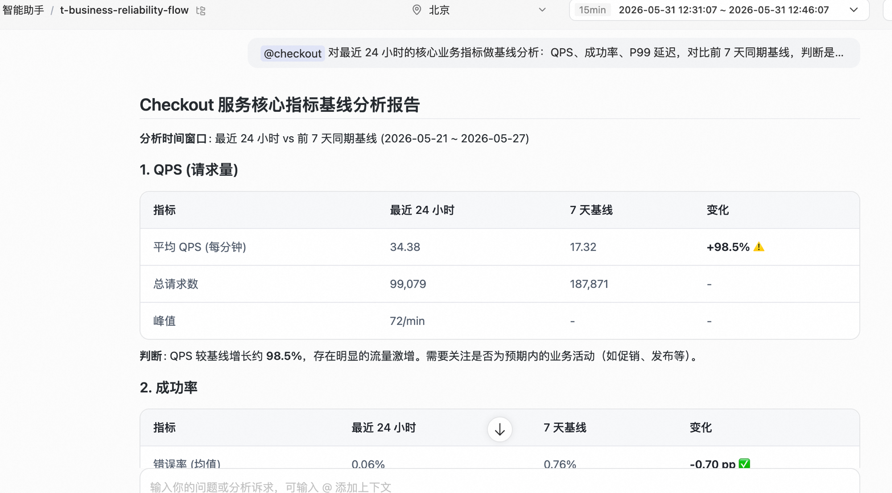
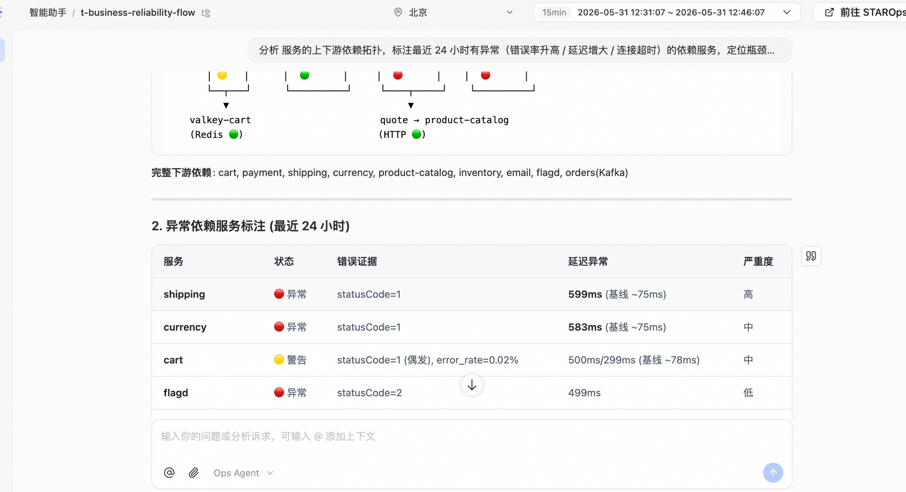
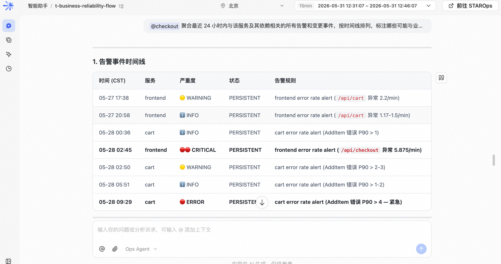
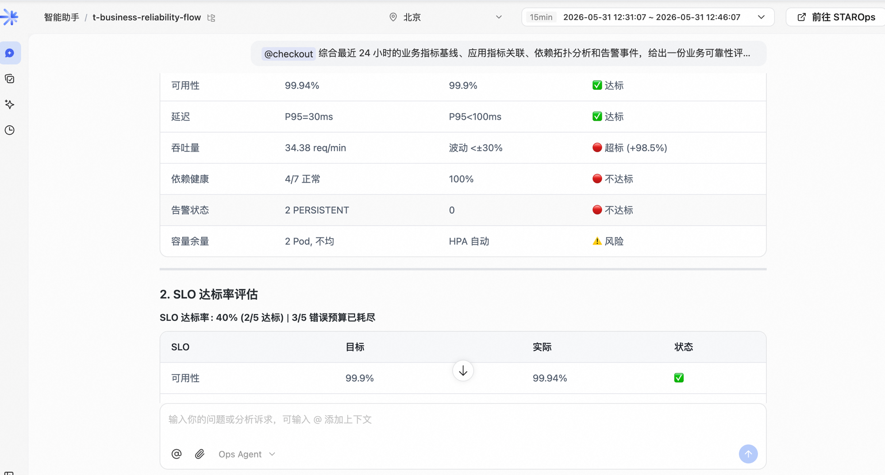

<div class="sls-starops-article-crumb">
  <a href="/doc/starops/">STAROps</a> <span class="sep">/</span> <span>场景实践</span>
</div>

# 业务服务可靠性巡检

<div class="sls-starops-article-meta">
  <span>分类 · 场景实践</span>
</div>

当您需要对核心业务服务（订单、支付、登录等）做定期可靠性评估，判断业务指标是否偏离正常范围、并在偏离时定位到具体的应用层与依赖层根因时，可以在 STAROps 里按 5 个 Phase 串起来：业务指标基线 → 应用指标关联 → 依赖拓扑分析 → 告警事件聚合 → 综合可靠性报告。流程依赖 ARMS APM 指标与 UModel 拓扑：取数、关联、归因均由 Agent 完成，同一 thread 内逐 Phase 累积上下文，产出含 SLO 达标率、风险点和行动项的服务可靠性报告。

> 这是一条**主动发现**路径：从业务指标出发追溯到基础设施，与告警驱动的被动排查方向相反。两者互补——告警排查解决"已经发生的问题"，业务守护发现"可能恶化的趋势"。

## 前提条件

- 已开通 STAROps，且当前账号可创建数字员工与对话。
- 核心业务服务已接入 ARMS APM，可查询到 QPS、成功率，以及根据业务特点选择的延迟分位数（PXX，如 P95、P99 等）。
- 服务之间的依赖拓扑可查（trace 数据已接入 UModel，采样率不宜过低）。
- 已确认切入服务的名称（如 `checkout` / `frontend` / `payment`），切入点应是核心业务链路的入口服务，而非底层依赖。

## 安装 Skill

完成本实践会落地一份 SOP Skill（本实践产物是服务可靠性报告，无可执行业务 Skill）。安装方式任选其一：本地 Agent 走 [`npx skills`](https://www.npmjs.com/package/skills)，STAROps 数字员工下载 tar.gz 后在控制台「技能管理 → 上传技能」上传。

| Skill | 作用 | 本地 Agent（npx） | STAROps 控制台（tar.gz） |
|---|---|---|---|
| `service-reliability-flow-sop` | 引导 Skill：教 Agent 按 5 个 Phase 协助用户完成"业务指标 → 应用指标 → 依赖拓扑 → 告警事件 → 综合报告"的端到端分析，最终在 STAROps 中产出一份服务可靠性报告。 | `npx skills add aliyun-sls/sls-doc --skill service-reliability-flow-sop` | [service-reliability-flow-sop.tar.gz](https://starops-demo.oss-cn-beijing.aliyuncs.com/starops/demo/starops-best-practice/business-reliability-flow/docs/service-reliability-flow-sop.tar.gz) |

下文步骤一到步骤五的提问模板与闭环 checklist 与该 SOP 一一对应。

## 5 Phase 概览

| # | Phase | 输入 | 输出 |
|---|---|---|---|
| 1 | 业务指标基线 | 服务名 + 时间范围 + 基线天数 | 业务指标基线表（QPS / 成功率 / 延迟，含偏离标注） |
| 2 | 应用指标关联 | Phase 1 输出 + 应用层指标范围 | 应用指标关联表（含"应用异常 → 业务影响"因果） |
| 3 | 依赖拓扑分析 | Phase 2 异常应用 | 依赖拓扑图 + 异常依赖标注表 + 瓶颈定位 |
| 4 | 告警事件聚合 | 服务 + 依赖范围 | 告警/事件时间线表 |
| 5 | 综合可靠性报告 | Phase 1-4 全部产出 | 整体健康判断 + SLO 评估 + 风险点 + 行动项 |

5 个 Phase 串行执行、共享同一 thread，Agent 逐 Phase 累积上下文。新开 thread 会丢失累积上下文，每个 Phase 都需要重新提供前序信息。

## 步骤一：业务指标基线

目标：对核心业务服务的关键业务指标做基线分析，判断是否偏离正常范围。

1. 进入 STAROps 控制台 → 数字员工 → 选择已启用 `service-reliability-flow-sop` 的数字员工 → 新建对话。
2. 在会话框中发送以下提问（把 `<服务名>` 替换为实际入口服务名，把 `<时间范围>` / `<基线天数>` 替换为实际值）：

   ```
   @应用-<服务名> 对最近 <时间范围> 的核心业务指标做基线分析：QPS、成功率、延迟 PXX（根据业务特点选择分位数），对比前 <基线天数> 同期基线，判断是否偏离正常范围
   ```

3. 等待 Agent 返回业务指标基线表，确认包含：指标清单覆盖 QPS / 成功率 / 延迟；每项有当前值与基线值的定量对比；偏离状态有显式标注。

> 建议在 prompt 中显式指定服务名；搜索范围过大时结果容易被稀释。切入点优先选核心业务链路的入口服务，效果好于从底层依赖切入。

::: details 查看图片



:::

产出物：业务指标基线表，作为后续 4 个 Phase 的输入。

## 步骤二：应用指标关联

目标：从业务指标异常出发，关联应用层指标（错误率 / 实例数 / CPU / 内存），定位哪些应用异常可能影响业务。

1. 在**同一 thread** 内继续发送提问：

   ```
   @应用-<服务名> 基于业务指标基线分析结果，关联最近 <时间范围> 的应用层指标（错误率 / QPS / 延迟 PXX / 实例数 / CPU / 内存），定位哪些应用指标异常可能影响业务
   ```

2. 等待 Agent 返回应用指标关联表，确认包含：应用指标与业务指标的关联分析；显式标注因果关系（哪个应用异常影响哪个业务指标）；异常按对业务的影响程度排序。

> 建议保持在同一 thread 内执行。Agent 会自动复用 Phase 1 的业务指标基线结果，并基于 UModel 把应用指标对齐到同一组实体；新开 thread 后这部分上下文会丢失，每个 Phase 都需要重新提供前序信息。

产出物：建立"应用指标异常 → 业务指标偏离"因果链的关联表。

## 步骤三：依赖拓扑分析

目标：从异常应用出发，追踪上下游依赖拓扑，定位瓶颈或故障点。

1. 在**同一 thread** 内继续发送提问：

   ```
   @应用-<服务名> 分析当前服务的上下游依赖拓扑，标注最近 <时间范围> 有异常（错误率升高 / 延迟增大 / 连接超时）的依赖服务，定位瓶颈或故障点
   ```

2. 等待 Agent 返回依赖拓扑图 + 异常依赖标注表，确认包含：上游 → 当前服务 → 下游的完整拓扑；异常依赖有标注（错误率 / 延迟 / 状态）；有瓶颈定位结论。

> 依赖拓扑来自 UModel：trace 数据接入后由 UModel 沉淀为可查询的服务依赖图谱。trace 采样率过低或部分服务未接入会导致拓扑残缺，可以在 prompt 末尾补一句"已知依赖：A → B、C → A"做兜底。

::: details 查看图片



:::

产出物：在前两个 Phase 之上叠加基础设施层的依赖拓扑视图。

## 步骤四：告警事件聚合

目标：聚合与当前业务服务及其依赖相关的所有告警与变更事件，确认是否有已知问题。

1. 在**同一 thread** 内继续发送提问：

   ```
   @应用-<服务名> 聚合最近 <时间范围> 内与该服务及其依赖相关的所有告警和变更事件，按时间线排列，标注哪些可能与业务指标异常相关
   ```

2. 等待 Agent 返回告警/事件时间线表，确认包含：按时间排列的事件流；显式标注事件与业务异常的时间相关性；已知问题确认。

> 告警与变更事件来自不同数据源（告警系统 / 变更管理系统），需要跨数据源聚合。若告警系统未接入 STAROps，本 Phase 可能返回空结果，可跳过，Agent 会在综合报告中说明数据缺失。

::: details 查看图片



:::

产出物：与业务异常时间对齐的告警/变更事件时间线，原始信号收集完成。

## 步骤五：综合可靠性报告

目标：综合前 4 个 Phase 的分析结果，给出服务可靠性评估报告。

1. 在**同一 thread** 内继续发送提问：

   ```
   @应用-<服务名> 综合最近 <时间范围> 的业务指标基线、应用指标关联、依赖拓扑分析和告警事件，给出一份服务可靠性评估报告：包含整体健康判断、SLO 达标率评估、风险点、影响范围和行动建议
   ```

2. 等待 Agent 返回综合评估报告，确认包含：整体健康状态表（业务指标 / 应用健康 / 依赖稳定性 / 告警态势）；SLO 达标率评估；风险点按优先级排列并附行动项；影响范围覆盖服务 / 用户 / 功能。

::: details 查看图片



:::

产出物：完整的服务可靠性报告。建议另存或导出归档（截图、转 PDF、复制到飞书/Wiki 均可）。

### 闭环验证 checklist

以下 5 件事全部为「是」才算闭环成立，任一为「否」回到对应步骤复查：

| # | 判据 | 不通过时回退到 |
|---|---|---|
| 1 | Phase 1 产出业务指标基线表，且偏离状态有显式标注 | 步骤一（检查服务是否接入 APM） |
| 2 | Phase 2 产出应用指标关联表，且建立了"应用异常 → 业务影响"的因果链 | 步骤二（检查埋点完整度） |
| 3 | Phase 3 产出依赖拓扑图，且异常依赖有标注 | 步骤三（检查 trace 采样率） |
| 4 | Phase 4 产出告警/事件时间线（或明确说明无数据） | 步骤四（检查告警系统对接） |
| 5 | Phase 5 综合报告引用了前 4 个 Phase 的结果，未要求用户重提上下文 | 步骤五（确认 5 个 Phase 在同一 thread 内执行） |

## 常见问题

### 业务指标和应用指标有什么区别

业务指标反映用户可感知的业务结果（订单成功率、登录成功率），应用指标反映服务本身的技术状态（错误率、QPS、延迟）。业务指标异常通常由应用指标异常引起，Phase 2 的作用就是显式建立这个因果链。

### 依赖拓扑不完整怎么办

依赖拓扑来自 UModel 对 trace 数据的语义化。trace 采样率过低或部分服务未接入会导致拓扑残缺。短期处置是在 Phase 3 的 prompt 末尾手动补上已知依赖；长期处置是提高 trace 采样率或补齐未接入的服务。

### 5 个 Phase 必须按顺序执行吗

建议按顺序。每个 Phase 的输出是下一个 Phase 的输入上下文，Agent 据此逐步收敛搜索范围。如果跳过某个 Phase（例如告警系统未接入、Phase 4 跳过），Agent 会在 Phase 5 综合报告中说明哪部分数据缺失，并据此调整结论。

### 跨 thread 执行会有什么问题

每个 Phase 的提问都依赖前序 Phase 沉淀的上下文。跨 thread 时 Agent 看不到历史，需要在每个 Phase 的 prompt 中重述前序结果，Phase 5 综合阶段也容易产出 4 个 Phase 互不引用的报告。

### 这个流程能定期自动跑吗

本流程是按需深度分析，每次执行依赖人对切入服务、时间范围、基线天数的判断，因此不通过"长期任务"调度。"定期自动评估某项业务指标是否偏离基线"更适合走告警规则或定时巡检，本流程作为人介入后的深入诊断使用。

## 相关入口

- [返回 STAROps 最佳实践首页](/starops/)
- [打开 STAROps Playground](/playground/staropsdemo.html)
- [进入 STAROps 控制台](https://starops.console.aliyun.com)
