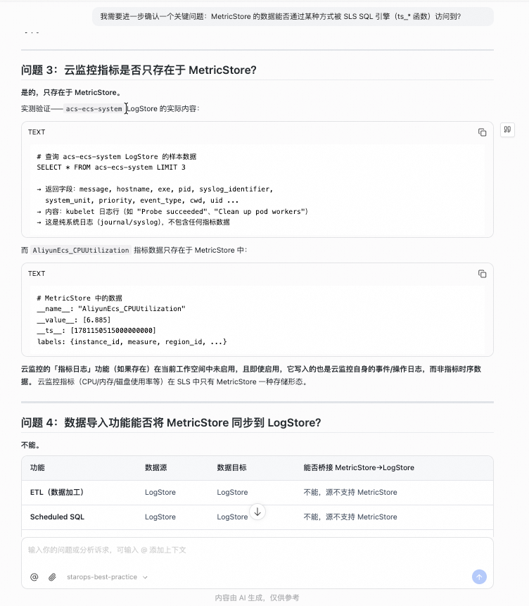
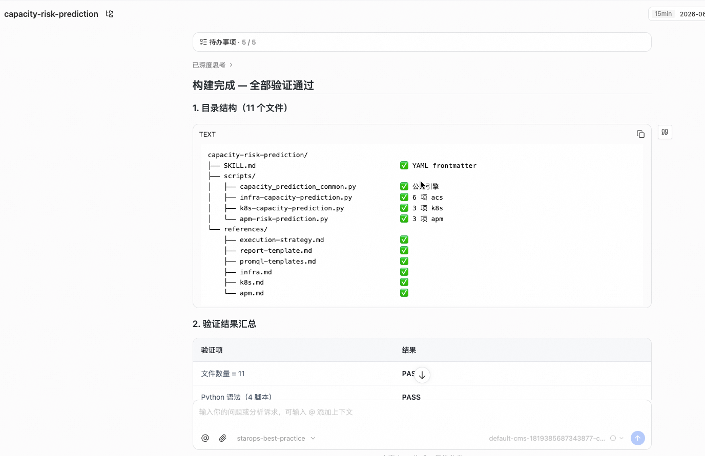
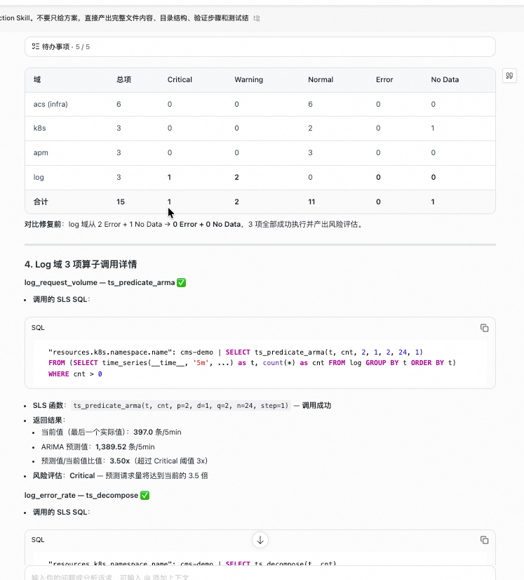
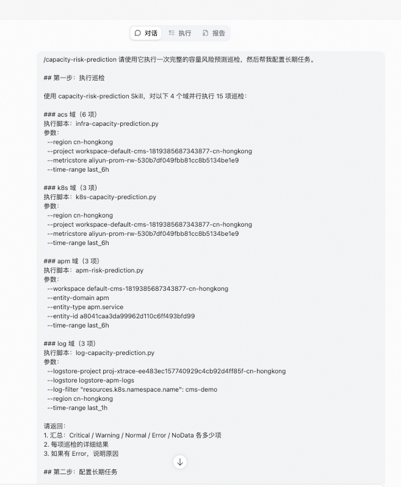
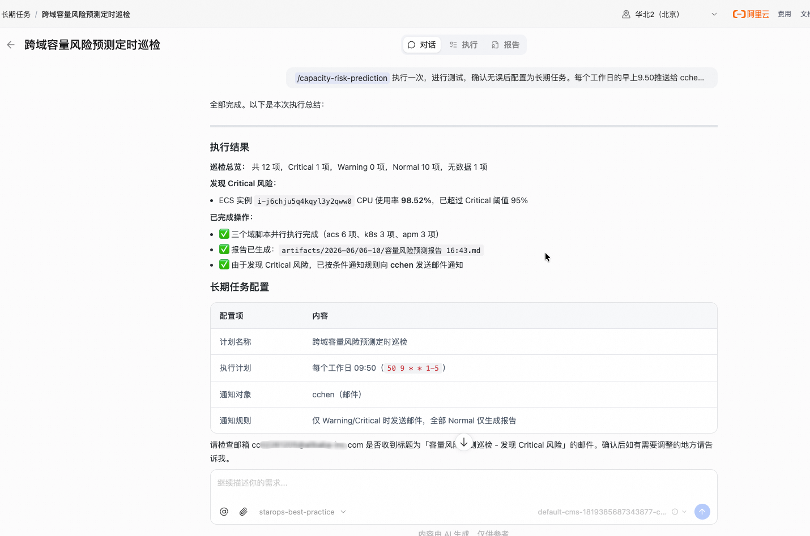

<div class="sls-starops-article-crumb">
  <a href="/doc/starops/starops.html">STAROps</a> <span class="sep">/</span> <span>主动巡检</span>
</div>

# 饱和度评估与风险预测

<div class="sls-starops-article-meta">
  <span>分类 · 主动巡检</span>
</div>

> 对话回放：[Phase 1：算子能力认知](/playground/capacity-risk-prediction-operator-replay.html) ｜ [Phase 2：Skill 构建与验证](/playground/capacity-risk-prediction-replay.html) ｜ [Phase 3：长期任务运营](/playground/capacity-risk-prediction-mission-replay.html)

容量风险预测关注两个问题：当前水位是否接近阈值，按当前趋势还剩多久会触发风险。本文介绍如何在 STAROps 中把 PromQL 指标预测、SLS SQL 日志时序分析和长期任务组合起来，对 ECS、RDS、Redis、K8s、APM 服务和应用日志执行周期性容量风险巡检。

该方案覆盖 4 个域、15 项巡检、7 种评估策略。MetricStore 指标使用 PromQL 的 `deriv`、`predict_linear`、`holt_winters`、`offset`、`avg_over_time`；Logstore 日志先聚合为等间隔时序，再使用 SLS SQL 的 `ts_predicate_arma`、`ts_decompose`、`ts_anomaly_filter` 进行预测和异常检测。巡检结果可配置为长期任务，每个工作日自动执行，只有发现 Warning 或 Critical 风险时发送通知。

适用场景：

- 需要定期评估 ECS、RDS、Redis、K8s 节点、Pod 或 APM 服务的容量水位。
- 需要回答“磁盘还能撑多久”“CPU 是否会触顶”“请求量是否异常增长”这类趋势问题。
- 已有应用访问日志、错误日志或业务日志，希望从日志中构造时序并判断周期性、突增和异常波动。
- 需要把巡检结果接入长期任务，只在发现 Warning 或 Critical 风险时通知。

不适用场景：

- 已经发生故障，需要做告警根因分析；这类问题应走告警 RCA 实践。
- 只想做一次资源现状巡检，不需要预测剩余时间或周期性变化。
- Logstore 中没有可聚合的访问日志、错误日志或业务日志；此时只能使用 PromQL 或 APM 指标路径。

## 前提条件

- 已开通 STAROps，且当前账号可创建数字员工与长期任务。
- 待评估资源已接入 STAROps workspace，可查询到 MetricStore / Prometheus 指标或 APM 指标。
- 如需分析日志衍生时序，Logstore 中需要有可聚合的访问日志、错误日志或业务日志。
- 已确认至少一种可达的通知通道，例如联系人、邮件、群机器人或 Webhook。
- 已了解 UModel 指标语义，特别是 `data_format`、`type`、`generator`、`aggregator`。参考 [UModel 使用指南](/starops/practices/umodel-metric-entity/article.html)。

## 安装 Skill

本文配套两份 Skill，二者职责不同，不能互相替代。安装方式任选其一：本地 Agent 走 [`npx skills`](https://www.npmjs.com/package/skills)，STAROps 数字员工下载 tar.gz 后在控制台「技能管理 → 上传技能」上传。

| Skill | 作用 | 本地 Agent（npx） | STAROps 控制台（tar.gz） |
|---|---|---|---|
| `capacity-risk-prediction` | 业务 Skill：调度脚本批量执行 4 域 15 项容量风险巡检，输出结构化 JSON 风险报告。 | `npx skills add aliyun-sls/sls-doc-skills --skill capacity-risk-prediction` | [capacity-risk-prediction.tar.gz](https://starops-demo.oss-cn-beijing.aliyuncs.com/starops/demo/starops-best-practice/capacity-risk-prediction/docs/capacity-risk-prediction.tar.gz) |
| `capacity-risk-prediction-sop` | 引导 Skill：教 Agent 按「算子认知 → Skill 构建 → 长期任务运营」三阶段复现完整流程。 | `npx skills add aliyun-sls/sls-doc-skills --skill capacity-risk-prediction-sop` | [capacity-risk-prediction-sop.tar.gz](https://starops-demo.oss-cn-beijing.aliyuncs.com/starops/demo/starops-best-practice/capacity-risk-prediction/docs/capacity-risk-prediction-sop.tar.gz) |

下文步骤一至步骤三与 `capacity-risk-prediction-sop` 一一对应。`capacity-risk-prediction` 负责真实执行巡检。

## 流程概览

| 阶段 | 目标 | 产出 |
|---|---|---|
| Phase 1：算子认知 | 确认当前工作空间支持哪些 PromQL 和 SLS SQL 时序能力，明确 MetricStore / Logstore / APM 的边界 | 算子可用性表、数据路径选择表、不可用函数清单 |
| Phase 2：构建 Skill | 构建并验证 `capacity-risk-prediction`，覆盖 4 域 15 项、7 种策略 | 可上传的业务 Skill 包、结构验证结果、真实执行报告 |
| Phase 3：长期任务运营 | 将业务 Skill 配置到 STAROps 数字员工与长期任务中，验证通知闭环 | mission ID、cron、通知规则、一次完整巡检报告 |

三个阶段必须按顺序执行。先确认算子边界，再固化 Skill；否则容易把 MetricStore 和 Logstore 的能力混用，导致脚本在真实环境中失败。

## 步骤一：确认算子能力和数据边界

目标：确认当前工作空间支持哪些 PromQL 和 SLS SQL 时序能力，明确 MetricStore / Logstore / APM 的数据路径边界，避免后续把不同存储引擎的能力混用。

先确认当前工作空间可用的数据路径。不同数据源对应不同查询方式和算子，不能混用。

| 数据源 | 访问方式 | 已验证能力 | 适合场景 |
|---|---|---|---|
| MetricStore / Prometheus 指标 | `starops sls promql query` | `deriv`、`predict_linear`、`holt_winters`、`offset`、`avg_over_time` | ECS / RDS / Redis / K8s 等云监控或 Prometheus 指标 |
| Logstore 日志 | `starops sls query` | `ts_predicate_arma`、`ts_decompose`、`ts_anomaly_filter` | 从访问日志、错误日志、日志量构造出的等间隔时序 |
| APM 预聚合指标 | `starops observe metric_set query` | 指标摘要和统计值 | 错误率、延迟、QPS 等服务指标 |

关键边界：SLS SQL 的 `ts_*` 时序函数只能作用于 Logstore 中的日志数据，不能直接用于 MetricStore 指标。云监控指标如 `AliyunEcs_CPUUtilization` 应使用 PromQL；日志衍生时序如请求量、错误数、日志量，先用 SQL 聚合成时间序列，再调用 SLS SQL 时序函数。

### PromQL 路径

| 函数 | 作用 | 典型用法 |
|---|---|---|
| `deriv(metric[6h])` | 计算变化率 | 判断水位是否持续上升 |
| `predict_linear(metric[6h], 86400)` | 基于线性拟合预测未来值 | 预判 1 天后是否触达阈值 |
| `holt_winters(metric[1h], 0.7, 0.5)` | 双指数平滑短期预测 | 捕捉短周期流量突增 |
| `metric offset 1d` | 获取昨天同时段指标 | 做日环比 |
| `avg_over_time(metric[7d])` | 获取 7 天基线 | 判断偏离幅度 |

### SLS SQL 路径

| 函数 | 作用 | 调用要点 |
|---|---|---|
| `ts_predicate_arma(t, cnt, p, d, q, n, step)` | ARIMA 预测 | `p` / `q` 必须在 `[2,100]`；返回预测值、置信区间和异常概率 |
| `ts_decompose(t, cnt)` | 时序分解 | 返回每个时间点的 `src` / `trend` / `season` / `residual` |
| `ts_anomaly_filter(name, ts[], actual[], lower[], upper[], window, step)` | 异常检测 | 需要先用 `array_agg` 构造数组输入；边界可固定或动态计算 |

构造日志时序的基本模式：

```sql
-- 请求量时序，5 分钟粒度
{filter} | SELECT time_series(__time__, '5m', '%Y-%m-%d %H:%i:%s', '0') AS t,
                  count(*) AS cnt
           FROM log
           GROUP BY t
           ORDER BY t

-- 错误数时序，从 envoy access log 的 content 字段提取 HTTP 4xx/5xx
{filter} | SELECT time_series(__time__, '5m', '%Y-%m-%d %H:%i:%s', '0') AS t,
                  sum(CASE WHEN content LIKE '%" 4%' OR content LIKE '%" 5%' THEN 1 ELSE 0 END) AS cnt
           FROM log
           GROUP BY t
           ORDER BY t
```

选择算子时以当前工作空间的实际返回为准。若函数不可用，应从执行路径中移除，避免长期任务运行失败。

::: details 查看图片 — 算子能力与数据边界

:::

在 STAROps 中新建对话，发送以下提问即可完成本步骤：

```
帮我确认当前工作空间可用的时序分析能力：
1. MetricStore 支持哪些 PromQL 函数 —— 请逐个测试 deriv、predict_linear、holt_winters、offset、avg_over_time
2. Logstore 支持哪些 SLS SQL 时序函数 —— 请逐个测试 ts_predicate_arma、ts_decompose、ts_anomaly_filter
3. APM metric_set 可以查到哪些指标摘要
4. 列出不可用的函数，避免后续 Skill 引用
```

产出物：算子可用性表、数据路径选择表、不可用函数清单。

## 步骤二：构建并验证容量风险预测 Skill

目标：构建覆盖 4 域 15 项、7 种策略的容量风险预测 Skill，验证脚本可打包执行、同参数重复执行输出稳定。

构建 `capacity-risk-prediction` 业务 Skill，目标是把 4 域 15 项容量风险巡检固化为脚本包。脚本包采用「数据驱动声明 + 公共引擎」结构：业务脚本只声明 `PredictionCase`，公共引擎负责查询、解析、评估、格式化和聚合。

| 域 | 巡检项 | 数据路径 | 关键算子 |
|---|---|---|---|
| acs | ECS CPU / 磁盘 / 内存，RDS CPU / 连接数，Redis 内存 | MetricStore | `predict_linear`、`deriv`、`avg_over_time` |
| k8s | Node CPU / Node 内存 / Pod 内存 | MetricStore | `predict_linear`、`offset`、`avg_over_time` |
| apm | 错误率 / 延迟 / QPS | metric_set | 脚本内阈值与基线评估 |
| log | 请求量预测 / 错误率检测 / 日志量趋势 | Logstore | `ts_predicate_arma`、`ts_decompose`、`ts_anomaly_filter` |

### 7 种评估策略

| 策略 | 触发条件 | 核心计算 | 输出 |
|---|---|---|---|
| 趋势预测 | 当前值在阈值 50%-90%，且变化率大于 0 | `predict_linear(metric[6h], N)` | 预测值 + 剩余天数 |
| 基线偏离 | 日环比或周基线偏离显著 | `metric / metric offset 1d` | 偏离倍数 + 方向 |
| 缓慢增长 | 变化率大于 0 但绝对值小 | `predict_linear(metric[6h], 604800)` + `avg_over_time(metric[7d])` | 7 天预测 + 基线差 |
| 阈值突破 | 当前值已超 Warning 或 Critical | 当前值 vs 阈值 | 超标幅度 |
| 短期波动 | 流量型指标突增预警 | `holt_winters(metric[1h], 0.7, 0.5)` | 短期预测值 |
| ARIMA 预测 | 请求量或错误数需要预测 | `ts_predicate_arma(t, cnt, p, d, q, n, step)` | 预测值 + 置信区间 + 异常概率 |
| 分解与异常检测 | 发现周期性或统计异常 | `ts_decompose` + `ts_anomaly_filter` | 趋势 / 季节 / 残差 + 异常点 |

验证口径：Skill 需覆盖 6 + 3 + 3 + 3 = 15 项巡检，脚本可打包为 tar.gz，同参数重复执行输出稳定。验证时需覆盖 SLS SQL 的参数范围、字段索引和返回格式，避免长期任务在运行期失败。

::: details 查看图片 — Skill 生成与结构验证

:::

::: details 查看图片 — Skill 执行验证结果

:::

产出物：可上传的业务 Skill 包、结构验证结果、真实执行报告。

## 步骤三：配置长期任务并验证通知闭环

目标：将已验证的 Skill 配置为 STAROps 数字员工的长期任务，按工作日自动执行，验证 Warning / Critical 时通知可达、全部 Normal 时只保存报告。

将已验证的容量风险预测 Skill 配给 STAROps 数字员工，并创建长期任务。

| 配置项 | 值 |
|---|---|
| 任务名 | 容量风险预测巡检计划 |
| 执行计划 | 每个工作日 09:50（cron: `50 9 * * 1-5`） |
| 通知规则 | 仅 Warning / Critical 时邮件通知；全部 Normal 只保存报告 |

::: details 查看图片 — 长期任务输入

:::

一次真实执行的汇总结果如下：

| 状态 | 数量 |
|---|---:|
| Critical | 0 |
| Warning | 3 |
| Normal | 11 |
| Error | 0 |
| NoData | 1 |

Warning 项：

| 域 | 巡检项 | 结果 |
|---|---|---|
| apm | cart 服务 QPS 基线偏离 | 偏离比 2.38x，超过 2.0x 阈值 |
| log | 日志错误率异常 | 错误日志波动，残差标准差 21.19 |
| log | 日志量趋势异常 | 日志量波动大，残差标准差 1086.98 |

NoData 项为 K8s Pod 内存缺少 limits 数据。当前执行无 Error。

操作完成后，任务列表中可见任务状态为「活跃」，下次执行时间和通知配置可在详情页确认。通知测试需发送到目标通道，确认收件人能看到风险摘要、受影响域、巡检项、建议操作和报告路径。

::: details 查看图片 — 长期任务执行结果与通知

:::

产出物：mission ID、cron 表达式、通知规则、一次完整巡检报告。

### 闭环验证 checklist

以下 5 件事全部为「是」才算闭环成立，任一为「否」回到对应步骤复查：

| # | 判据 | 不通过时回退到 |
|---|---|---|
| 1 | Phase 1 已确认 MetricStore、Logstore、APM 的数据路径边界 | 步骤一 |
| 2 | `capacity-risk-prediction` 已上传并启用 | 步骤二 |
| 3 | 业务 Skill 能输出 4 域 15 项结构化巡检报告 | 步骤二 |
| 4 | 长期任务已引用该 Skill，并按 cron 至少执行一次 | 步骤三 |
| 5 | Warning / Critical 时通知送达，全部 Normal 时只保存报告 | 步骤三 |

## 已知限制

- **L0 只读**：本流程不执行任何变更操作。所有阈值调整、资源配置、脚本修改需人工确认后执行。
- **数据源依赖**：未接入 MetricStore 则 acs / k8s 域不可用；未接入 Logstore 则 log 域不可用；未接入 APM 则 apm 域不可用。缺少任一数据源时，对应域的巡检项无数据返回。
- **阈值需按业务调整**：文中阈值为示例口径，生产环境需根据实际业务水位和 SLA 重新设定。
- **SLS SQL 函数可用性**：不同地域、实例和日志版本支持的时序函数可能不同。将函数写入 Skill 前，应先在目标工作空间执行最小查询验证；未通过验证的函数不要进入长期任务路径。

## 常见问题

### 为什么需要同时使用 PromQL 和 SLS SQL

PromQL 适合分析 MetricStore 中的资源和服务指标，例如 CPU、内存、连接数和 QPS。SLS SQL 适合从 Logstore 中把访问日志、错误日志或业务日志聚合成时序，再做 ARIMA 预测、时序分解和异常检测。两条路径覆盖的数据不同，不能互相替代。

### SLS SQL 的 ts_* 函数能否用于云监控指标

不能。MetricStore 和 Logstore 是两套存储引擎。MetricStore 指标走 PromQL；Logstore 日志走 SLS SQL。若要对日志做容量预测，必须先从日志中聚合出等间隔时序。

### predict_linear 和 holt_winters 怎么选

`predict_linear` 适合天 / 周级别的长期趋势预测，语义直接：N 秒后的值是多少。`holt_winters` 适合小时级别的短期波动，对近期突增更敏感。容量水位优先用 `predict_linear`，流量突增可并行看 `holt_winters`。

### APM 指标为什么不走 PromQL

APM 服务层指标是预聚合数据，不暴露为 MetricStore 原始时序。实践中使用 `starops observe metric_set query` 获取 `__summary__.cur_statistics`，再由脚本按阈值和基线规则评估。

### 全部 Normal 的报告还有价值吗

定时执行的价值在于捕捉缓慢增长。磁盘每天涨 0.1%，单次看不出差异，连续 7 天的趋势预测能提前暴露。保持每工作日执行，只关注有风险时的邮件通知即可。

## 相关入口

- [返回 STAROps 最佳实践首页](/starops/starops.html)
- [打开 STAROps Playground](/playground/staropsdemo.html)
- [进入 STAROps 控制台](https://starops.console.aliyun.com)

## 附录：构建 Prompt

如需在 STAROps 中重新生成容量风险预测 Skill，打开 STAROps 新建对话，复制下方 prompt 主体发送。生成后需确认 Skill 覆盖 4 域 15 项巡检，脚本可打包为 tar.gz，同参数重复执行输出稳定。

::: details 展开

````markdown
# 重放 Prompt（Phase 2：构建 Meta Skill）

请基于以下要求，完整构建一个可用的 `capacity-risk-prediction` Meta Skill。不要只给方案，直接产出完整文件内容、目录结构、验证步骤和测试结果格式。所有产物文件必须保存到当前 thread 工作目录。

## 目标

构建一个用于跨域容量风险预测与服务饱和度评估的 Skill，要求：

1. 使用“脚本批量执行”方式，整体架构参考 `rds-inspection` Skill。
2. 覆盖四个域：acs 基础资源（ECS/RDS/Redis）、k8s（Node/Pod）、apm 业务服务、log 日志衍生时序。
3. 实现 7 种评估策略：趋势预测、基线偏离、缓慢增长、阈值突破、短期波动（holt_winters）、ARIMA 预测（ts_predicate_arma）、分解与异常检测（ts_decompose + ts_anomaly_filter）。
4. 输出结构化 JSON 结果 + 风险报告。
5. 符合 Skill 文件格式要求，`SKILL.md` 必须包含合法 YAML frontmatter。
6. 支持跨 workspace / region 复用，不依赖某个固定环境。所有环境相关参数（region、project、metricstore、logstore-project、logstore、log-filter、workspace、entity-id 等）必须通过 CLI 参数传入，不写死任何具体值。
7. acs/k8s 域通过 `starops sls promql query` 获取数据并执行 PromQL 函数（deriv/predict_linear/holt_winters/offset/avg_over_time）。
8. apm 域通过 `starops observe metric_set query` 获取指标摘要，在脚本内做阈值和基线评估。
9. log 域通过 `starops sls query` 执行 SLS SQL（ts_predicate_arma/ts_decompose/ts_anomaly_filter），对 Logstore 中的日志数据构造时序并分析。
10. 四个域脚本可并行执行，共 15 项巡检。
11. 脚本架构遵循确定性设计原则：数据驱动声明 + 公共引擎。

## 确定性架构约束

### 架构模式：数据驱动声明 + 公共引擎

- 业务脚本（infra / k8s / apm / log）：只声明巡检项配置（`PredictionCase`），零计算逻辑。
- 公共引擎（`capacity_prediction_common.py` + `capacity_prediction_engine.py`）：承载查询、解析、评估、格式化、聚合。
- 新增巡检项 = 新增一个 `PredictionCase` 数据项，不需要写新的计算代码。

### 7 种评估策略

| 策略 | 触发条件 | 核心 PromQL / SLS SQL | 输出 |
|---|---|---|---|
| 趋势预测 | 当前值在阈值 50%-90%，deriv > 0 | `predict_linear(metric[6h], N)` | 预测值 + 剩余天数 |
| 基线偏离 | 日环比或周基线偏离显著 | `metric / metric offset 1d` | 偏离倍数 + 方向 |
| 缓慢增长 | deriv > 0 但绝对值小 | `predict_linear(metric[6h], 604800)` + `avg_over_time(metric[7d])` | 7 天预测 + 基线差 |
| 阈值突破 | 当前值已超 Warning 或 Critical | 当前值 vs 阈值 | 超标幅度 |
| 短期波动 | 流量型指标突增预警 | `holt_winters(metric[1h], 0.7, 0.5)` | 短期预测值 |
| ARIMA 预测 | 请求量/错误数需要预测 | `ts_predicate_arma(t, cnt, p, d, q, n, step)` | 预测值 + 置信区间 + 异常概率 |
| 分解与异常检测 | 发现周期性或统计异常 | `ts_decompose` + `ts_anomaly_filter` | 趋势/季节/残差 + 异常点 |

## 15 项巡检清单

### acs 域（`infra-capacity-prediction.py`）— 6 项

| case_id | 指标 | 策略 | 阈值 | 级别 |
|---|---|---|---|---|
| ecs_cpu_trend | AliyunEcs_CPUUtilization | 趋势预测 | W:85% C:95% | P1 |
| ecs_disk_trend | AliyunEcs_diskusage_utilization | 缓慢增长 | W:80% C:90% | P1 |
| ecs_memory_trend | AliyunEcs_memory_usedutilization | 趋势预测 | W:85% C:95% | P2 |
| rds_cpu_trend | AliyunRds_CpuUsage | 趋势预测 | W:70% C:85% | P1 |
| rds_conn_trend | AliyunRds_ConnectionUsage | 趋势预测 | W:70% C:85% | P2 |
| redis_memory_trend | AliyunKvstore_StandardMemoryUsage | 缓慢增长 | W:75% C:90% | P1 |

### k8s 域（`k8s-capacity-prediction.py`）— 3 项

| case_id | 指标 | 策略 | 阈值 | 级别 |
|---|---|---|---|---|
| node_cpu_trend | node_cpu_seconds_total | 趋势预测 + 基线偏离 | W:70% C:85% | P1 |
| node_memory_trend | node_memory_MemAvailable_bytes | 趋势预测 | W:80% C:90% | P1 |
| pod_memory_trend | container_memory_working_set_bytes | 缓慢增长 | W:80% C:95% | P2 |

### apm 域（`apm-risk-prediction.py`）— 3 项

| case_id | 指标 | 策略 | 阈值 | 说明 |
|---|---|---|---|---|
| service_error_rate | error_rate | 阈值突破 | W:5% C:10% | 用 metric_set query 获取摘要 |
| service_latency | avg_request_latency_seconds | 阈值突破 + 趋势 | W:200ms C:500ms | 用 metric_set query 获取摘要 |
| service_qps_spike | request_count | 基线偏离 | 日环比 > 2x | 用 metric_set query 获取摘要 |

### log 域（`log-capacity-prediction.py`) — 3 项

| case_id | 来源 | 策略 | 阈值 | 说明 |
|---|---|---|---|---|
| log_request_volume | Logstore 请求量时序 | ARIMA 预测 | W:预测值超当前 2 倍 C:超 3 倍 | `time_series` + `count(*)` + `ts_predicate_arma` |
| log_error_rate | Logstore 错误数时序 | 分解与异常检测 | W:异常概率 > 0.8 C: > 0.95 | 从 `content` 提取 HTTP 4xx/5xx，不依赖 `level: ERROR` |
| log_volume_trend | Logstore 日志量时序 | 分解与异常检测 | W:残差超 2 倍标准差 | `ts_decompose` 输出 trend/season/residual |

## SLS SQL 适配要求

1. `ts_predicate_arma` 的 `p` 和 `q` 默认值必须为 2 或更大；SLS 要求 `p∈[2,100]`、`q∈[2,100]`。
2. 不要使用未建索引字段的冒号搜索，例如 `level: ERROR`。错误数优先从 envoy access log 的 `content` 字段提取 HTTP status >= 400。
3. `ts_decompose` 实际返回 `logs` 数组，每行包含 `unixtime` / `src` / `trend` / `season` / `residual`，不要假设返回 JSON 字符串列。
4. SLS SQL 的 `ts_*` 函数只用于 Logstore，不用于 MetricStore。

## 交付要求

```text
capacity-risk-prediction/
├── SKILL.md
├── scripts/
│   ├── capacity_prediction_common.py
│   ├── capacity_prediction_engine.py
│   ├── infra-capacity-prediction.py
│   ├── k8s-capacity-prediction.py
│   ├── apm-risk-prediction.py
│   └── log-capacity-prediction.py
└── references/
    ├── execution-strategy.md
    ├── report-template.md
    ├── promql-templates.md
    ├── sls-sql-templates.md
    ├── infra.md
    ├── k8s.md
    ├── apm.md
    └── log.md
```

总计 15 个文件。每个 `.py` 文件不能超过 32KB。

## 验证要求

```bash
find ./capacity-risk-prediction -type f | sort
python3 -m py_compile capacity-risk-prediction/scripts/*.py
python3 capacity-risk-prediction/scripts/infra-capacity-prediction.py --list-cases --region test --project test --metricstore test
python3 capacity-risk-prediction/scripts/k8s-capacity-prediction.py --list-cases --region test --project test --metricstore test
python3 capacity-risk-prediction/scripts/apm-risk-prediction.py --list-cases --workspace test --entity-domain apm --entity-type apm.service --entity-id test
python3 capacity-risk-prediction/scripts/log-capacity-prediction.py --list-cases --logstore-project test --logstore test --log-filter '*' --region test
```

验收：总数 15（infra 6 + k8s 3 + apm 3 + log 3），语法通过，同参数重复执行输出稳定。

## 真实执行参数模板

```bash
python3 scripts/infra-capacity-prediction.py \
  --region cn-hongkong \
  --project <project> \
  --metricstore <metricstore> \
  --time-range last_6h

python3 scripts/k8s-capacity-prediction.py \
  --region cn-hongkong \
  --project <project> \
  --metricstore <metricstore> \
  --time-range last_6h

python3 scripts/apm-risk-prediction.py \
  --workspace <workspace> \
  --entity-domain apm \
  --entity-type apm.service \
  --entity-id <apm_service_entity_id> \
  --time-range last_6h

python3 scripts/log-capacity-prediction.py \
  --logstore-project <logstore-project> \
  --logstore <logstore> \
  --log-filter '<log-filter>' \
  --region cn-hongkong \
  --time-range last_1h
```

## 输出要求

1. 完整目录结构。
2. 15 个文件的完整内容。
3. 所有验证命令和结果。
4. 真实执行结果汇总：Critical / Warning / Normal / Error / NoData。
5. tar.gz 文件路径和大小。
6. 不要只给摘要，不要省略文件内容。
7. 实际执行测试必须使用生成的脚本原样执行；如果失败，报告错误，不要临时改脚本后伪装成功。
````

:::
