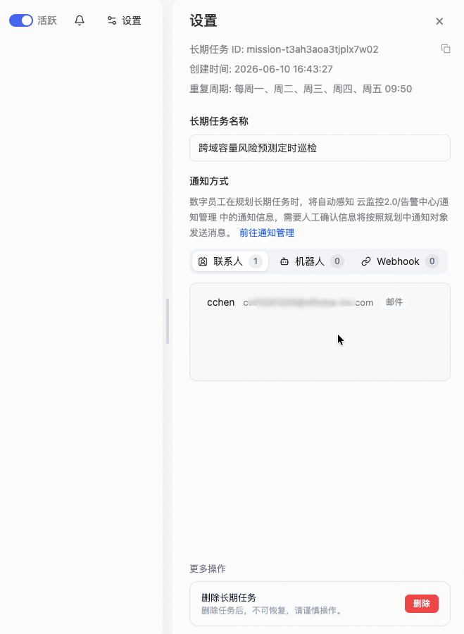

<div class="sls-starops-article-crumb">
  <a href="/doc/starops/starops.html">STAROps</a> <span class="sep">/</span> <span>场景实践</span>
</div>

# 饱和度评估与风险预测

<div class="sls-starops-article-meta">
  <span>分类 · 场景实践</span>
</div>

> 对话回放：[Skill 创建与验证](/playground/capacity-risk-prediction-replay.html) ｜ [定时巡检配置与测试](/playground/capacity-risk-prediction-mission-replay.html)

当您需要定期评估 ECS、RDS、Redis、K8s 节点或 APM 服务的容量水位——磁盘何时写满、CPU 何时触顶、延迟是否持续劣化——可以用 STAROps 的 PromQL 趋势函数配合定时巡检 Skill，跨域执行容量预测并生成风险报告。本文以 3 个域、12 项巡检为例，覆盖趋势预测、基线偏离、缓慢增长、阈值突破 4 种评估策略，并把巡检固化为每工作日自动执行的长期任务。

## 背景信息

容量管理的关键问题不是"现在有没有问题"，而是"什么时候会出问题"。PromQL 提供 4 个趋势函数，基于历史数据计算变化率和预测值：

| 函数 | 作用 | 典型用法 |
|---|---|---|
| `deriv(metric[6h])` | 6 小时窗口内的变化率（每秒增量） | 正值 = 上升，负值 = 下降 |
| `predict_linear(metric[6h], 86400)` | 基于 6 小时数据线性外推 1 天后的值 | 预判何时触及阈值 |
| `metric offset 1d` | 昨天同时段的值 | 日环比 |
| `avg_over_time(metric[7d])` | 过去 7 天均值 | 基线，算偏离幅度 |

> APM 服务层指标为预聚合数据，不支持上述 PromQL 函数。APM 域改用 `starops observe metric_set query` 获取指标摘要后评估。

## 前提条件

- 已开通 STAROps 实例并配置 workspace。
- 待评估实体已接入数据源（SLS MetricStore 或 CMS Prometheus）。
- 了解 UModel 指标语义（`data_format` / `type` / `generator`），参考 [UModel 使用指南](/starops/practices/umodel-metric-entity/article.html)。

## 安装 Skill

完成本实践会落地两份 Skill，二者职责不同。安装方式任选其一：本地 Agent 走 [`npx skills`](https://www.npmjs.com/package/skills)，STAROps 数字员工下载 tar.gz 后在控制台「技能管理 → 上传技能」上传。

| Skill | 作用 | 本地 Agent（npx） | STAROps 控制台（tar.gz） |
|---|---|---|---|
| `capacity-risk-prediction` | 业务 Skill：调度脚本批量执行 3 域 12 项容量巡检，输出结构化 JSON 风险报告。 | `npx skills add aliyun-sls/sls-doc-skills --skill capacity-risk-prediction` | [capacity-risk-prediction.tar.gz](https://starops-demo.oss-cn-beijing.aliyuncs.com/starops/demo/starops-best-practice/capacity-risk-prediction/docs/capacity-risk-prediction.tar.gz) |
| `capacity-risk-prediction-sop` | 引导 Skill：教 Agent 按 5 步 SOP 完成从选对象到出报告的容量评估流程。 | `npx skills add aliyun-sls/sls-doc-skills --skill capacity-risk-prediction-sop` | [capacity-risk-prediction-sop.tar.gz](https://starops-demo.oss-cn-beijing.aliyuncs.com/starops/demo/starops-best-practice/capacity-risk-prediction/docs/capacity-risk-prediction-sop.tar.gz) |

## 4 种评估策略

| 策略 | 触发条件 | 核心计算 | 输出 |
|---|---|---|---|
| 趋势预测 | 当前值在阈值 50%-90%，deriv > 0 | `predict_linear(metric[6h], N)` | 预测值 + 剩余天数 |
| 基线偏离 | 日环比或周基线偏离显著 | `metric / metric offset 1d` | 偏离倍数 + 方向 |
| 缓慢增长 | deriv > 0 但绝对值很小 | `predict_linear([6h], 604800)` + `avg_over_time([7d])` | 7 天预测 + 基线差 |
| 阈值突破 | 当前值已超 Warning 或 Critical | 当前值 vs 阈值 | 超标幅度 |

## 步骤一：选择评估对象与指标

确定要评估的域和实体。本实践覆盖 3 个域共 12 项巡检。

**acs 基础资源（6 项）**

| 巡检项 | 策略 | 阈值 |
|---|---|---|
| ECS CPU 使用率 | 趋势预测 | W:85% C:95% |
| ECS 磁盘使用率 | 缓慢增长 | W:80% C:90% |
| ECS 内存使用率 | 趋势预测 | W:85% C:95% |
| RDS CPU 使用率 | 趋势预测 | W:70% C:85% |
| RDS 连接数使用率 | 趋势预测 | W:70% C:85% |
| Redis 内存使用率 | 缓慢增长 | W:75% C:90% |

**k8s 集群资源（3 项）**

| 巡检项 | 策略 | 阈值 |
|---|---|---|
| Node CPU | 趋势预测 + 基线偏离 | W:70% C:85% |
| Node 内存 | 趋势预测 | W:80% C:90% |
| Pod 内存 | 缓慢增长 | W:80% C:95% |

**apm 业务服务（3 项）**

| 巡检项 | 策略 | 阈值 |
|---|---|---|
| 服务错误率 | 阈值突破 | W:5% C:10% |
| 服务延迟 | 阈值突破 | W:200ms C:500ms |
| 服务 QPS | 基线偏离 | 日环比 > 2x |

在 STAROps 中用 `@` 引用具体实体，确认 `entity_id`、指标 `data_format` 和单位。上表阈值为行业常用建议值，可按业务实际调整。

## 步骤二：查看当前状态与趋势

查询目标实体的当前值和变化率。

acs/k8s 域使用 PromQL：

```promql
-- 当前值
avg by (instance_id) (AliyunEcs_CPUUtilization)

-- 变化率（每秒增量，× 3600 = 每小时增量）
avg by (instance_id) (deriv(AliyunEcs_CPUUtilization[6h]))
```

APM 域使用 metric_set query：

```bash
starops observe metric_set query \
  --metric-set-name apm.metric.apm.service \
  --metric-names error_rate \
  --entity-type apm.service \
  --entity-id {entity_id}
```

deriv 正值 = 上升，负值 = 下降，接近零 = 平稳。

## 步骤三：容量预测

deriv > 0 的指标，用 `predict_linear` 预测未来值：

```promql
-- 预测 1 天后（86400 秒）
avg by (instance_id) (predict_linear(AliyunEcs_CPUUtilization[6h], 86400))

-- 预测 7 天后（604800 秒）
avg by (instance_id) (predict_linear(AliyunEcs_CPUUtilization[6h], 604800))
```

剩余天数 = `(threshold - current) / (deriv × 86400)`。deriv ≤ 0 时不会触及阈值。

## 步骤四：基线偏离检测

环比分析用 `offset` 和 `avg_over_time`：

```promql
-- 日环比
AliyunEcs_CPUUtilization{instance_id="{id}"}
  / AliyunEcs_CPUUtilization{instance_id="{id}"} offset 1d

-- 7 天基线
avg_over_time(AliyunEcs_CPUUtilization{instance_id="{id}"}[7d])
```

偏离幅度 = `(当前值 - 基线) / 基线 × 100%`，偏离超过 50% 标注异常。

## 步骤五：汇总报告与风险分级

汇总步骤二到步骤四的结果，按风险等级分类：

| 等级 | 判定条件 |
|---|---|
| **Critical** | 当前值已超 Critical 阈值，或剩余天数 < 1 天 |
| **Warning** | 当前值超 Warning 阈值，或剩余天数 < 7 天，或基线偏离 > 50% |
| **Normal** | 其余 |

以下为实测 3 域 12 项巡检的报告示例：

| 域 | 巡检项 | 实体 | 当前值 | 风险 | 建议 |
|---|---|---|---|---|---|
| acs | ECS CPU | `i-j6chju****qww0` | 98.52% | **Critical** | 升级规格或排查高 CPU 进程 |
| acs | ECS 磁盘 | `i-j6c18s****vuv` | 35.04% | Normal | — |
| acs | RDS CPU | `rm-j6c32****1j` | 0.20% | Normal | — |
| acs | Redis 内存 | `r-j6cryt****r8h` | 0.73% | Normal | — |
| k8s | Node CPU | (聚合) | 8.62% | Normal | — |
| apm | 错误率 | mall-gateway | 0.02% | Normal | — |
| apm | 延迟 | mall-gateway | 21.96ms | Normal | — |

上述巡检由 Skill 脚本批量执行，3 个域并行，每项自动完成当前值查询、变化率计算、阈值对比和风险等级判定。

::: details 查看图片 — Skill 生成与结构验证

:::

::: details 查看图片 — Skill 执行验证结果

:::

## 步骤六：配置定时巡检（可选）

将容量预测配置为 STAROps 长期任务（Mission），按 cron 自动执行。

1. 进入长期任务 → 新建，任务名建议体现用途，例如 `容量风险预测巡检计划`。
2. 在任务输入中引用 Skill 名称，写清域、阈值和通知要求。
3. 配置执行周期、通知对象和通知条件。

| 配置项 | 建议值 |
|---|---|
| 执行计划 | 每个工作日 09:50（cron: `50 9 * * 1-5`） |
| 通知对象 | 指定联系人（邮件） |
| 通知条件 | 发现 Warning 或 Critical 时发送邮件，全部 Normal 仅生成报告不发邮件 |

全部 Normal 时不发邮件，避免每天一封无操作价值的报告。

::: details 查看图片 — 长期任务执行结果

:::

::: details 查看图片 — 长期任务设置面板

:::

操作完成后，任务列表中可见任务状态为「活跃」，下次执行时间和通知配置可在详情页确认。

## 常见问题

### predict_linear 假设线性增长，实际负载有周期性怎么办

`predict_linear` 基于指定窗口做线性拟合。负载有周期性时（工作日高、周末低），建议在固定时段执行（如工作日上午），或将窗口扩大到 7d 覆盖完整周期。定时巡检配置为每工作日执行即可回避周末低谷偏差。

### APM 指标为什么不能用 predict_linear

APM 服务层指标为预聚合的平均值（如平均延迟、错误率），不暴露为 MetricStore 原始时序，SLS 无法对其执行 PromQL 函数。改用 `starops observe metric_set query` 获取指标摘要，从 `__summary__.cur_statistics` 提取 mean/max 值评估。

### 全部 Normal 的报告还有价值吗

定时执行的价值在于捕捉缓慢增长。磁盘每天涨 0.1%，单次看不出差异，连续 7 天的 `predict_linear` 能提前暴露。保持每工作日执行，只关注有风险时的邮件通知即可。

## 相关入口

- [返回 STAROps 最佳实践首页](/starops/starops.html)
- [打开 STAROps Playground](/playground/staropsdemo.html)
- [进入 STAROps 控制台](https://starops.console.aliyun.com)

## 附录：Replay Prompt

打开 STAROps 新建对话，整段复制下方内容（含围栏）发送，等待生成完整 Skill 包（1 份 SKILL.md + 5 个 Python 脚本 + 6 份参考资料），下载后用 `python3 -m py_compile` 和 `--list-cases` 确认产物合规。

::: details 展开

````markdown
# 重放 Prompt

请基于以下要求，完整构建一个可用的 `capacity-risk-prediction` Skill。不要只给方案，直接产出完整文件内容、目录结构、验证步骤和测试结果格式。所有产物文件必须保存到当前 thread 工作目录。

## 目标

构建一个用于跨域容量风险预测与服务饱和度评估的 Skill，要求：

1. 使用"脚本批量执行"方式，整体架构参考 `rds-inspection` Skill
2. 覆盖三个域：acs 基础资源（ECS/RDS/Redis）、k8s（Node/Pod）、apm 业务服务
3. 实现 4 种评估策略：趋势预测、基线偏离、缓慢增长、阈值突破
4. 输出结构化 JSON 结果 + 风险报告
5. 符合 Skill 文件格式要求，`SKILL.md` 必须包含合法 YAML frontmatter
6. 支持跨 workspace / region 复用，不依赖某个固定环境
7. acs/k8s 域通过 `starops sls promql query` 获取数据并执行 PromQL 函数（deriv/predict_linear/offset/avg_over_time）
8. apm 域通过 `starops observe entity metric-data` 获取时序数据，在脚本内用线性回归计算趋势
9. 三个域脚本可并行执行，共 12 项巡检
10. 脚本架构遵循确定性设计原则：数据驱动声明 + 公共引擎

---

## 确定性架构约束

### 架构模式：数据驱动声明 + 公共引擎

- **业务脚本**（infra / k8s / apm）：只声明巡检项配置（`PredictionCase`），**零计算逻辑**
- **公共引擎**（capacity_prediction_common.py）：承载所有计算（查询、解析、评估、格式化、聚合）
- 新增巡检项 = 新增一个 `PredictionCase` 数据项，不需要写新的计算代码

### 4 种评估策略

| 策略 | 触发条件 | 核心 PromQL / 计算 | 输出 |
|---|---|---|---|
| 趋势预测 | 当前值在阈值 50%-90%，deriv > 0 | `predict_linear(metric[6h], N)` | 预测值 + 剩余天数 |
| 基线偏离 | 日环比或周基线偏离显著 | `metric / metric offset 1d` | 偏离倍数 + 方向 |
| 缓慢增长 | deriv > 0 但绝对值小 | `predict_linear([6h], 604800)` + `avg_over_time([7d])` | 7天预测 + 基线差 |
| 阈值突破 | 当前值已超 Warning 或 Critical | 当前值 vs 阈值 | 超标幅度 + 持续时间 |

### 确定性保证

- 所有数值计算函数必须是纯函数
- 同输入同输出（可复跑验证）
- 脚本独立可运行
- 错误处理结构化

---

## 12 项巡检清单

### acs 域（infra-capacity-prediction.py）— 6 项

| case_id | 指标 | 策略 | 阈值 | 级别 |
|---|---|---|---|---|
| ecs_cpu_trend | AliyunEcs_CPUUtilization | 趋势预测 | W:85% C:95% | P1 |
| ecs_disk_trend | AliyunEcs_diskusage_utilization | 缓慢增长 | W:80% C:90% | P1 |
| ecs_memory_trend | AliyunEcs_memory_usedutilization | 趋势预测 | W:85% C:95% | P2 |
| rds_cpu_trend | AliyunRds_CpuUsage | 趋势预测 | W:70% C:85% | P1 |
| rds_conn_trend | AliyunRds_ConnectionUsage | 趋势预测 | W:70% C:85% | P2 |
| redis_memory_trend | AliyunKvstore_StandardMemoryUsage | 缓慢增长 | W:75% C:90% | P1 |

### k8s 域（k8s-capacity-prediction.py）— 3 项

| case_id | 指标 | 策略 | 阈值 | 级别 |
|---|---|---|---|---|
| node_cpu_trend | node_cpu（通过 node_cpu_seconds_total 计算） | 趋势预测 + 基线偏离 | W:70% C:85% | P1 |
| node_memory_trend | node_memory_MemAvailable_bytes | 趋势预测 | W:80% C:90% | P1 |
| pod_memory_trend | container_memory_working_set_bytes | 缓慢增长 | W:80% C:95% | P2 |

### apm 域（apm-risk-prediction.py）— 3 项

| case_id | 指标 | 策略 | 阈值 | 级别 | 特殊说明 |
|---|---|---|---|---|---|
| service_error_rate | error_count/request_count | 阈值突破 | W:5% C:10% | P1 | 不用 PromQL 函数，用 metric_set query 获取后脚本内计算 |
| service_latency | avg_request_latency_seconds | 阈值突破 + 趋势 | W:200ms C:500ms | P1 | 同上 |
| service_qps_spike | request_count | 基线偏离 | 日环比 > 2x | P2 | 同上 |

---

## 交付要求

请直接构建以下完整目录结构：

```text
capacity-risk-prediction/
├── SKILL.md
├── scripts/
│   ├── capacity_prediction_common.py
│   ├── capacity_prediction_engine.py
│   ├── infra-capacity-prediction.py
│   ├── k8s-capacity-prediction.py
│   └── apm-risk-prediction.py
└── references/
    ├── execution-strategy.md
    ├── report-template.md
    ├── promql-templates.md
    ├── infra.md
    ├── k8s.md
    └── apm.md
```

总计必须是 12 个文件。每个 .py 文件不能超过 32KB。

---

## 验证要求

### 1. 结构验证

```bash
find ./capacity-risk-prediction -type f | sort
```

验收：正好 12 个文件。每个 .py 文件 ≤ 32KB（`wc -c scripts/*.py` 确认）。

### 2. Python 语法验证

```bash
python3 -m py_compile capacity-risk-prediction/scripts/capacity_prediction_common.py
python3 -m py_compile capacity-risk-prediction/scripts/capacity_prediction_engine.py
python3 -m py_compile capacity-risk-prediction/scripts/infra-capacity-prediction.py
python3 -m py_compile capacity-risk-prediction/scripts/k8s-capacity-prediction.py
python3 -m py_compile capacity-risk-prediction/scripts/apm-risk-prediction.py
```

### 3. --list-cases 功能测试

```bash
python3 infra-capacity-prediction.py --list-cases --region test --project test --metricstore test
python3 k8s-capacity-prediction.py --list-cases --region test --project test --metricstore test
python3 apm-risk-prediction.py --list-cases --region test --project test --metricstore test
```

验收：总数 12（infra 6 + k8s 3 + apm 3）。

### 4. 确定性验证

同参数执行两次，diff 无差异。

---

## 输出要求

1. 完整目录结构
2. 11 个文件的完整内容
3. 验证命令和结果
4. **所有产物文件必须保存到当前 thread 工作目录**
5. 不要只给摘要，不要省略文件内容
6. **实际执行测试必须使用生成的脚本原样执行，不允许修改任何文件后再执行**

请直接开始构建。
````

:::
