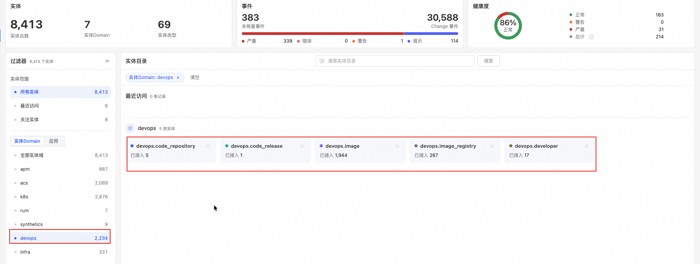
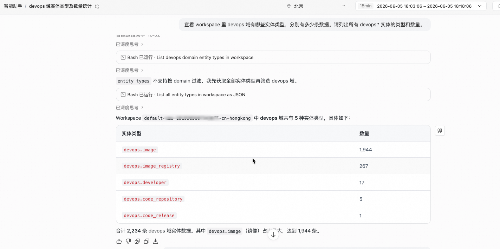
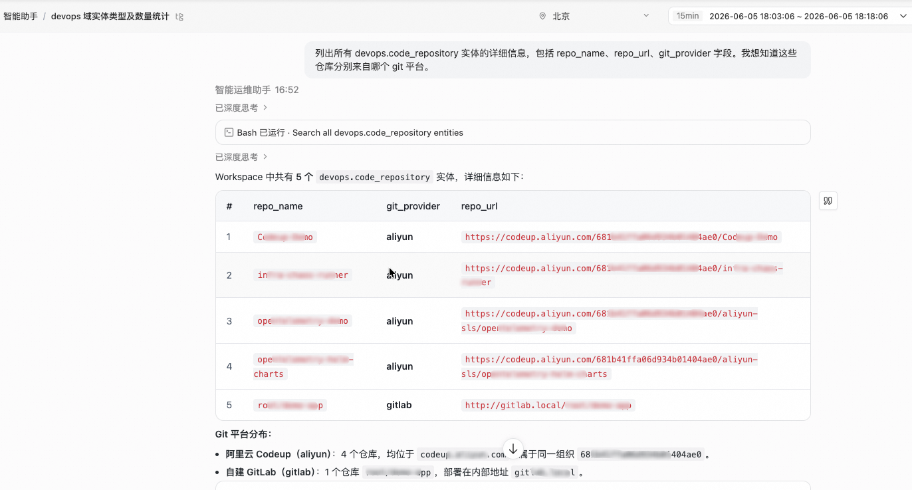
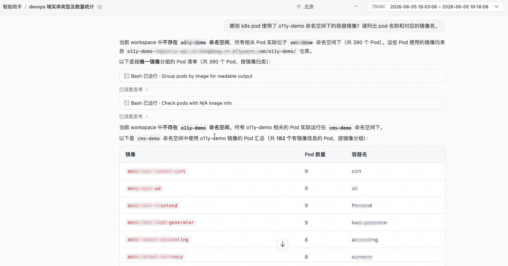
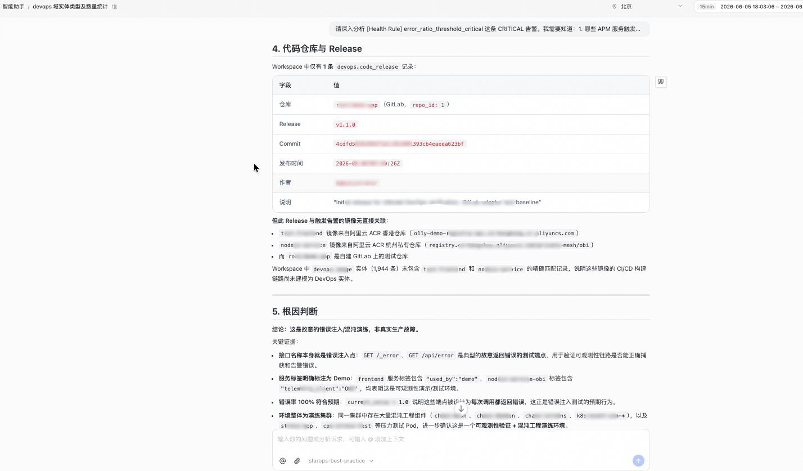

<div class="sls-starops-article-crumb">
  <a href="/doc/starops/starops.html">STAROps</a>
  <span class="sep">/</span>
  <span>扩展集成</span>
</div>

# DevOps 跨域追因建模

<div class="sls-starops-article-meta"><span>分类 · 扩展集成</span></div>

UModel 已内置 apm、k8s、acs 等运行时域，覆盖服务、Pod、云资源的可观测性。但告警触发时，Agent 只能告诉你"哪个 Pod 挂了"，无法回答"是谁的哪次发布导致的"——代码仓库、Release 和容器镜像不在 UModel 建模范围内。

本文介绍如何将 DevOps 数据（代码仓库、开发者、Release、镜像）接入 UModel，补全从告警到代码变更的追因链路。接入完成后，Agent 可以沿着 `告警 → 服务 → Pod → 镜像 → Release → 代码仓库 → 开发者` 的关系链自动追因。

## 安装 Skill

本实践配套 1 份 SOP Skill 和 6 个验证 Skill。SOP Skill 引导 Agent 按 7 步完成端到端建模；6 个验证 Skill 用于逐阶段校验数据完整性。

| Skill | 作用 | 本地 Agent（npx） | STAROps 控制台（tar.gz） |
|---|---|---|---|
| `devops-code-to-runtime-sop` | 引导 Skill：按 7 步完成"理解建模 → 环境准备 → 配置接入 → 代码域采集 → 制品域采集 → 跨域关联 → 端到端验证"。 | `npx skills add aliyun-sls/sls-doc-skills --skill devops-code-to-runtime-sop` | [devops-code-to-runtime-sop.tar.gz](https://starops-demo.oss-cn-beijing.aliyuncs.com/starops/demo/starops-best-practice/devops-code-to-runtime/docs/devops-code-to-runtime-sop.tar.gz) |
| `verification-resource-readiness` | 检查配置文件完整性和 API 连通性 | `npx skills add aliyun-sls/sls-doc-skills --skill verification-resource-readiness` | [verification-resource-readiness.tar.gz](https://starops-demo.oss-cn-beijing.aliyuncs.com/starops/demo/starops-best-practice/devops-code-to-runtime/docs/verification-resource-readiness.tar.gz) |
| `verification-workspace-alignment` | 验证 CMS workspace 与 SLS project 对齐 | `npx skills add aliyun-sls/sls-doc-skills --skill verification-workspace-alignment` | [verification-workspace-alignment.tar.gz](https://starops-demo.oss-cn-beijing.aliyuncs.com/starops/demo/starops-best-practice/devops-code-to-runtime/docs/verification-workspace-alignment.tar.gz) |
| `verification-workspace-refresh` | 运行 data_generator，确认全部 task success | `npx skills add aliyun-sls/sls-doc-skills --skill verification-workspace-refresh` | [verification-workspace-refresh.tar.gz](https://starops-demo.oss-cn-beijing.aliyuncs.com/starops/demo/starops-best-practice/devops-code-to-runtime/docs/verification-workspace-refresh.tar.gz) |
| `verification-cms-visibility` | 验证 CMS 中 devops 域实体可见 | `npx skills add aliyun-sls/sls-doc-skills --skill verification-cms-visibility` | [verification-cms-visibility.tar.gz](https://starops-demo.oss-cn-beijing.aliyuncs.com/starops/demo/starops-best-practice/devops-code-to-runtime/docs/verification-cms-visibility.tar.gz) |
| `verification-cms-field-check` | 检查实体关键字段值正确性 | `npx skills add aliyun-sls/sls-doc-skills --skill verification-cms-field-check` | [verification-cms-field-check.tar.gz](https://starops-demo.oss-cn-beijing.aliyuncs.com/starops/demo/starops-best-practice/devops-code-to-runtime/docs/verification-cms-field-check.tar.gz) |
| `verification-cms-sls-diagnose` | 诊断 SLS 写入问题（仅失败时使用） | `npx skills add aliyun-sls/sls-doc-skills --skill verification-cms-sls-diagnose` | [verification-cms-sls-diagnose.tar.gz](https://starops-demo.oss-cn-beijing.aliyuncs.com/starops/demo/starops-best-practice/devops-code-to-runtime/docs/verification-cms-sls-diagnose.tar.gz) |

参考实现仓库 [umodel-devops-reference](https://github.com/aliyun-sls/umodel-devops-reference) 包含上述 Skill 的完整实现、data_generator 代码、配置样例和中英双语文档。

## 为什么 UModel 没有内置 DevOps 域

UModel 内置域（apm / k8s / acs / rum / synthetics 等）覆盖的是阿里云可观测性产品数据。DevOps 数据来源于外部 Git 平台（GitLab、Codeup、GitHub 等）和容器镜像仓库，每个团队的技术栈和接入方式差异大，不适合统一内置。

本文提供的是一套参考实现 [umodel-devops-reference](https://github.com/aliyun-sls/umodel-devops-reference)：定义 5 个 DevOps 实体 + 12 条关系，通过 adapter 抽象屏蔽 Git 平台差异，将数据写入 UModel EntityStore。可以直接使用，也可以基于此扩展。

## 建模覆盖范围

| 域 | 实体 | 数据来源 | UModel 是否内置 |
|---|---|---|---|
| 代码域 | code_repository、developer、code_release | GitLab / Codeup API | 否（本文接入）|
| 制品域 | image_registry、image | ACR API | 否（本文接入）|
| 运行时域 | k8s.pod、k8s.deployment | CMS workspace | 是（已内置）|
| 服务域 | apm.service | ARMS | 是（已内置）|

关系链路：`developer → code_repository → code_release → image → k8s.pod ← apm.service`

## 已验证的 Git 平台

| Provider | 认证方式 | 验证版本 |
|---|---|---|
| GitLab | Personal / Project / Group Access Token | CE 17.6.0，python-gitlab 4.8.0 |
| Codeup | RAM AK/SK 或个人访问令牌（PAT） | alibabacloud-devops20210625 3.0.0 |

## 前提条件

- 阿里云账号拥有 CMS、SLS、ACR 的操作权限，以及对应的 RAM AccessKey。
- 已在 CMS 中创建 workspace，作为实体数据的存储目标。
- 已准备 Git provider 环境：GitLab 的 Personal Access Token，或 Codeup 的 RAM AK/SK（或个人访问令牌）。
- 已在 ACR 中管理容器镜像（镜像 tag 用于与 Release tag 建立关联）。
- 已在 STAROps 控制台创建数字员工，用于验证跨域查询能力。

## 流程概览

1. **理解建模架构** — 掌握 5 实体 + 12 关系的设计和三域串联逻辑
2. **准备环境与凭据** — 选择 Git provider，准备 ACR / CMS / SLS 环境和凭据
3. **配置数据接入引擎** — 配置 adapter、task 列表和 mapping 文件
4. **接入代码域数据** — 采集代码仓库、开发者和 Release
5. **接入制品域与运行时域数据** — 采集 ACR 镜像和 K8s Pod
6. **建立跨域关联** — 通过 mapping 文件连接代码、制品和运行时
7. **端到端验证** — 通过 verification skill 和 STAROps 数字员工确认全链路可用

## 步骤一：理解建模架构

UModel DevOps 域定义了 5 个 EntitySet：

| EntitySet | 含义 | 关键字段 |
|---|---|---|
| `devops.code_repository` | 代码仓库 | repo_id、repo_name、git_provider、default_branch |
| `devops.developer` | 开发者 | developer_id、developer_name、role |
| `devops.code_release` | 发布版本 | release_id、tag、commit_sha、release_time |
| `devops.image_registry` | 镜像仓库 | registry_id、registry_name、region |
| `devops.image` | 容器镜像 | image_id、image_name、image_tag、digest |

12 条 EntitySetLink 定义了实体间的关系：

| 关系 | 起点 → 终点 | 建立方式 |
|---|---|---|
| developer_manages_code_repository | developer → code_repository | manage_mapping.yaml 静态映射 |
| code_release_sourced_from_code_repository | code_release → code_repository | API 自动关联 |
| image_registry_contains_image | image_registry → image | API 自动关联 |
| image_sourced_from_code_release | image → code_release | repo_image_mapping.yaml + tag 字面匹配 |
| pod_uses_image | kubernetes_pod → image | CMS 数据自动关联 |

> 说明：当前建模粒度为 release 级，不采集 commit 历史。如需 commit 级追溯，可在参考实现 [umodel-devops-reference](https://github.com/aliyun-sls/umodel-devops-reference) 基础上扩展 adapter。

## 步骤二：准备环境与凭据

### 选择 Git provider

| Provider | 认证方式 | 可见范围 | 适用场景 |
|---|---|---|---|
| GitLab（PAT） | Personal Access Token，scope 选 `read_api` | PAT 所属用户有权限的所有仓库 | 自建 GitLab 或 GitLab SaaS |
| Codeup（RAM） | RAM AK/SK | RAM 用户被授权的仓库 | 精确控制可见范围 |
| Codeup（PAT） | 个人访问令牌，scope 选 `read_api` | 令牌所属用户可见的所有仓库 | 需要拉取更多仓库时 |

> 说明：Codeup RAM 模式和 PAT 模式的仓库可见范围差异较大。如果采集的仓库数量少于预期，检查认证模式。

### 确认环境参数

| 服务 | 需要的参数 | 获取方式 |
|---|---|---|
| CMS | workspace 名称 | CMS 控制台 → workspace 列表 |
| SLS | project 名称、logstore 名称 | 通常与 CMS workspace 同名 |
| ACR | 实例 ID、region | ACR 控制台 → 实例列表 |
| K8s | cluster ID | ACK 控制台 → 集群列表 |

## 步骤三：配置数据接入引擎

### 配置文件结构

```
config/
  app_config.yaml              # 主配置（provider 选择、凭据、环境参数）
  data_mapping.yaml            # 实体字段映射
  manage_mapping.yaml          # developer → repository 静态映射
  repo_image_mapping.yaml      # repository → image_registry 静态映射
  static_topo.yaml             # 静态拓扑关系
```

### 关键配置项

`app_config.yaml` 的 `git_provider.type` 字段决定运行时使用哪个 adapter：

```yaml
git_provider:
  type: codeup   # 可选值：codeup / gitlab
```

`tasks.enabled` 列表控制执行哪些采集任务。12 个 task 按依赖关系顺序执行：

```yaml
tasks:
  enabled:
    - code_repository              # 依赖：无
    - developer                    # 依赖：无
    - code_release                 # 依赖：code_repository
    - code_release_sourced_from_code_repository  # 依赖：code_release
    - developer_manages_code_repository          # 依赖：developer + code_repository
    - image_registry               # 依赖：无
    - image                        # 依赖：image_registry
    - image_registry_contains_image              # 依赖：image + image_registry
    - image_sourced_from_code_release            # 依赖：image + code_release
    - kubernetes_pod               # 依赖：无
    - pod_uses_image               # 依赖：kubernetes_pod + image
    - static_topo                  # 依赖：无
```

> 说明：配置样例位于 `config/app_config.codeup.yaml.sample` 和 `config/app_config.gitlab.yaml.sample`。复制其中一个为 `app_config.yaml` 后按实际环境修改。

## 步骤四：接入代码域数据

1. 将配置样例复制为实际配置文件，填入凭据和环境参数。
2. 运行接入引擎：

```bash
python3 devops_data_generator/main.py --mode single --config devops_data_generator/config
```

3. 确认输出日志中 `code_repository`、`developer`、`code_release` 三个 task 状态为 success。

### Codeup 认证模式选择

配置文件中通过 `auth_mode` 字段选择认证方式：

```yaml
codeup:
  auth_mode: pat   # ram 或 pat
  organization_id: "<组织 ID>"
  access_key_id: "<AK>"
  access_key_secret: "<SK>"
  access_token: "<PAT>"   # auth_mode 为 pat 时使用
```

> 说明：`auth_mode: ram` 时只使用 AK/SK，`access_token` 字段被忽略。`auth_mode: pat` 时 AK/SK 仍用于 SDK 签名，`access_token` 控制仓库可见范围。

### 分页采集

adapter 内置分页循环，每页 100 条。仓库或 tag 数量超过 100 时自动翻页直到拉取完毕。

## 步骤五：接入制品域与运行时域数据

ACR 相关 task（`image_registry`、`image`、`image_registry_contains_image`）通过阿里云 ACR API 拉取镜像仓库和 tag 列表。K8s Pod 数据通过 CMS API 从 workspace 的 EntityStore 中读取。

1. 确认 `app_config.yaml` 中 ACR、CMS、K8s 的配置正确。
2. 运行接入引擎（与步骤四同一命令，12 个 task 按依赖顺序一次性执行）。
3. 确认 `image_registry`、`image`、`kubernetes_pod` 三个 task 状态为 success。

### ACR 镜像 tag 分页

`image` task 对每个镜像仓库拉取 tag 列表，同样内置分页循环。可通过配置参数限制拉取数量：

```yaml
acr:
  max_tags_per_repo: 0      # 0 = 不限制，拉取全量
  max_repositories: 0        # 0 = 不限制
```

> 说明：多个采集容器并发请求同一 ACR 实例时可能触发 API 限流。如果部署了多个 data_generator 实例，建议只在其中一个实例启用 ACR 相关 task，另一个仅启用 git 相关 task。

## 步骤六：建立跨域关联

### repo_image_mapping.yaml

定义代码仓库到镜像仓库的映射关系。`image_sourced_from_code_release` task 依据此映射 + Release tag 与 image tag 的字面匹配来建立关系。

```yaml
repo_image_mappings:
  "<your-project-path>":              # 如 "my-group/my-app"
    image_registries:
      - "<acr-registry-id>"           # ACR 镜像仓库 ID
```

> 说明：Release tag（如 `v1.1.0`）和 image tag（如 `v1.1.0`）字面一致时，系统自动建立 `image_sourced_from_code_release` 关系。静态映射 + tag 匹配比自动发现更可控——不同团队的命名规则差异大，自动匹配误判率较高。

### manage_mapping.yaml

定义开发者到代码仓库的管理关系。

```yaml
manage_mappings:
  "<developer-name>":
    repositories:
      - "<your-project-path>"
```

> 说明：不填写 manage_mapping.yaml 时，`developer_manages_code_repository` 关系为空，不影响其他关系，但 STAROps 查询"谁负责这个仓库"时无法给出结果。

### pod_uses_image

该关系由系统自动建立，不需要额外配置。CMS 中的 Pod 数据包含镜像信息，data_generator 会自动匹配 Pod 使用的镜像与 ACR 中采集到的镜像。

## 步骤七：端到端验证

### 数据完整性验证

数据写入成功后，在 CMS EntityStore 中可以看到 devops 域的 5 种实体类型：

::: details 查看图片

:::

按顺序执行前文「安装 Skill」中列出的 6 个 verification skill：

| Stage | Skill | 验证目标 |
|---|---|---|
| 1 | verification-resource-readiness | 配置文件完整性、API 连通性 |
| 2 | verification-workspace-alignment | CMS workspace 与 SLS project 对齐 |
| 3 | verification-workspace-refresh | 运行 data_generator，确认全部 task success |
| 4 | verification-cms-visibility | CMS 中 devops 域实体可见 |
| 5 | verification-cms-field-check | 实体关键字段值正确（如 git_provider 值） |
| 6 | verification-cms-sls-diagnose | 仅失败时使用，诊断 SLS 写入问题 |

### STAROps 跨域查询验证

在 STAROps 中通过数字员工逐层验证。下方「查询样例」给出了每一层的具体提问方式和预期结果。

## 查询样例

### 样例 1：查询 workspace 中 DevOps 域实体概览

向 STAROps 数字员工提问：

「列出当前 workspace 中 devops 域有哪些实体类型（EntitySet），每种类型有多少条数据」

预期返回：5 种 devops 域实体类型及各自的数量。

::: details 查看图片

:::

### 样例 2：查询所有代码仓库及其 Git provider

向 STAROps 数字员工提问：

「列出当前 workspace 中所有 devops.code_repository 实体，显示 repo_name 和 git_provider 字段」

预期返回：所有代码仓库及其 `git_provider` 字段值（`gitlab` 或 `aliyun`）。

::: details 查看图片

:::

### 样例 3：查询某仓库关联的开发者

向 STAROps 数字员工提问：

「查询 frontend-app 这个代码仓库关联了哪些开发者」

预期返回：开发者列表，包含 developer_name 和 role 字段。返回为空说明 `manage_mapping.yaml` 中未配置该仓库的开发者映射。

### 样例 4：查询 Pod 使用的镜像来源

向 STAROps 数字员工提问：

「查询哪些 kubernetes_pod 使用了指定命名空间下的镜像，按镜像名分组展示」

预期返回：Pod 按镜像分组，显示镜像来源 ACR 仓库地址，覆盖业务服务和基础设施组件。

::: details 查看图片

:::

### 样例 5：从镜像追溯到代码 Release

向 STAROps 数字员工提问：

「某个镜像仓库中的 v1.1.0 tag 对应的代码 Release 是什么？来自哪个代码仓库？」

预期返回：`image_sourced_from_code_release` 关系命中，显示 Release tag、commit_sha、release_time 以及来源仓库路径。

### 样例 6：查询 ACR 镜像仓库和 tag 分布

向 STAROps 数字员工提问：

「当前 workspace 中有多少个 devops.image_registry，每个 registry 下有多少个 image tag？列出 tag 数量前 5 的 registry」

预期返回：registry 总数和 image tag 总数，tag 数量最多的 registry 排在前面。

### 样例 7：告警追因全链路

向 STAROps 数字员工提问：

「查看最近的 CRITICAL 级别告警，找到关联的服务和 Pod，然后追溯到对应的镜像版本和代码仓库」

预期返回包含完整的 5 层追因链路：

1. **告警层**：告警名称、触发规则、影响服务
2. **服务→Pod 层**：受影响的服务名和对应的 Pod 列表
3. **Pod→镜像层**：Pod 使用的镜像名和 tag
4. **镜像→Release 层**：该 image tag 对应的 code_release
5. **Release→仓库层**：Release 来自哪个代码仓库、发布时间、commit hash

::: details 查看图片

:::

### 样例 8：双 provider 数据对比

向 STAROps 数字员工提问：

「对比 git_provider=gitlab 和 git_provider=aliyun 的代码仓库，分别有多少个仓库、多少个开发者、多少个 Release」

预期返回：按 `git_provider` 分组的实体数量对比，可直观看到两个平台的接入覆盖范围差异。

## 常见问题

### 认证与权限

**Codeup 采集到的仓库数量少于预期**

检查 `auth_mode` 配置。RAM 模式只返回该 RAM 用户被授权的仓库，PAT 模式返回令牌所属用户可见的所有仓库。两者差异可能很大。如需更大范围的仓库可见性，切换到 PAT 模式。

**GitLab PAT 需要哪些权限**

scope 选 `read_api` 即可。`read_api` 允许只读访问仓库列表、成员、Release 等 API，不需要 `api`（读写权限）。

### 数据采集

**ACR 镜像 tag 数量明显少于实际**

确认使用了包含分页循环的版本，同时检查 `acr.max_tags_per_repo` 是否被设置为非零限制值。

**多个 data_generator 实例同时运行时 ACR 返回错误**

多容器并发请求同一 ACR 实例会触发 API 限流。将 ACR 相关 task 集中到一个实例运行，其他实例仅启用 git 相关 task。

**kubernetes_pod task 报 404**

在 CMS 控制台确认 workspace 的准确名称，填入 `app_config.yaml` 的 `cms.workspace` 字段。

### 跨域关联

**image_sourced_from_code_release 关系为空**

该关系依赖两个条件同时满足：`repo_image_mapping.yaml` 中配置了仓库到镜像仓库的映射，且 Release tag 与 image tag 字面一致。检查 mapping 文件配置和 tag 命名是否匹配。

**developer_manages_code_repository 关系为空**

该关系依赖 `manage_mapping.yaml` 的静态映射。未填写此文件时关系为空是预期行为。按实际组织结构填写开发者与仓库的对应关系。

### 数据存储与持续运行

**CMS workspace 中看不到 devops 域数据**

确认 `app_config.yaml` 中的 `cms.workspace` 和 `sls.project` 配置正确。CMS workspace 名称通常与 SLS project 同名。名称错误会导致 404 或写入到错误的 workspace。

**数据在 CMS 中消失了**

实体数据保活时间为 `keep_alive_seconds`（默认 86400 秒 = 24 小时）。停止采集后 24 小时数据过期。通过 docker-compose 或 cron 定时运行可保持数据持续可用。

**如何配置持续采集**

使用 docker-compose 启动 data_generator 容器，设置 `tasks.interval` 控制刷新间隔（建议 1800 秒）。详见参考实现 [umodel-devops-reference](https://github.com/aliyun-sls/umodel-devops-reference) 中的 `docker-compose.yml`。

## 相关入口

- [返回 STAROps 最佳实践首页](/starops/starops.html)
- [打开 STAROps Playground](/playground/staropsdemo.html)
- [进入 STAROps 控制台](https://starops.console.aliyun.com)
