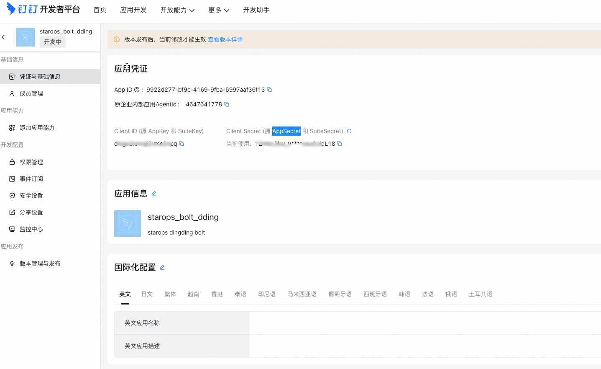
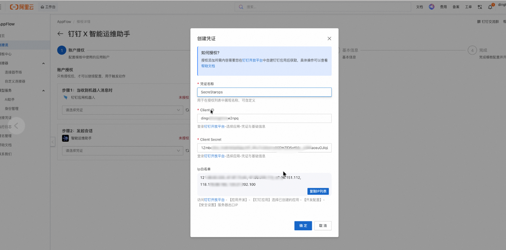
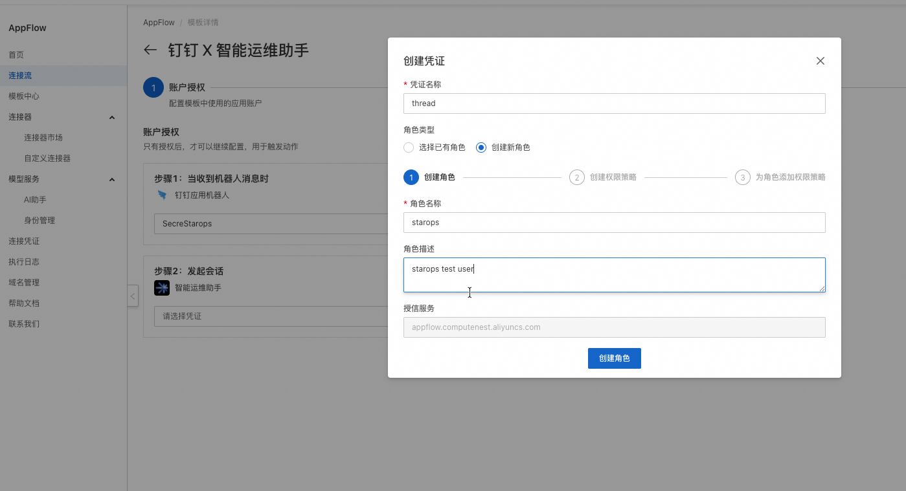
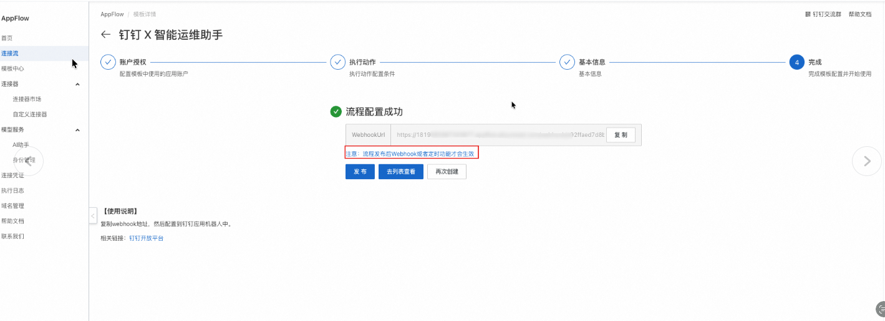
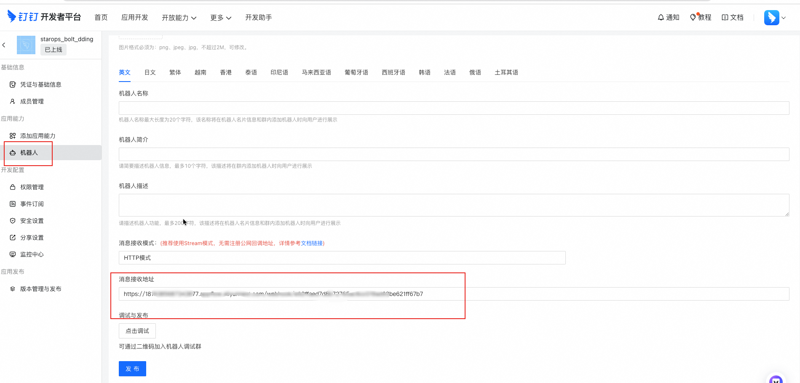
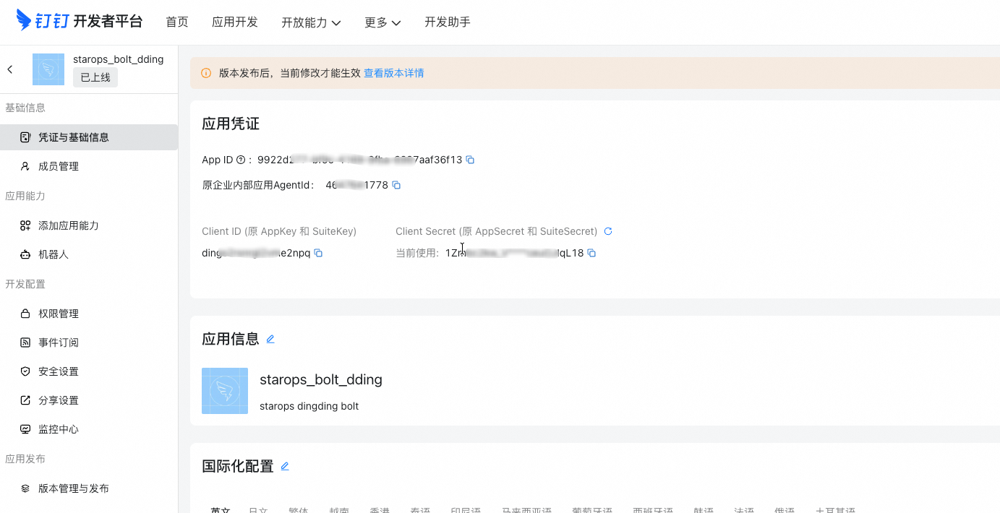
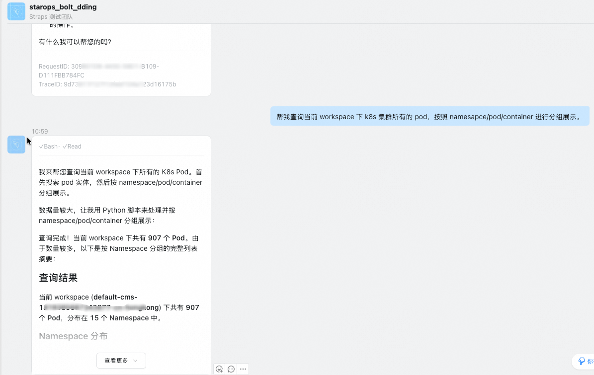

  <a href="/doc/starops/starops.html">STAROps</a>
  /
  扩展集成

# 集成钉钉 IM 通道

分类 · 扩展集成

当您希望在钉钉中直接与 STAROps 数字员工对话——例如在单聊中查询可观测数据、在群内 @机器人发起告警诊断时，您可以按照本文完成钉钉应用创建、AppFlow 连接流配置和机器人发布。

## 安装 Skill

本实践配套一份 SOP Skill。安装方式任选其一：本地 Agent 走 [`npx skills`](https://www.npmjs.com/package/skills)，STAROps 数字员工下载 tar.gz 后在控制台「技能管理 → 上传技能」上传。

| Skill | 作用 | 本地 Agent（npx） | STAROps 控制台（tar.gz） |
|---|---|---|---|
| `dingtalk-integration-sop` | 引导 Skill：按 4 步 SOP 协助用户完成钉钉应用创建、AppFlow 连接流双凭证授权、机器人配置发布，最终在钉钉内与 STAROps 数字员工对话。 | `npx skills add aliyun-sls/sls-doc-skills --skill dingtalk-integration-sop` | [dingtalk-integration-sop.tar.gz](https://starops-demo.oss-cn-beijing.aliyuncs.com/starops/demo/starops-best-practice/dingtalk-integration/docs/dingtalk-integration-sop.tar.gz) |

## 背景信息

STAROps 数字员工默认通过控制台对话使用。接入钉钉后，值班团队无需切换到控制台，可以直接在日常协作工具中发起诊断和查询。

整个集成链路由三个平台串联：

1. **钉钉开放平台**：创建企业内部应用，作为机器人的载体。
2. **阿里云 AppFlow**：通过预置模板「钉钉 X 智能运维助手」建立钉钉应用与 STAROps 数字员工之间的消息桥接，生成 WebhookUrl。
3. **STAROps 控制台**：提供已创建的数字员工，作为机器人的后端智能体。

配置完成后，用户在钉钉中发送的消息经由 AppFlow 转发到 STAROps 数字员工处理，数字员工的响应再经由同一链路返回钉钉。

## 前提条件

- 您的钉钉账号拥有企业组织管理员或开发者权限，能够在钉钉开放平台创建企业内部应用。
- 您的阿里云账号拥有 AppFlow 的操作权限。
- 您已在 STAROps 控制台创建数字员工，该数字员工将作为钉钉机器人的后端。

## 步骤一：在钉钉开放平台创建应用

本步骤获取 Client ID 和 Client Secret，供步骤二中 AppFlow 授权使用。

1. 使用管理员或开发者账号登录[钉钉开发者平台](https://open-dev.dingtalk.com/)，选择目标企业组织。
2. 进入**应用开发 > 钉钉应用**，单击**创建应用**，填写应用名称（例如 `智能运维助手`）、描述和图标后保存。
3. 在应用详情页进入**凭证与基础信息 > 应用凭证**区域，记录 **Client ID** 和 **Client Secret**。

> 说明：Client Secret 创建后仅显示一次。如果未及时记录，需要在该页面重置 Client Secret。

::: details 查看图片

:::

## 步骤二：通过 AppFlow 创建连接流

本步骤在 AppFlow 中完成两项授权（钉钉凭证 + STAROps 角色），然后发布连接流获取 WebhookUrl。

1. 登录阿里云 AppFlow 控制台，在模板中找到「钉钉 X 智能运维助手」，单击进入模板详情。
2. 进入**账户授权**阶段。首先创建钉钉应用机器人凭证：在弹窗中填写凭证名称，输入步骤一获取的 Client ID 和 Client Secret。IP 白名单栏可单击**复制IP列表**获取需要填入的地址。

::: details 查看图片

:::

> 说明：IP 白名单中的地址是 AppFlow 服务器的出口 IP。您需要将这些 IP 同步配置到钉钉开放平台的**开发配置 > 安全设置 > 服务器出口IP** 中，否则钉钉会拒绝 AppFlow 的请求。

3. 创建智能运维助手凭证：在弹窗中选择**创建新角色**，填写角色名称和描述，单击**创建角色**。该角色用于授权 AppFlow 调用 STAROps 数字员工的对话能力。

::: details 查看图片

:::

4. 两个凭证均创建完成后，进入**执行动作**配置。填写数字员工所在的 Region 和 Workspace，从下拉列表中选择已创建的数字员工。
5. 填写连接流名称和描述，单击**发布**。页面提示「流程配置成功」后，复制页面上的 **WebhookUrl**，步骤三需要使用。

> 说明：连接流必须处于已发布状态，Webhook 才会生效。如果跳过发布直接配置机器人，消息将无法到达数字员工。

::: details 查看图片

:::

## 步骤三：为钉钉应用配置机器人

本步骤为钉钉应用添加机器人能力，将 WebhookUrl 填入消息接收地址，完成消息链路的最后一环。

1. 返回钉钉开发者平台的应用详情页，在左侧导航中单击**添加应用能力**，添加**机器人**能力。
2. 进入**机器人**配置页面，填写机器人名称、头像和描述。这些信息会展示在用户搜索和添加机器人时的卡片中。
3. 将消息接收模式设置为 **HTTP 模式**，在**消息接收地址**中粘贴步骤二复制的 WebhookUrl。

::: details 查看图片

:::

4. 在左侧导航进入**开发配置 > 权限管理**，为应用添加以下权限：

| 权限名称 | 说明 | 是否必须 |
|---|---|---|
| `qyapi_robot_sendmsg` | 允许企业内部机器人发送消息 | 是 |
| `Card.Instance.Write` | 创建和投放卡片实例（交互式卡片消息） | 按需 |
| `Card.Streaming.Write` | 流式更新卡片（数字员工流式卡片） | 按需 |

> 说明：`qyapi_robot_sendmsg` 是必选权限，缺少该权限机器人将无法向用户发送响应消息。卡片相关权限用于支持富文本交互卡片和流式输出，如不需要可不添加。

5. 在左侧导航进入**版本管理与发布**，单击**创建新版本**，填写版本号和描述。
6. 配置使用范围，指定哪些部门或人员可以使用该机器人，然后发布。

> 说明：使用范围决定了谁能与该机器人对话。如果不限制，组织内所有人员均可与机器人对话，并通过数字员工查询可观测数据或执行管控动作。建议按实际需要限定到值班团队或运维相关人员。

::: details 查看图片

:::

## 步骤四：验证对话

1. 在钉钉中搜索步骤三配置的机器人名称，发起单聊。
2. 发送一条查询消息，例如「查询当前 workspace 下的 K8s Pod」。
3. 确认数字员工返回了查询结果，且响应中包含 RequestID。

如果未收到响应，请依次检查：AppFlow 连接流是否已发布、WebhookUrl 是否正确粘贴到机器人配置中、AppFlow 执行日志中是否有报错。

::: details 查看图片

:::

## 相关入口

- [返回 STAROps 最佳实践首页](/starops/starops.html)
- [打开 STAROps Playground](/playground/staropsdemo.html)
- [进入 STAROps 控制台](https://starops.console.aliyun.com)
