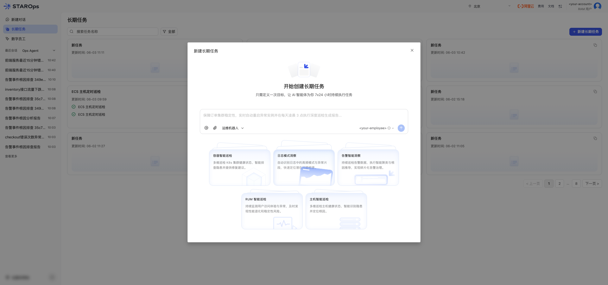
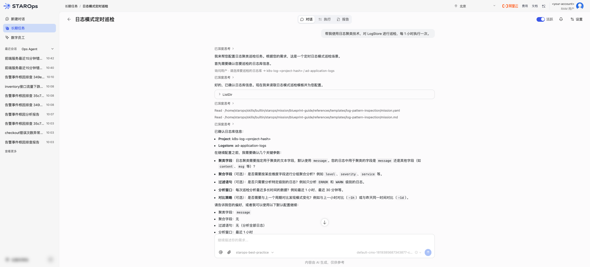
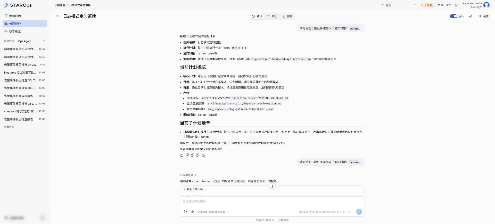
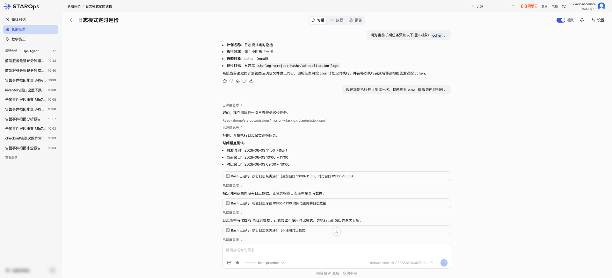
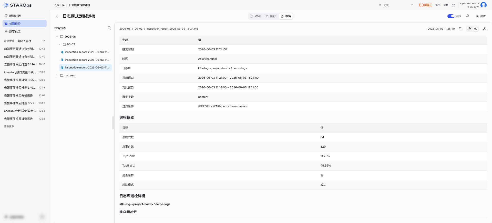
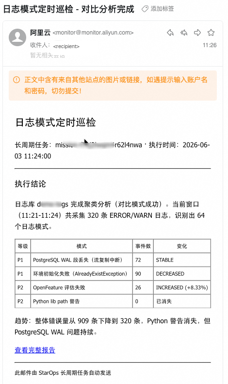

<div class="sls-starops-article-crumb">
  <a href="/doc/starops/starops.html">STAROps</a> <span class="sep">/</span> <span>场景实践</span>
</div>

# 日志模式定时巡检

<div class="sls-starops-article-meta">
  <span>分类 · 场景实践</span>
</div>

> [查看对话回放内容演示](/playground/log-insight-pattern-replay.html)

本实践把核心 Logstore 的日志模式定期纳入主动巡检：场景卡建任务、数字员工对话内编排配置，cron 周期触发模式聚类与基线对比，报告归档并送达通知通道。

适用范围：

- 巡检对象：单 Logstore，或 2 至 5 个 Logstore 跨库汇总
- 关注变化：新增模式、消失模式、高频噪声占比、错误趋势
- 触达方式：报告写入归档目录 + 摘要推送至钉钉 / 飞书 / 邮件 / Webhook

> 主动巡检路径：从核心 Logstore 周期发现模式变化与异常，与「告警 RCA 全链路分析」由告警下钻的方向互补。单次深度排查可走文末附录 5 步会话路径。

## 前提条件

- 已开通 STAROps 实例，账号有创建并启用长期任务的权限。
- 已有至少一个核心 Logstore（含日志数据），并确认 project / Logstore / region。
- 日志数据源已接入 SLS；若 Logstore 是 v2 行索引（无结构化字段），需在 SLS 控制台为聚类字段（如 `content` / `message` / `__line__`）开启字段索引。
- 已确认至少一种可达的通知通道（钉钉 / 飞书 / 邮件 / Webhook 等）。

## 安装 Skill

本实践会落地一份 SOP Skill。安装方式任选其一：本地 Agent 走 [`npx skills`](https://www.npmjs.com/package/skills)，STAROps 数字员工下载 tar.gz 后在控制台「技能管理 → 上传技能」上传。

| Skill | 作用 | 本地 Agent（npx） | STAROps 控制台（tar.gz） |
|---|---|---|---|
| `log-insight-pattern-sop` | 引导 Skill：陪 Agent 在 STAROps 控制台「长期任务」入口单击「日志模式洞察」场景卡建任务，按 5 步（场景卡选择 → 对话内自然语言收集参数 → 草稿校验 → 应用计划 → 等 cron 触发）完成配置，并保留附录 5 步会话路径覆盖单次深度排查。 | `npx skills add aliyun-sls/sls-doc-skills --skill log-insight-pattern-sop` | [log-insight-pattern-sop.tar.gz](https://starops-demo.oss-cn-beijing.aliyuncs.com/starops/demo/starops-best-practice/log-insight-pattern/docs/log-insight-pattern-sop.tar.gz) |

下文步骤一至步骤五的提问模板与配置摘要与该 SOP 一一对应。

## 步骤一：单击「日志模式洞察」场景卡

进入 STAROps 控制台，从左侧导航打开「长期任务」列表，单击右上角「新建长期任务」按钮。模态弹窗会展示 5 张固定场景卡。

1. 进入 STAROps 控制台，左侧导航单击「长期任务」。
2. 在「长期任务」列表右上角单击「新建长期任务」按钮。
3. 模态弹窗加载完成后展示 5 张固定场景卡：「容器智能巡检」、「日志模式洞察」、「告警智能洞察」、「RUM 智能巡检」、「主机智能巡检」。
4. 鼠标悬停「日志模式洞察」卡片，确认副标题与模式聚类、异常片段定位相关（具体文案以控制台为准）。
5. 单击该卡片。平台自动创建新对话、注入预设提示词，由数字员工接管对话。

::: details 查看图片

:::

新建对话页打开后顶部任务名初始为「新任务」，应用计划后更新为配置的任务名。数字员工先询问要巡检的 Logstore。

## 步骤二：在对话中用自然语言提供配置参数

数字员工依次询问 6 类参数，日常表达即可回答，可逐项或一次性给出。

1. 输入总体诉求，例如：

   ```
   帮我使用日志聚类技术，对 Logstore 进行巡检，每 1 小时执行一次
   ```

2. 数字员工询问要巡检的日志库，按 `<project> / <Logstore>` 格式回答。
3. 数字员工询问关键参数（未指定时采用默认值）：

   | 询问项 | 回答示例 | 不指定时的默认值 |
   |---|---|---|
   | 聚类字段 | `content`（或 `message` / `msg` / `__line__`）| `message` |
   | 聚合字段（可选）| `level` / `service` 等维度字段 | 无 |
   | 过滤语句（可选）| `(ERROR or WARN) not chaos-daemon` | 无 |
   | 分析窗口 | `最近 1 小时` / `最近 24 小时` | 最近 1 小时 |
   | 对比策略（可选）| `-1h` / `-1d` / `-7d` | `-1h` |
   | cron 表达式 | `每 1 小时执行一次` / `每天 09:00` | `0 * * * *` |

4. 添加通知对象：「请为当前长期任务添加以下通知对象：`<通知对象名>`」。

::: details 查看图片

:::

参数收齐后，数字员工进入下一步：数据探查与草稿写盘。

> 说明：Logstore 数据为空或聚类字段不存在时，数字员工会先做数据探查，给出候选 Logstore 的数据量与字段对比，引导您切换 Logstore 或在 SLS 开启字段索引。

## 步骤三：等数字员工生成草稿并通过校验

参数收齐后，数字员工会自动加载平台内置的 Blueprint 模板，在任务工作目录下生成配置草稿（`mission.yaml`）与说明文件（`mission.md`），并执行校验。

1. 数字员工依次完成：加载 Blueprint 模板 → 校验通知对象有效性 → 生成草稿 → 校验语法、数据连通性与时间窗口。
2. 校验通过后，数字员工输出「本次调整」摘要：
   - 任务名称、cron 表达式、通知对象、调整说明
   - 当前计划概览（核心计划、目标、巡检目标、产物路径）
   - 当前子计划清单
   - 末尾确认提示（询问是否提交此计划配置）

::: details 查看图片

:::

校验失败时（如 `cronExpression` 非 5 段式、通知对象不存在、数据连通性失败），数字员工指出具体失败项。在对话内追加自然语言修改指令（例如「把 Logstore 换成 demo-logs，聚类字段换成 content」），数字员工重新生成草稿并校验。

## 步骤四：确认应用计划，任务进入活跃状态

摘要无误后输入 `yes`（或「确认」「应用」等等价表达），数字员工更新长期任务并应用计划。

1. 输入 `yes`。
2. 数字员工依次完成：更新长期任务配置 → 应用计划（草稿提升为活跃配置）。
3. 数字员工输出「当前计划状态」摘要：计划名称、执行频率、通知对象、巡检目标。
4. 控制台右上角任务状态变为「活跃」。

::: details 查看图片

:::

任务进入活跃状态后按 cron 周期触发。需立即验证一次时，追加「现在立刻执行并且测试一次」，数字员工触发一轮测试运行，不影响 cron 时刻表。

## 步骤五：等 cron 触发，确认报告与通知均到达

首次 cron 触发后任务产出报告并发送通知。在两个位置确认结果：控制台「报告」页签 + 绑定的通知通道。

1. 等待首次 cron 触发时刻到达（控制台任务详情页可查看下次触发时刻）。
2. 进入控制台任务详情页的「报告」页签，左侧按月 / 日 / patterns 分类目录树展示所有产物：

   | 产物 | 路径 |
   |---|---|
   | 主报告 | `artifacts/YYYY-MM/MM-DD/inspection-report-YYYY-MM-DD-hh-mm.md` |
   | 各库洞察 | `artifacts/patterns/{project}/{Logstore}/important-information.md` |
   | 多库汇总（仅 `correlated` 模式）| `artifacts/patterns/cross-logstore-summary.md` |

3. 右侧渲染选中的报告内容，包含：

   - 元信息：触发时刻、当前窗口、对比窗口、聚类字段、过滤条件
   - 巡检概览：总模式数、总事件数、Top1 与 Top5 占比、是否采样、对比模式状态
   - 模式对比分析表、模式变更详情、单库风险评估

4. 检查通知通道是否收到摘要消息（含报告链接）。邮件主题：「日志模式定时巡检 - 对比分析完成」。

::: details 查看图片



:::

报告样例参考同目录 [`assets/sample-report.md`](./assets/sample-report.md)。首份报告产出后核对通知通道送达情况；后续巡检按 `cronExpression` 周期执行。

## 路径选择：场景卡与自定义 Skill

STAROps 提供两条建任务路径：

- **场景卡路径（本实践）**：控制台内置 5 张固定场景卡（容器智能巡检 / 日志模式洞察 / 告警智能洞察 / RUM 智能巡检 / 主机智能巡检），单击后自动注入预设提示词，数字员工在对话内接管配置
- **自定义 Skill 路径**：方案方编写 Skill 与脚本、注册数字员工后配置长期任务，覆盖平台未预设的垂直产品场景（如 RDS / Redis / Kafka 专项巡检）

两条路径的对照：

| 维度 | 场景卡（本实践）| 自定义 Skill 包装 |
|---|---|---|
| 前置工作 | 平台（5 张固定场景卡 + 内置 Blueprint）| 方案方（编写 Skill + 注册数字员工 + 配置长期任务）|
| 客户配置工作量 | 在对话里回答 4 至 6 个问题 | 编写 Skill 与脚本 + 注册 + 配置 cron |
| 覆盖场景 | 平台预设的 5 类标准场景之一 | 任何垂直产品自定义巡检 |
| 升级路径 | 平台 Blueprint 升级，客户自动受益 | 方案方自行维护版本 |
| 适用判断 | 客户场景与平台预设匹配 | 客户场景平台未覆盖 |

日志模式巡检属于平台预设场景，本实践采用场景卡路径。垂直产品的专项巡检可参考 [RDS 周期性自动巡检](/starops/practices/rds-inspection-via-script/article.html)。

## 常见问题

> 日常咨询优先在 STAROps 控制台 @数字员工提问。对话内的数字员工持有当前任务上下文（Logstore / cron / 过滤条件），答案比离线照搬本节更精准。本节供离线场景或机制理解参考。

### 数据量预检超过 5 万条，选过滤还是采样

优先在 `filter` 字段追加业务关键词（如 `level: ERROR` 或 `service: payment`）做精准过滤。无法精准过滤时显式设置 `samplingAcknowledged: true` 接受采样风险——此时报告标注 `sampled=true` 与 `sample_ratio`，结论显式声明受采样影响。

### `--compare-offset` 报「no log data in the specified time range」

对比窗口失败时 Blueprint 内嵌降级方案改走「双查询对比」：分别查当前窗口与对比窗口的模式集，本地完成对比。两个窗口都查不到数据时，核对 Logstore 数据保留期是否覆盖对比偏移。

### 冷启动或数据量不足，如何先验证巡检任务能跑通

新接入的 Logstore 没有 1 小时或 1 天历史数据时，临时把对比偏移调到 `-3min` 跑通连通性。数据积累到 1 小时以上后切回 `-1h` 或 `-1d`。`-3min` 仅用于冷启动，不适合生产场景的有意义对比。

### `correlated` 跨库分析输出为空

`correlated` 模式要求 2 至 5 个 Logstore 在业务上强相关（如同一调用链的 nginx / 应用 / 数据库）。无关联的 Logstore 使用 `correlated` 会因找不到共同实体而退化为各自独立分析，此时建议改回 `independent`。

### 高频噪声模式占比超过 80%

在该 Logstore 的 `filter` 字段追加排除条件（如 `not content:"chaos-daemon"`），下一次 cron 触发后即按新过滤规则重新聚类。每个 Logstore 可独立配置 `filter`。

### 需要做单次深度排查，不想等 cron 周期怎么办

在 STAROps 会话中按 5 步顺序提问（模式聚类 → 新增模式 → 错误趋势 → 代表样本 → 影响判断），适合单次深度排查与个案根因分析；长期任务路径不适合一次性需求。

### Mission 触发后没有产出报告

按以下顺序排查：

1. 任务状态是否活跃
2. 数据量预检是否通过
3. `cronExpression` 是否为有效 5 段式
4. 通知通道是否绑定成功
5. 控制台执行记录中 `missionTaskId` / `run_id` 的错误日志

## 相关入口

- [返回 STAROps 最佳实践首页](/starops/starops.html)
- [打开 STAROps Playground](/playground/staropsdemo.html)
- [进入 STAROps 控制台](https://starops.console.aliyun.com)
