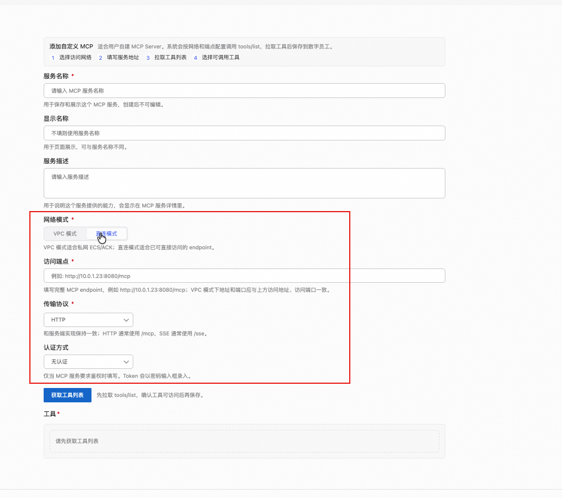
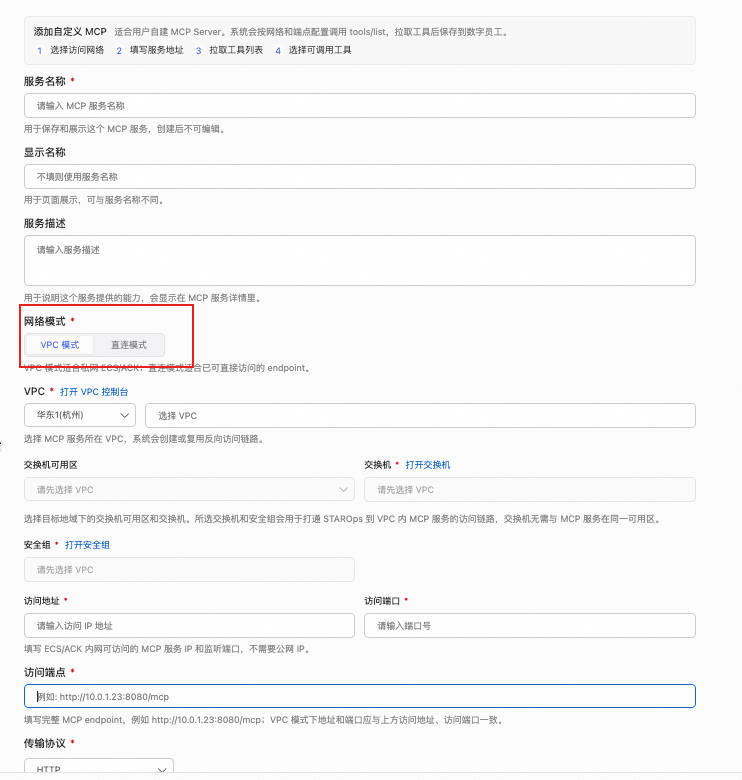
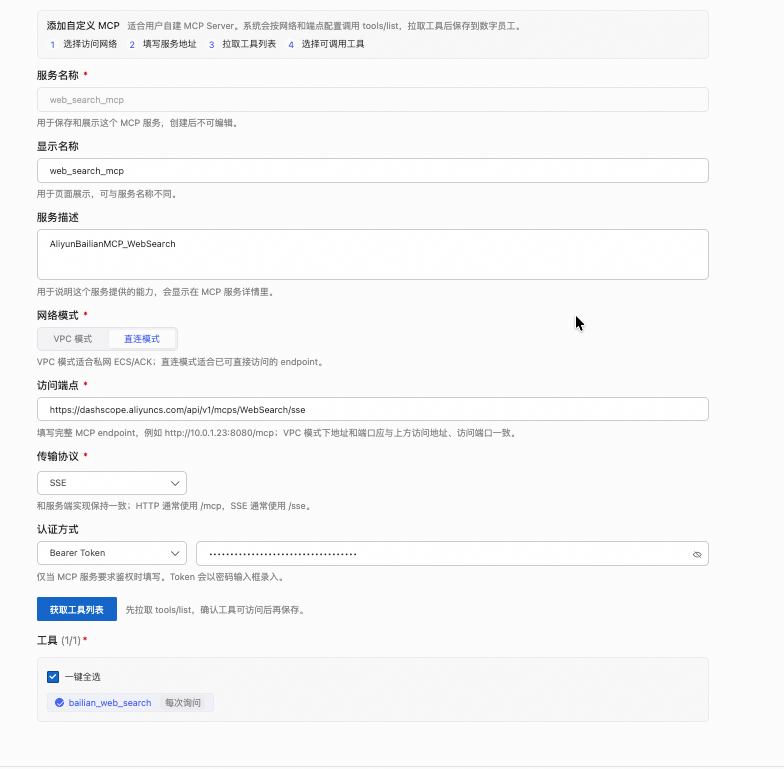
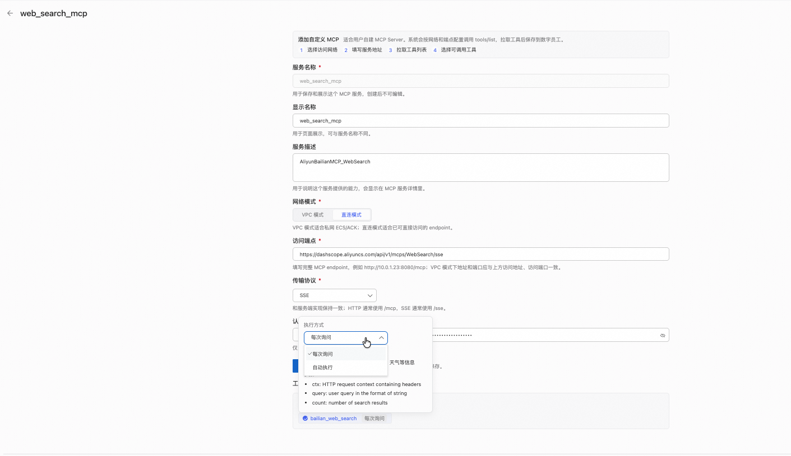
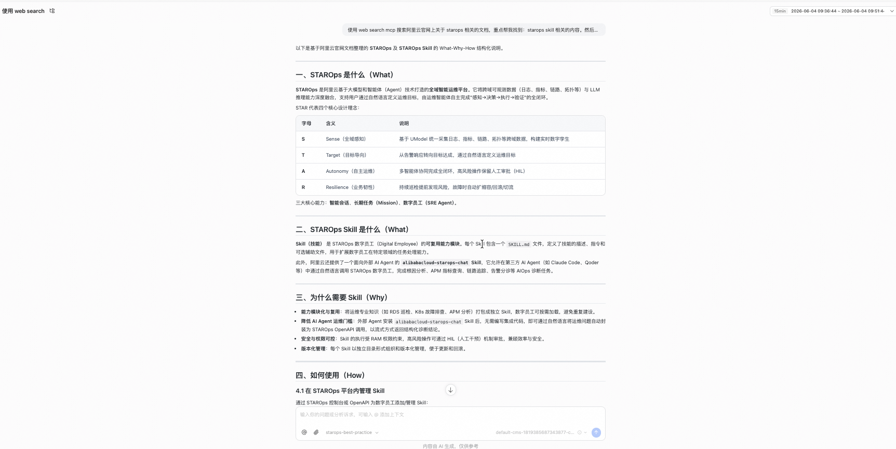
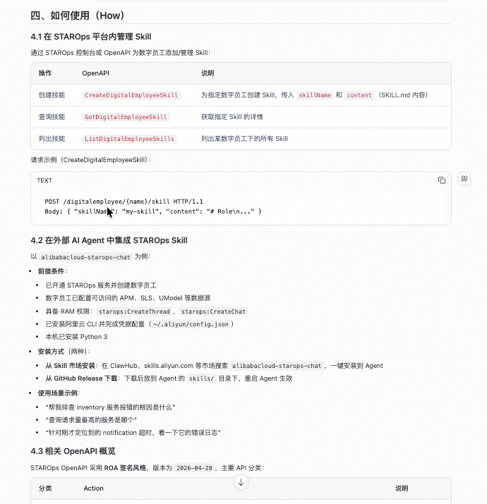
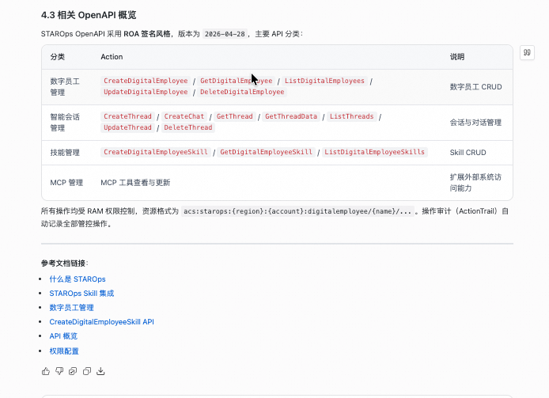

<div class="sls-starops-article-crumb">
  <a href="/doc/starops/starops.html">STAROps</a> <span class="sep">/</span> <span>扩展集成</span>
</div>

# 接入外部 MCP 工具

<div class="sls-starops-article-meta">
  <span>分类 · 扩展集成</span>
</div>

当您需要让数字员工调用外部能力（例如搜索阿里云官网、查询内部 CMDB、读取 GitLab commit、拉取 Jenkins build 状态、读写工单系统等），并希望接入一次、所有数字员工都能复用时，您可以通过控制台「添加自定义 MCP」入口把外部 MCP Server 接进来。本文以阿里云百炼 web_search MCP 为范例（SSE 协议 + 直连模式 + Bearer Token 认证），其他传输协议、网络模式与认证方式按相同表单结构自行选择。

## 前提条件

- 已开通 STAROps 实例，账号具备「自定义 MCP」管理权限（默认平台管理员角色具备）
- 目标 MCP Server 的访问端点已就绪（公网 URL 或 VPC 内地址），传输协议为 HTTP `/mcp` 或 SSE `/sse`
- 认证凭证已就绪（Bearer Token 或自定义 Header），Bearer 类需确认 Token 有效期
- 网络可达：直连模式需公网出口；VPC 模式需准备好 VPC ID、交换机 ID、安全组 ID、服务 IP + 端口
- 至少 1 个数字员工已创建，用于挂载 MCP 工具

## 步骤一：在控制台打开「添加自定义 MCP」弹窗并选网络模式

控制台路径：左侧导航「数字员工」→ 选择目标数字员工 →「工具」tab →「MCP」子 tab → 右上角「添加自定义 MCP」按钮。

弹窗顶部进度条显示 4 段（选择访问模式、填写服务信息、拉取工具列表、选择可调用工具），实际全部字段在一页表单内可填完。

先填两个标识字段：

| 字段 | 说明 | 范例值 |
|---|---|---|
| 服务名称 | 英文标识符，唯一不可修改 | `web_search_mcp` |
| 显示名称 | UI 展示用 | `web_search_mcp` |
| 服务描述 | 用于显示提示，可选 | `AliyunBailianMCP_WebSearch` |

然后选择**网络模式**：

- **直连模式**：适用于公网可达的 MCP Server（如阿里云百炼 dashscope SaaS）。展开后只需填访问端点 URL。
- **VPC 模式**：适用于私网部署的 MCP Server（如内部 CMDB、工单系统）。展开后需填 VPC ID、交换机 ID、安全组 ID、服务 IP 和端口。
- 混合部署（公网 SLB + 私网后端）优先走 VPC 模式，避免数据出域。

::: details 查看图片





:::

## 步骤二：填服务端点、传输协议与认证

直连模式下需填以下 4 个字段。以阿里云百炼 web_search MCP 为例：

**访问端点**：

```text
https://dashscope.aliyuncs.com/api/v1/mcps/WebSearch/sse
```

SSE 协议以 `/sse` 结尾；HTTP 协议以 `/mcp` 结尾。

**其他 3 个字段**：

| 字段 | 范例值 | 说明 |
|---|---|---|
| 传输协议 | `SSE` | 下拉可选 `SSE` 或 `HTTP` |
| 认证方式 | `Bearer Token` | 下拉可选 `Bearer Token` / `Custom Header` / `无` |
| Token | 密码框 | 填 dashscope API Key，服务端加密存储 |

完整配置页全貌：

::: details 查看图片



:::

## 步骤三：拉取工具列表并选工具

4 个字段填完后，弹窗下方「拉取工具列表」按钮变为可点击状态。点击该按钮后，平台向 MCP Server 发握手请求并返回该 Server 暴露的所有工具。

阿里云百炼 web_search MCP 返回 1 个工具：

| 工具名 | 参数 | 用途 |
|---|---|---|
| `bailian_web_search` | `ctx` / `query` / `count`（默认 5） | 调用搜索引擎返回结果数组（title / link / snippet / date） |

工具列表下方有「全选 / 取消全选」复选框，用于把该 MCP 下所有工具批量勾选给数字员工。勾选完成后，弹窗内出现「工具 (N/M)」标签（N 为已勾选数，M 为总数）。

## 步骤四：给每个工具配执行策略

每个勾选的工具在表单底部出现一行「工具名 + 执行策略下拉」。3 个策略可选：

::: details 查看图片



:::

| 策略 | 行为 | 适用 MCP 类型 |
|---|---|---|
| 每次询问 | 数字员工调工具前在 chat 里弹卡片，用户点确认才执行 | 变更类（P1）、高风险类（P2） |
| 自动执行 | 数字员工自主决定调用，不打断 | 查询类（P0）、分析类（P0） |
| 谨慎执行（默认） | 数字员工自主决定调用，但调用前在 chat 流式输出说明 | 不确定时的安全档 |

本范例的 `bailian_web_search` 属于查询类，选「自动执行」即可保证流畅的搜索体验。执行策略是工具级配置（不是 MCP 服务级），同一 MCP 下不同工具可配不同策略，例如 `read_*` 走自动、`write_*` 走每次询问。

策略配完后点弹窗底部「保存」按钮，回到 MCP 列表页，新接入的 MCP 显示在列表里且状态正常。

## 步骤五：挂数字员工 + chat 验证

如果接入 MCP 时已经在某个数字员工配置入口下，此步可跳过；否则需要进入目标数字员工的配置页 -> 工具 tab -> 勾选刚接入的 MCP。

挂载后在 chat 里提问触发工具调用：

```text
请使用 web_search MCP 在阿里云官网搜索「STAROps」，
综合返回结果给我说明 STAROps 平台是什么、为什么需要它、如何使用它。
```

数字员工的预期行为：

1. 识别意图，决定调用 `bailian_web_search` 工具
2. 拼参数（query 内含 `site:aliyun.com` 过滤、count 取 5-10）
3. 调用工具，收到搜索结果数组
4. 综合结果输出 3 段：What（STAROps 是什么）、Why（为什么用它）、How（如何使用，包含 Skill OpenAPI 管理、`外部 AI Agent 集成`、OpenAPI 概览三段）

::: details 查看图片







:::

操作完成后，chat 内可见数字员工调用 `bailian_web_search` 的工具调用卡片（含输入参数与输出结果摘要），下方综合输出 3 段结构化文字。

## 接入前 5 项检查

接入任何外部 MCP 之前，建议按以下 5 项检查逐条核对：

| 检查项 | 要求 | 范例（百炼 web_search） |
|---|---|---|
| 网络 | 明确公网、VPC、AI 网关或函数计算接入方式 | 公网（直连模式，端点 `dashscope.aliyuncs.com`） |
| 权限 | 工具级最小权限，避免一个 MCP 暴露过大能力 | Token 仅限 web_search 命名空间 |
| 审计 | 所有调用能追踪到用户、数字员工、任务、参数 | 平台默认审计：chat 内调用卡片与后台执行日志 |
| 幂等 | 写操作需说明是否可重试、如何回滚 | 不适用（查询类，可任意重试） |
| 降级 | 工具不可用时不阻塞整体对话 | 数字员工自主降级：搜索失败时改用内置知识回答 |

不同类型的 MCP 对应不同的执行策略默认值：

| MCP 类型 | 优先级 | 示例 | 默认执行策略 |
|---|---|---|---|
| 查询类 | P0 | 查询 CMDB、GitLab commit、Jenkins build、工单状态 | 自动执行 |
| 分析类 | P0 | 代码搜索、日志样本提取、配置差异分析 | 自动执行或谨慎执行 |
| 变更类 | P1 | 创建工单、暂停流水线、扩缩容 | 每次询问 |
| 高风险类 | P2 | 删除资源、强制回滚、重启核心服务 | 强制 HIL 与二次确认 |

本范例属于查询类，「自动执行」是合理选择。变更类与高风险类的接入治理涉及 HIL 流程、审批工单、回滚演练，建议先按上表配「每次询问」策略兜底，再按内部审批流程评估是否放宽。

## 常见问题

### 拉取工具列表时按钮没反应或报错怎么处理

请按以下顺序排查：

1. 端点 URL 拼写是否正确（SSE 协议以 `/sse` 结尾，HTTP 协议以 `/mcp` 结尾）
2. 传输协议下拉与端点协议是否匹配
3. 认证 Token 是否过期
4. 网络可达性（VPC 模式需检查安全组放行 STAROps 出口 IP）

排查后如仍失败，可在控制台 chat 内直接 @数字员工，把 MCP 服务名报给数字员工，由数字员工查后台错误日志定位。

### Bearer Token 过期了如何续

打开 MCP 列表页，找到目标 MCP 进入编辑页（与新建入口共用同一弹窗），重填 Token 字段后保存，新调用立即生效。生产场景建议配 Token 续期提醒（钉钉或飞书 webhook）提前感知。

### 多个 MCP 之间工具同名是否会冲突

平台按 MCP 服务名做命名空间隔离（同一 MCP 内工具名唯一即可）。chat 内调用时数字员工按服务名加工具名两段定位，不会跨 MCP 误调。

### 执行策略选了「每次询问」感觉太啰嗦

执行策略可在 MCP 编辑页随时调整。查询类工具选「自动执行」更流畅；变更类必选「每次询问」避免误改；不确定时走「谨慎执行」（数字员工调用前在 chat 流式说明）。

## 相关入口

- [返回 STAROps 最佳实践首页](/starops/starops.html)
- [打开 STAROps Playground](/playground/staropsdemo.html)
- [进入 STAROps 控制台](https://starops.console.aliyun.com)
