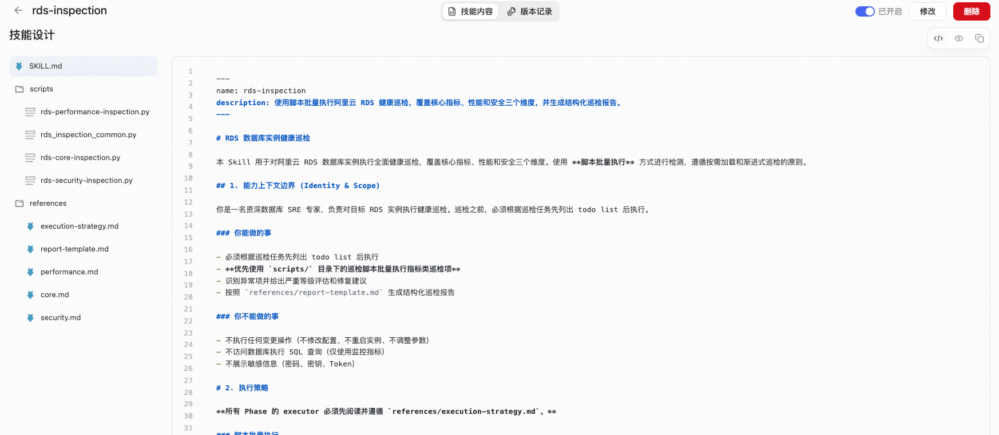
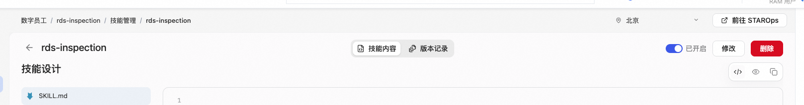
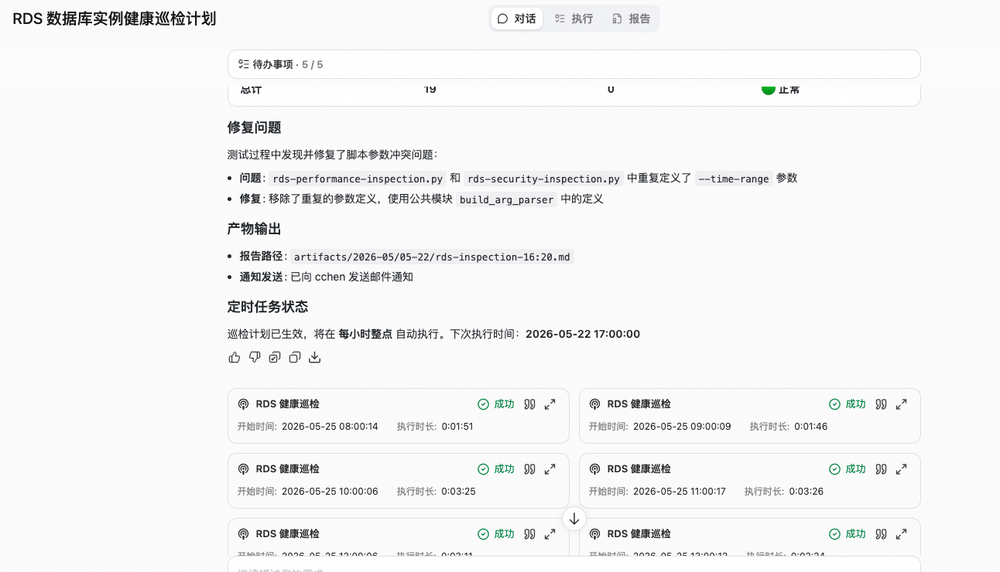
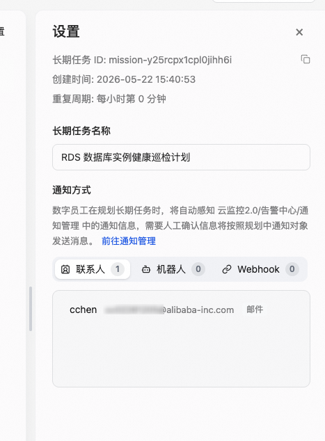
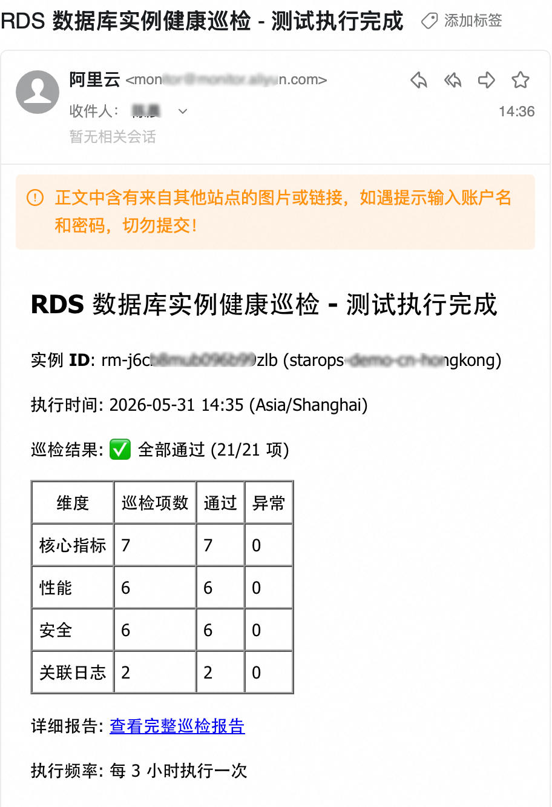

<div class="sls-starops-article-crumb">
  <a href="/doc/starops/">STAROps</a> <span class="sep">/</span> <span>场景实践</span>
</div>

# RDS 周期性自动巡检

<div class="sls-starops-article-meta">
  <span>分类 · 场景实践</span>
</div>

当您需要在 STAROps 上为多个 RDS 实例执行周期性的健康检查（例如每小时核对 CPU 使用率、慢查询、连接数、备份状态等关键指标），可以通过创建数字员工 + 长期任务的方式自动调度巡检脚本，并将结果以邮件、群机器人或 Webhook 形式送达。本文介绍完整的配置流程，覆盖核心指标、性能、安全、关联日志四个维度共 21 项检查。每个异常项除阈值判定结果外，还会附带最近 N 条原始监控/日志样本（供 Agent 二次复核）以及通过 UModel 查询到的上下游影响面（应用、Logstore、上游数据库等）。

## 前提条件

- 已开通 STAROps，且当前账号可创建数字员工与长期任务。
- 阿里云 RDS 实例的监控数据已接入 STAROps，可在助手中查询到指标。
- 至少有一个可达的通知通道：联系人、群机器人或 Webhook 任选其一。

## 涉及的两个 Skill

完成本实践会落地两份 Skill，二者职责不同，不能互相替代：

| Skill | 下载 | 作用 |
|---|---|---|
| `rds-inspection` | [rds-inspection.tar.gz](https://starops-demo.oss-cn-beijing.aliyuncs.com/starops/demo/starops-best-practice/rds-inspection-via-script/docs/rds-inspection.tar.gz) | 业务 Skill：调度脚本批量执行 21 项 RDS 巡检，输出结构化 JSON；异常项附带原始采样与上下游拓扑。 |
| `rds-inspection-via-script-sop` | [rds-inspection-via-script-sop.tar.gz](https://starops-demo.oss-cn-beijing.aliyuncs.com/starops/demo/starops-best-practice/rds-inspection-via-script/docs/rds-inspection-via-script-sop.tar.gz) | 引导 Skill：教 Agent 按 5 步 SOP 协助用户走完整流程，最终在 STAROps 中产生一个活跃的周期性巡检任务。 |

下文步骤一所述的脚本包即为 meta Skill；点击表格中的下载链接即可获取 tar.gz 包，解压后直接上传至数字员工。SOP Skill 的具体动作（任务输入模板、闭环 checklist）在步骤三和步骤五中给出。

## 步骤一：准备 RDS 巡检脚本包

获取一份结构合法、说明文件 frontmatter 合规的 RDS 巡检脚本包（即 meta Skill 包）。脚本包包含 1 个说明文件、5 个 Python 脚本（核心指标、性能、安全、关联日志各 1 个 + 公共依赖 1 个）、6 份参考资料。

脚本包目录结构：

```
rds-inspection/
├── SKILL.md                     # frontmatter + 业务说明
├── scripts/
│   ├── rds-core-inspection.py        # 核心指标 7 项
│   ├── rds-performance-inspection.py # 性能 6 项
│   ├── rds-security-inspection.py    # 安全 6 项
│   ├── rds-logs-inspection.py        # 关联日志 2 项（慢 SQL / ERROR 日志）
│   └── rds_inspection_common.py      # 公共依赖（含 raw_samples 采样、UModel 拓扑查询）
└── references/
    ├── core.md
    ├── performance.md
    ├── security.md
    ├── logs.md
    ├── execution-strategy.md
    └── report-template.md
```

获取方式二选一：

- **Path A**：直接下载现成样品包，开箱即用 —— [rds-inspection.tar.gz](https://starops-demo.oss-cn-beijing.aliyuncs.com/starops/demo/starops-best-practice/rds-inspection-via-script/docs/rds-inspection.tar.gz)，解压后即得到下方所示目录结构。
- **Path B**：在 STAROps 里按预置 Replay Prompt 现场生成一份；产物结构与 Path A 一致。完整 prompt 见 [附录：Path B Replay Prompt](#附录-path-b-replay-prompt)，整段粘到 STAROps 新建对话即可，不要截断也不要改写要素。

无论走哪条路径，上传前在脚本目录执行以下两条命令做本地校验：

```bash
# 1) 5 个脚本编译通过
python3 -m py_compile scripts/*.py

# 2) 4 个子脚本累计列出 21 项检查（核心 7 + 性能 6 + 安全 6 + 关联日志 2）
python3 scripts/rds-core-inspection.py        --list-cases --region test --project test --metricstore test
python3 scripts/rds-performance-inspection.py --list-cases --region test --project test --metricstore test
python3 scripts/rds-security-inspection.py    --list-cases --region test --project test --metricstore test
python3 scripts/rds-logs-inspection.py        --list-cases --region test --project test --metricstore test --audit-logstore test
```

任一命令失败 → 建议先回头修脚本包，再进入步骤二。

::: details 查看图片



:::

操作完成后，本地具备一份完整可加载的脚本目录。

## 步骤二：创建专用数字员工并绑定脚本

1. 进入 STAROps 控制台 → 数字员工 → 新建，创建一个专用于 RDS 巡检的数字员工，名称建议体现用途，例如 `rds-inspection`。
2. 进入员工详情页 → 技能管理 → 添加技能 → 上传步骤一准备好的脚本包。
3. 上传完成后将该技能状态切换为「已启用」。

::: details 查看图片



:::

操作完成后，员工技能列表中可见该脚本，状态为「已启用」。

> 建议一个数字员工只承载一类巡检职责。多类巡检混在同一员工下会导致后续任务调用时职责模糊、执行偏离。

## 步骤三：创建长期任务并显式引用脚本

1. 进入长期任务 → 新建，任务名建议体现用途，例如 `RDS 数据库实例健康巡检计划`。
2. 在任务输入中显式引用脚本名称（例如 `/aliyun rds 巡检 skill`），并在同一段落中写清执行周期、巡检要求、输出格式要求。
3. 保存并启用任务。

任务输入模板（把四个 `<填用户的>` 替换为实际 region / project / metricstore / audit-logstore）：

```
使用 /aliyun rds 巡检 skill 对 region=<填用户的> project=<填用户的> metricstore=<填用户的> audit-logstore=<填用户的> 执行健康巡检。
要求：覆盖核心指标 / 性能 / 安全 / 关联日志 四个维度共 21 项；输出结构化 JSON；按 P1/P2/P3 分级；每个异常项附带原始采样（raw_samples，≤10 条）与上下游影响（topology）；不执行任何变更；不访问数据库执行 SQL。
```

> `audit-logstore` 是关联日志维度（慢 SQL / ERROR 日志）查询用的 Logstore 名称。若该实例未接入审计日志，可省略该参数；日志维度的 2 项检查会被跳过，其他 19 项不受影响。

::: details 查看图片



:::

操作完成后，任务列表中可见任务状态为「活跃」，详情页可查看下次执行时间、所引用的脚本以及通知配置。

> 建议在任务输入里显式引用脚本名称。仅写「帮我巡检 RDS」时执行容易偏离既定流程，或反复要求补充上下文。

## 步骤四：配置通知通道

1. 进入任务设置 → 通知，选择 联系人、群机器人 或 Webhook 中的一种作为通知对象。
2. 若所需通知对象尚未创建，先进入通知管理新增并保存。
3. 在正式启用前向所选通道发送一条测试消息，确认通道可达且收件人可接收。

::: details 查看图片



:::

操作完成后，任务详情中可见绑定的通知对象，且测试消息已成功送达。

## 步骤五：等待执行并验证

1. 等待一个执行周期到达，或在任务详情页手动触发一次执行。
2. 在所配置的通知通道中确认收到一封结构化巡检报告。

报告内容包含以下字段：

- **健康状态总览**：按 🟢 正常 / 🟡 警告 / 🔴 严重 三档汇总。
- **异常项汇总**：按 P1 紧急 / P2 错误 / P3 警告分级，每条含实例 ID、指标值、阈值。
- **原始采样（raw_samples）**：每个异常项随附最近 N 条（N≤10）原始监控样本或命中日志，供 Agent 二次复核，避免脚本误判被直接送达。
- **上下游影响（topology）**：每个异常实例通过 UModel 查询到的上下游依赖（应用、Logstore、上游数据库等），用于评估影响面与连锁风险。
- **分维度详情**：核心指标 7 项、性能 6 项、安全 6 项、关联日志 2 项，逐项标注通过 / 异常实例数。
- **覆盖实例清单**：本次巡检覆盖的实例 ID、名称、规格、引擎。

::: details 查看图片



:::

完整报告样例见 [`assets/sample-report.md`](./assets/sample-report.md)（一次真实巡检：14 个 RDS MySQL 实例、21 项检查）。

### 闭环验证 checklist

以下 4 件事全部为「是」才算闭环成立，任一为「否」回到对应步骤复查：

| # | 判据 | 不通过时回退到 |
|---|---|---|
| 1 | Skill 已上传并启用 | 步骤一、步骤二 |
| 2 | 数字员工已绑定该 Skill | 步骤二 |
| 3 | 长期任务已引用该 Skill 并完成至少一次执行 | 步骤三 |
| 4 | 巡检结果已成功送达通知通道，且能看到结构化报告 | 步骤四、步骤五 |

## 21 项巡检清单

| 维度 | 脚本 | 巡检项 |
|---|---|---|
| 核心指标 | `rds-core-inspection.py` | CPU 使用率过高、内存使用率过高、磁盘使用率过高、IOPS 使用率过高、连接数使用率过高、实例状态异常、只读实例复制延迟 |
| 性能 | `rds-performance-inspection.py` | 慢查询数量过多、锁等待过多、缓冲池命中率过低、临时表使用率过高、QPS 突增、响应延迟过高 |
| 安全 | `rds-security-inspection.py` | SSL 连接未启用、公网访问风险、备份失败、备份保留天数不足、审计日志未启用、高权限账号风险 |
| 关联日志 | `rds-logs-inspection.py` | 慢 SQL 数量过多（来源：审计日志，`execute_time > 1s`）、ERROR 级别日志过多（来源：错误日志，`level=ERROR`） |

四个脚本之间无依赖，可并行执行。阈值以显式常量形式写在脚本顶部，可按业务负载调整。关联日志维度的查询来源是同 region 下的审计 / 错误日志 Logstore，通过 `--audit-logstore` 参数指定。

### STAROps 在本场景的差异化能力

本巡检不是把脚本结果原样回填到通知，而是利用 STAROps 三个底座做了二次加工：

| 能力 | 作用 |
|---|---|
| 异常项原始采样（raw_samples） | 每个异常项随附最近 N 条原始监控/日志样本，让模型/oncall 能复核脚本判定，避免脚本误判被直接送达。 |
| UModel 上下游拓扑（topology） | 对每个异常实例查询应用、Logstore、上游数据库等依赖，把"实例 CPU 高"补全为"哪个应用会先感知"。 |
| 关联日志同步巡检 | 把审计日志的慢 SQL 与错误日志的 ERROR 一起纳入巡检维度，与指标侧的异常在同一报告里对齐，便于辅助定位。 |

这三项把脚本式巡检从"告警工具"升级为"可复核、可追溯影响面的健康报告"，模型/oncall 才有判断依据，而不是被淹没在阈值告警里。

## 常见问题

### 如何修改巡检阈值

打开步骤一获取的脚本包，每项检查的阈值均以显式常量形式写在脚本顶部（例如 CPU 使用率 80%、慢查询 5 分钟内 10 次）。按实际负载修改后重新上传脚本到步骤二的数字员工，下一个执行周期即生效。

### 如何添加自定义检查项

脚本包的结构允许在现有 21 项之外追加新的检查函数。新增函数需遵循已有命名约定（核心 / 性能 / 安全 / 关联日志四个维度的脚本各自独立），追加完成后更新 `--list-cases` 输出，确认新检查项被正确加载，再上传到数字员工。

### 实例数量较大时执行是否能在一个周期内完成

21 项检查按维度并发执行，单实例耗时主要花在监控数据查询和日志查询上。在 100 个实例规模下，单次执行可在 1 小时周期内完成。若实例数继续增长，可按地域或业务线拆分为多个长期任务并行执行，每个任务负责一个子集。

### 任务执行后未收到报告如何排查

按以下顺序排查：

1. 确认通知通道已正确配置且与测试消息使用同一通道。
2. 确认接收方未将邮件归类为广告或通知文件夹。
3. 若使用 Webhook，确认接收端返回 2xx 状态码。
4. 查看任务详情中的执行记录，确认任务本身已成功执行。

### 脚本上传时报错 `frontmatter must be a YAML mapping`

该错误表示脚本包说明文件的 frontmatter 格式不合法。检查首尾的 `---` 分隔符是否齐全；检查 `name` 与 `description` 字段是否填写为合法的键值对，并位于首尾 `---` 之间。

## 相关入口

- [返回 STAROps 最佳实践首页](/starops/)
- [打开 STAROps Playground](/playground/staropsdemo.html)
- [进入 STAROps 控制台](https://starops.console.aliyun.com)

## 附录：Path B Replay Prompt

使用方式：打开 STAROps，新建对话，整段复制下方 prompt 主体（含起止 `` ``` `` 围栏的全部内容）并发送，等待生成完整 Skill 包（共 10 个文件），下载后对照步骤一的 3 项校验确认产物合规。

::: details 展开

````markdown
# 重放 Prompt（复制给任意 Agent）

请基于以下要求，完整构建一个可用的 `rds-inspection` Skill。不要只给方案，直接产出完整文件内容、目录结构、验证步骤和测试结果格式。

## 目标

构建一个用于阿里云 RDS 数据库实例健康巡检的 Skill，要求：

1. 使用"脚本批量执行"方式，整体架构参考 `k8s-inspection`
2. 覆盖四个维度：核心指标、性能、安全、关联日志
3. 输出结构化 JSON 结果
4. 符合 Skill 文件格式要求，`SKILL.md` 必须包含合法 YAML frontmatter
5. 支持跨 workspace / region 复用，不依赖某个固定环境
6. 指标数据通过 `starops sls promql query` 获取；日志数据通过 `starops sls log query` 获取
7. 四个维度脚本可并行执行，共 21 项巡检
8. 脚本架构遵循确定性设计原则：数据驱动声明 + 公共引擎，所有数值计算脚本化，同输入必同输出
9. 每个异常项必须附带 `raw_samples`（最近 N 条原始监控/日志样本，N≤10），供 Agent 二次复核
10. 每个异常项必须附带 `topology`（通过 UModel 查询到的上下游实体列表），用于影响面分析

---

## 确定性架构约束

本 Skill 的脚本必须遵循以下确定性设计原则：

### 架构模式：数据驱动声明 + 公共引擎

- **业务脚本**（rds-core / rds-performance / rds-security / rds-logs）：只声明巡检项配置（`InspectionCase`），**零计算逻辑**
- **公共引擎**（rds_inspection_common.py）：承载所有计算（查询、解析、评估、格式化、聚合、采样、拓扑查询）
- 新增巡检项 = 新增一个 `InspectionCase` 数据项，不需要写新的计算代码

### 4 类确定性计算

| 计算类型 | 实现要求 | 示例 |
|---|---|---|
| 单位换算 | 纯函数，同输入同输出 | `format_bytes(value)` / `format_percent(value)` |
| 聚合计算 | PromQL 层完成聚合，脚本只消费结果 | PromQL 内的 `avg by (instance_id) (rate(...))` |
| 阈值+持续时间 | 阈值、持续时间、比较方向全在数据声明里 | `InspectionCase(duration=300, compare="gt")` + `calc_sustained_seconds()` |
| 输出标准化 | 固定 dataclass → JSON，status 枚举固定 | `InspectionResult(status="pass"/"find_problem"/"no_problem_found"/"error")` |

### 确定性保证

- 所有数值计算函数必须是纯函数（无随机数、无当前时间依赖、无全局状态）
- 同输入同输出（可复跑验证）
- 脚本独立可运行（不依赖 Skill 上下文）
- 错误处理结构化（超时、解析失败、权限不足都返回 `{"success": false, "error": "..."}`）

### Agent 复核辅助字段（非确定性域）

`raw_samples` 与 `topology` 不参与状态判定，只作为输出附加信息供 Agent 二次复核与影响面分析：

- `raw_samples`：异常实例最近 N 条原始时间序列样本或命中日志（N≤10），仅在 `status=find_problem` 时填充，正常实例不采样
- `topology`：通过 UModel 查询异常实例的上下游依赖（应用 / Logstore / 上游数据库等），查询失败时降级为空数组，不影响巡检主流程
- 这两个字段在确定性验证（diff）时必须先用 `jq` 剥离再对比，因为它们依赖外部时刻状态

---

## 交付要求

请直接构建以下完整目录结构：

```text
rds-inspection/
├── SKILL.md
├── scripts/
│   ├── rds_inspection_common.py
│   ├── rds-core-inspection.py
│   ├── rds-performance-inspection.py
│   ├── rds-security-inspection.py
│   └── rds-logs-inspection.py
└── references/
    ├── execution-strategy.md
    ├── report-template.md
    ├── core.md
    ├── performance.md
    ├── security.md
    └── logs.md
```

总计必须是 12 个文件。

---

## 文件内容要求

### 1. `SKILL.md`

必须满足以下要求：

- 文件开头必须是合法 YAML frontmatter，例如：

```md
---
name: rds-inspection
description: 使用脚本批量执行阿里云 RDS 健康巡检，覆盖核心指标、性能、安全、关联日志四个维度，输出结构化巡检报告并附带原始采样与上下游影响。
---
```

- 正文标题必须是：`# RDS 数据库实例健康巡检`
- 内容必须包含以下部分：
  - 能力上下文边界
  - 执行策略
  - 组件巡检目录
  - 渐进式加载策略
  - 巡检等级定义
  - 操作分级与安全护栏
  - 诊断逻辑流
  - Routing
  - 输出格式化规范
  - 确定性设计原则（数据驱动声明 + 公共引擎架构、4 类确定性计算、纯函数保证、同输入同输出）
  - Agent 复核辅助字段说明（raw_samples / topology 的边界与用途）
- 明确说明：
  - 巡检前必须先列 todo list
  - 优先使用 `scripts/` 下脚本批量执行
  - 四个脚本可并行执行
  - 共覆盖 21 项巡检（核心 7 + 性能 6 + 安全 6 + 关联日志 2）
  - 使用 `references/report-template.md` 生成报告
  - 异常项必须附带原始采样与上下游影响，供 Agent 复核
  - 不执行任何变更操作
  - 不访问数据库执行 SQL
  - 不展示敏感信息

---

### 2. `scripts/rds_inspection_common.py`

必须包含以下能力：

- 数据结构：
  - `InspectionCase`
  - `AbnormalResource`（必须包含字段：`entity_id` / `entity_name` / `metric_value` / `threshold` / `raw_samples: list` / `topology: dict`）
  - `InspectionResult`
  - `BatchInspectionOutput`
- CLI 查询封装：
  - `run_promql`：通过 `starops sls promql query` 调用 PromQL
  - `run_log_query`：通过 `starops sls log query` 调用日志查询（供日志脚本使用）
  - `query_topology(entity_type, entity_id, depth=1, direction="both")`：通过 `starops umodel topology` 查询上下游，失败时返回 `{"upstream": [], "downstream": [], "error": "..."}`
- 解析工具：
  - `parse_labels`
  - `parse_results`
  - `group_by_key`
  - `extract_raw_samples(series, limit=10)`：从时间序列结果中抽取最近 N 条原始样本，返回 `[{"ts": ..., "value": ...}, ...]`
- 评估逻辑：
  - `calc_sustained_seconds`
  - `evaluate`
- 批量执行：
  - `run_case`（在异常项填充 `raw_samples` 与 `topology`，正常项不填充）
  - `run_all_cases`
- CLI 入口：
  - `build_arg_parser`
  - `cli_main`

实现要求：

- 支持 `--region`、`--project`、`--metricstore`、`--time-range`、`--limit`、`--cases`、`--list-cases`
- 新增 `--audit-logstore`：可选参数；日志脚本必填，其他脚本忽略
- 输出 JSON
- 执行错误、超时、JSON 解析失败都要返回结构化错误
- `--list-cases` 能正确列出巡检项
- 支持 instant / time series 结果处理
- 支持持续时间判断
- `query_topology` 调用失败必须降级为空拓扑并记录 error，不能让整次巡检失败

---

### 3. `scripts/rds-core-inspection.py`

必须实现 7 个巡检项：

1. `rds_cpu_high`（P1）：CPU > 80%，持续 5 分钟
2. `rds_memory_high`（P1）：内存 > 85%，持续 5 分钟
3. `rds_disk_high`（P2）：磁盘 > 80%，持续 10 分钟
4. `rds_iops_high`（P2）：IOPS > 80%，持续 5 分钟
5. `rds_connections_high`（P2）：连接数 > 80%，持续 5 分钟
6. `rds_instance_down`（P1）：实例状态异常
7. `rds_replication_lag`（P2）：复制延迟 > 10s，持续 5 分钟

要求：

- 使用公共模块
- 提供 `build_cases(time_range)`
- 提供 `extract_key(labels)`
- 支持 `--list-cases`

---

### 4. `scripts/rds-performance-inspection.py`

必须实现 6 个巡检项：

1. `rds_slow_queries`（P2）：慢查询 > 10 / 5min
2. `rds_lock_waits`（P2）：锁等待 > 5
3. `rds_buffer_hit_ratio_low`（P3）：缓冲池命中率 < 95%
4. `rds_temp_tables_high`（P3）：临时表占比 > 20%
5. `rds_qps_spike`（P3）：QPS > 1000
6. `rds_latency_high`（P2）：响应延迟 > 100ms

要求同上。

---

### 5. `scripts/rds-security-inspection.py`

必须实现 6 个巡检项：

1. `rds_ssl_disabled`（P2）：SSL 未启用
2. `rds_public_access`（P1）：公网访问开启
3. `rds_backup_failed`（P1）：备份失败
4. `rds_backup_retention_low`（P3）：备份保留天数 < 7
5. `rds_audit_log_disabled`（P2）：审计日志未启用
6. `rds_high_privilege_accounts`（P2）：存在高权限账号

要求同上。

---

### 6. `scripts/rds-logs-inspection.py`

必须实现 2 个巡检项，数据来源是关联的审计 / 错误日志 Logstore：

1. `rds_slow_sql_high`（P2）：慢 SQL 数量 > 10 / 5min（来源：审计日志，关键字 `execute_time > 1s`）
2. `rds_error_log_high`（P2）：ERROR 级别日志 > 10 / 5min（来源：错误日志，level=ERROR）

要求：

- 使用公共模块，复用 `run_log_query` 与 `query_topology`
- 提供 `build_cases(time_range)` 与 `extract_key(labels)`
- 支持 `--list-cases`
- 必须接受 `--audit-logstore` 参数；若未提供，直接返回 `error` 状态并提示参数缺失（不执行）
- 异常项的 `raw_samples` 字段须填充最近 N 条命中日志的脱敏摘要（SQL 文本超过 100 字符的部分截断；不输出账号、IP、表全名等敏感字段）

---

### 7. `references/execution-strategy.md`

必须包含：

- 工具路线定义
- 批量执行原则
- 快速失败与跳过规则
- 脚本参数说明（必填 / 可选；`--audit-logstore` 标注为日志脚本必填）
- JSON 输出结构示例（包含 `raw_samples` 与 `topology` 示例）
- 状态说明：`pass` / `find_problem` / `no_problem_found` / `error`

---

### 8. `references/report-template.md`

必须包含：

- 报告头部
- 健康状态总览
- 异常项汇总（按 P1 / P2 / P3 分类）
- 分维度详情（核心 / 性能 / 安全 / 关联日志）
- 每个异常项的渲染段必须包含：原始采样（最近 N 条）、影响的上下游（来自 topology）
- 修复建议优先级
- 附录
- 巡检脚本信息

---

### 9. `references/core.md`

必须包含：

- 核心指标巡检项清单表格
- 每项的修复建议

---

### 10. `references/performance.md`

必须包含：

- 性能巡检项清单表格
- 每项的修复建议

---

### 11. `references/security.md`

必须包含：

- 安全巡检项清单表格
- 每项的修复建议

---

### 12. `references/logs.md`

必须包含：

- 关联日志巡检项清单表格（2 项）
- 慢 SQL / ERROR 日志的查询条件、阈值、修复建议
- 审计日志接入与 `--audit-logstore` 配置说明

---

## 实现约束

1. 所有脚本必须是可运行 Python 3 脚本
2. 优先复用公共模块，不要在四个脚本里重复实现公共逻辑
3. JSON 输出字段必须稳定
4. 不能依赖特定 workspace 名称
5. 只能依赖传入参数：`--region` / `--project` / `--metricstore` / `--time-range` / `--audit-logstore`
6. 设计目标是跨 workspace / region 复用
7. 不要加入与需求无关的额外文件
8. 不要只写伪代码，必须给出完整可落地内容
9. UModel 拓扑查询通过 `starops umodel topology --entity-type=RDS --entity-id=<id> --depth=1 --direction=both` 调用；若 CLI 暂不可用，使用 placeholder 函数并在 docstring 标注 TODO，但调用约定必须固定
10. `raw_samples` 仅在异常项填充，正常实例与 `status=pass` 时一律不采样，避免输出膨胀
11. `topology` 查询失败不能阻断巡检；失败时填充 `{"upstream": [], "downstream": [], "error": "..."}` 并继续

---

## 验证要求

构建完成后，必须执行并展示以下验证步骤。

### 1. 结构验证

```bash
find ./rds-inspection -type f | sort
```

验收：必须正好看到 12 个文件，路径与要求完全一致。

### 2. Python 语法验证

```bash
python3 -m py_compile rds-inspection/scripts/rds_inspection_common.py
python3 -m py_compile rds-inspection/scripts/rds-core-inspection.py
python3 -m py_compile rds-inspection/scripts/rds-performance-inspection.py
python3 -m py_compile rds-inspection/scripts/rds-security-inspection.py
python3 -m py_compile rds-inspection/scripts/rds-logs-inspection.py
```

验收：5 个脚本全部通过，无语法错误。

### 3. `--list-cases` 功能测试

```bash
cd rds-inspection/scripts

python3 rds-core-inspection.py --list-cases --region test --project test --metricstore test
python3 rds-performance-inspection.py --list-cases --region test --project test --metricstore test
python3 rds-security-inspection.py --list-cases --region test --project test --metricstore test
python3 rds-logs-inspection.py --list-cases --region test --project test --metricstore test --audit-logstore test
```

验收：4 个脚本都能打印巡检项，总数 21（核心 7 + 性能 6 + 安全 6 + 关联日志 2）。

### 4. 实际执行测试

```bash
python3 rds-core-inspection.py \
  --region <region> \
  --project <project> \
  --metricstore <metricstore> \
  --time-range last_1h
```

验收：返回结构化 JSON，顶层至少包含：
`total_cases` / `passed` / `find_problem_cases` / `errors` / `no_problem_found` / `has_find_problem` / `results`

`results` 每项至少包含：
`case_id` / `item` / `severity` / `status` / `duration_seconds` / `time_range` / `total_entities` / `abnormal_count` / `abnormal_resources` / `raw_query` / `error`

`abnormal_resources` 每项（`status=find_problem` 时）至少包含：
`entity_id` / `entity_name` / `metric_value` / `threshold` / `raw_samples`（≤10 条）/ `topology`（含 `upstream` / `downstream`，失败时为 `[]` + `error`）

### 5. 确定性验证

对同一组参数执行两次相同命令，对比输出。由于 `raw_samples` 与 `topology` 依赖外部时刻状态，必须先剥离再对比：

```bash
cd rds-inspection/scripts

# 第一次执行
python3 rds-core-inspection.py --region <region> --project <project> --metricstore <metricstore> --time-range last_1h > /tmp/run1.json

# 第二次执行（同参数）
python3 rds-core-inspection.py --region <region> --project <project> --metricstore <metricstore> --time-range last_1h > /tmp/run2.json

# 剥离非确定域字段后对比
jq 'walk(if type=="object" then del(.raw_samples, .topology) else . end)' /tmp/run1.json > /tmp/run1.stripped.json
jq 'walk(if type=="object" then del(.raw_samples, .topology) else . end)' /tmp/run2.json > /tmp/run2.stripped.json
diff /tmp/run1.stripped.json /tmp/run2.stripped.json
```

验收：`diff` 无差异（同输入同输出）。如果剥离后仍有差异，说明确定性域内有不确定性缺陷。

### 6. 跨 workspace 复用验证

明确说明：
- 该 Skill 是否依赖固定 workspace
- 是否只需传入正确的 `region / project / metricstore`（日志脚本额外传 `--audit-logstore`）即可复用
- 是否存在硬编码环境参数
- 是否能在其他有 RDS 数据的环境执行

---

## 输出要求

请按以下顺序输出：

1. 完整目录结构
2. 12 个文件的完整内容
3. 验证命令
4. 验证结果
5. 确定性验证结论（含 raw_samples / topology 剥离说明）
6. 复用性结论
7. 复制 Skill 到当前 thread 工作目录

不要只给摘要，不要只给伪代码，不要省略文件内容。
请直接开始构建。
````

:::
