<div class="sls-starops-article-crumb">
  <a href="/doc/starops/starops.html">STAROps</a> <span class="sep">/</span> <span>语义上手</span>
</div>

# UModel 使用指南

<div class="sls-starops-article-meta">
  <span>分类 · 语义上手</span>
</div>

> [查看对话回放内容演示](/playground/umodel-metric-entity-replay.html)

[UModel](https://github.com/alibaba/UnifiedModel) 是面向企业 AI 和智能运维的厂商中立语义运行时，统一定义了实体、指标、日志、链路追踪、事件等数据的结构和关系。STAROps 基于 UModel 提供智能会话中的 `@` 引用、指标查询、拓扑分析和日志检索等能力。本文按指标、实体拓扑、日志、链路追踪、事件与操作手册、数据关联六个使用场景，用正反例样例说明如何正确使用 UModel 的语义信息。

## 前提条件

- 已开通 STAROps，且当前账号可创建数字员工与对话。
- 待查询实体（RDS 实例 / APM 应用 / k8s Pod 等）已被 UModel 纳入元数据；缺失实体无法 `@` 引用。
- 涉及拓扑分析时，trace 数据已接入 UModel 且采样率不宜过低。
- 已知道要查询的实体类型与名称（如 `rm-xxx`、`checkout`），切入点优先选具体实体而非抽象集群。

## 安装 Skill

本实践配套一份 SOP Skill，安装后 Agent 将按各场景引导用户识别提问中容易遗漏的要素。安装方式任选其一：本地 Agent 走 [`npx skills`](https://www.npmjs.com/package/skills)，STAROps 数字员工下载 tar.gz 后在控制台「技能管理 → 上传技能」上传。

| Skill | 作用 | 本地 Agent（npx） | STAROps 控制台（tar.gz） |
|---|---|---|---|
| `umodel-metric-entity-sop` | 引导 Skill：覆盖指标语义 / 实体拓扑 / 日志查询 / 链路追踪 / 事件关联等场景，检测反例提问并引导调整到正例形式。 | `npx skills add aliyun-sls/sls-doc-skills --skill umodel-metric-entity-sop` | [umodel-metric-entity-sop.tar.gz](https://starops-demo.oss-cn-beijing.aliyuncs.com/starops/demo/starops-best-practice/umodel-metric-entity/docs/umodel-metric-entity-sop.tar.gz) |


## 一、指标查询：MetricSet 语义

MetricSet 是 UModel 中定义指标的核心模型。每个 MetricSet 包含一组指标（Metric），每个 Metric 有以下关键字段：

| 字段 | 含义 | 是否必确认 |
|---|---|---|
| `data_format` | 指标的格式化方式（percent / percent_decimal / byte / bit / s / ms / KMB 等 30+ 种） | 必须 |
| `unit` | 显示单位（仅展示用，不做格式转换） | 必须 |
| `type` | 数据类型（gauge = 瞬时值 / counter = 累加计数器） | 必须 |
| `generator` | 指标的计算表达式（PromQL / SQL / SPL），决定指标是怎么算出来的 | 建议 |
| `aggregator` | 跨维度聚合方式（avg / sum / max 等），决定多实例合并时用什么函数 | 建议 |
| `interval_us` | 采集间隔（微秒），决定数据粒度 | 建议 |

### 样例 1 — 指标单位确认

**正例提问**：

```
@rm-j6cro90eaqh1rch5h 查 CPU 使用率，标注单位与 data_format
```

**实测返回**：明确给出指标元信息表——指标名 `AliyunRds_CpuUsage`、MetricSet `acs.metric.prometheus_rds_userid_instanceid`、类型 `gauge`、`data_format=percent`（0-100 百分比刻度，原始值即为百分比数值）、单位 `%`、采集周期 60s。CPU 使用率稳定在 0.12%-0.16%。

::: details 查看正例截图


:::

**反例提问**：`查一下 RDS CPU 高不高`

**反例返回**：Agent 借用上下文猜到实例，直接给结论"CPU 不高，负载极低"，用了内部默认阈值 70%，没有标注 `data_format` 和 `unit` 字段。

::: details 查看反例截图

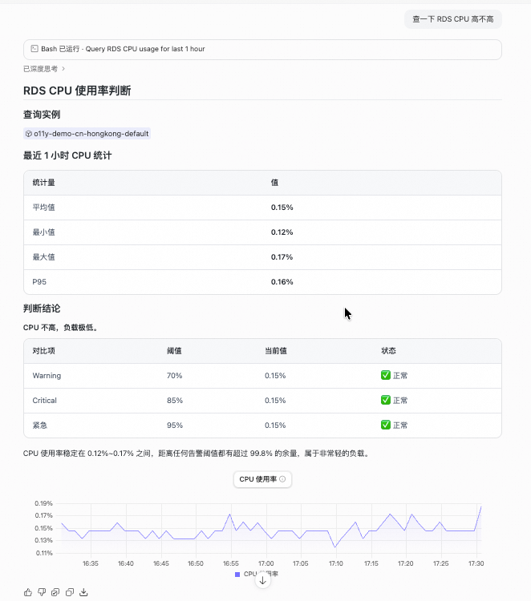

:::

**关键差异**：正例显式取 `data_format=percent` 后，您可以确认 0.14 就是 0.14%（不需要乘 100）。反例直接给结论，如果 data_format 是 `percent_decimal`（值域 0-1），0.14 实际是 14%，结论完全不同。

### 样例 2 — 聚合口径选择

> APM 服务层指标多为 generator 预聚合的平均值，**不直接提供请求级 P99**；要做长尾分析需走 TraceSet（见本文「四、链路追踪」章节）。

**正例提问**：

```
@checkout 服务 查询最近 1h 的 avg_request_latency_seconds，列出 mean / min / max / p50 / p75 / p95 关键统计量；这些统计量是基于哪一层数据计算的？
```

**实测返回**：返回 checkout 服务的统计量表，并详细说明了两层聚合结构。

::: details 查看正例截图


:::

关键统计量（checkout 最近 1h 实测）：

| 统计量 | 原始值 | 换算 |
|---|---|---|
| mean | 0.03s | 30 ms |
| min | 0.01s | 10 ms |
| max | 0.09s | 90 ms |
| p50 | 0.03s | 30 ms |
| p75 | 0.04s | 40 ms |
| p95 | 0.06s | 60 ms |

**两层聚合说明**：
- **第一层（generator 层）**：每个数据点 = 60s 窗口内所有请求的 总耗时/总请求数，即该分钟的加权平均延迟。
- **第二层（cur_statistics 层）**：mean/min/max/p50/p75/p95 是对上述 60 个 60s 粒度的数据点在 1h 时间窗口内做的二次统计。

**反例提问**：`@checkout 查响应延迟`

**反例返回**：Agent 默认用 avg，返回均值 30ms、P95 50ms，结论"延迟整体平稳"。没有声明是预聚合平均序列，也没有说明 generator 层级。

::: details 查看反例截图

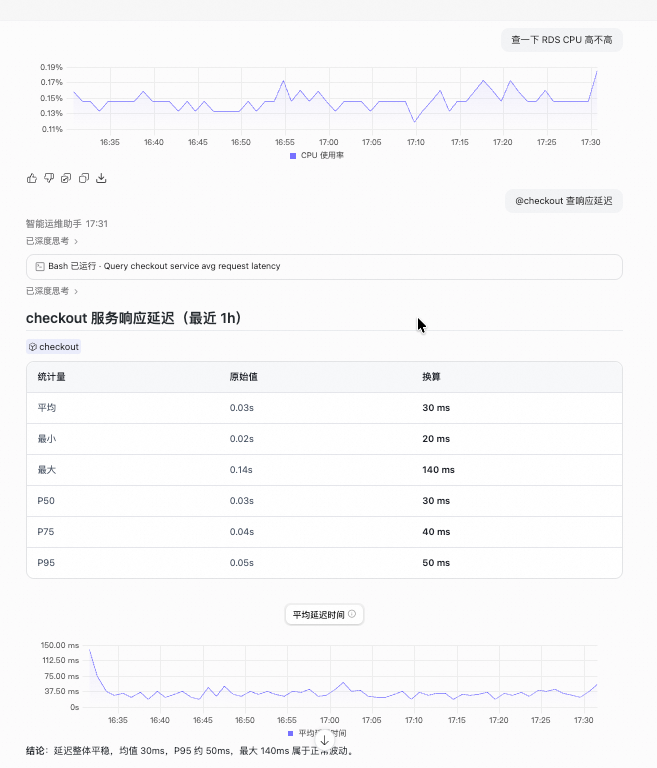

:::

**关键差异**：正例暴露了两层聚合结构，您可以看到这些统计量是"对预聚合平均序列再分位"，不是请求级分位数。反例掩盖了这层信息，容易误以为 P95=50ms 就是请求级 P95。

### 样例 3 — 实体维度锁定

**正例提问**：

```
@rm-j6cro90eaqh1rch5h 查 CPU 使用率，按 instanceId 独立统计，不要跨实例聚合
```

**实测返回**：PromQL 通过 `instanceId="rm-j6cro90eaqh1rch5h"` 精确过滤，返回单实例独立时间序列。明确说明"MetricSet 底层存储中虽然包含多个 RDS 实例的数据，但本次查询通过 instanceId= 精确过滤，确保只返回目标实例的数据，不存在跨实例聚合。"

::: details 查看正例截图


:::

**反例提问**：`查 RDS 集群的 CPU`

**反例返回**：Agent 返回 workspace 下全部 14 个 RDS MySQL 实例的 CPU 概览表，按均值降序排列。单实例的异常信号被稀释在 14 行数据中。

::: details 查看反例截图

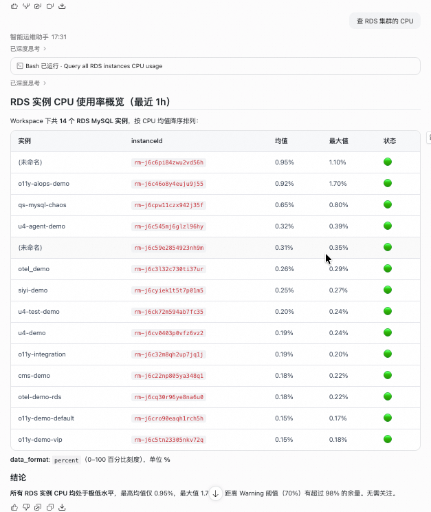

:::

**关键差异**：正例锁定单实例，能精确看到该实例的时序波动。反例返回 14 个实例的汇总，如果某个实例 CPU 从 0.15% 飙到 85%，在反例的表格中只是 14 行中的一行，容易被忽略。

### 样例 4 — UModel 缺失字段

UModel 提供技术元数据，但以下业务语义字段 UModel 未定义：

| 缺失字段 | 说明 | 建议来源 |
|---|---|---|
| 异常阈值 | UModel 未提供 Warning / Critical 默认阈值 | 业务告警规则 / 历史基线 / 行业建议 |
| 采集源 | 未说明是 Host OS 级还是 Engine 内部统计 | 数据源文档 |
| 多核归一化 | 未说明 100% 代表单核满载还是所有核总满载 | 云监控文档 |

**正例提问**：

```
@rm-j6cro90eaqh1rch5h 查 CPU 使用率并判断是否需要告警；同时显式声明阈值来源（行业建议 / 历史基线 / 业务规则）
```

**实测返回**：返回指标值后，给出了完整的阈值来源声明表（Warning >= 70% 行业建议 / Critical >= 85% 行业建议 / 紧急 >= 95% 行业建议），并附注"以上阈值为行业通用建议，非该实例的历史基线或业务规则"。

::: details 查看正例截图


:::

**反例提问**：`这个 CPU 算高吗`

**反例返回**：直接回答"不算高，全部极低"，用了"行业建议"阈值但没有让用户选择来源类型，也没有区分行业建议 vs 历史基线 vs 业务规则。

::: details 查看反例截图

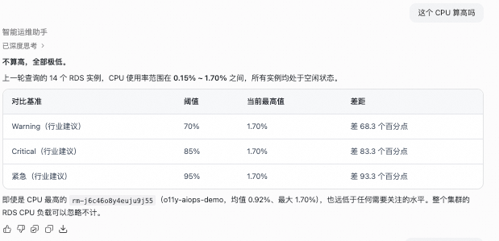

:::

**关键差异**：正例的阈值来源声明让结论可追溯——您能看到 70% 是行业建议，如果您的业务（如 OLAP 场景）合理阈值是 90%，可以自行调整。反例的结论不可追溯，无法判断"不算高"的依据是什么。


## 二、实体拓扑：EntitySet 与关系

### EntitySet 四域分类

UModel 通过 `entity_domain` 字段将实体分为多个域。最常用的 4 个：

| 域 | 代表实体 | 说明 |
|---|---|---|
| k8s | `k8s.pod` / `k8s.deployment` / `k8s.service` / `k8s.node` | Kubernetes 资源 |
| acs | `acs.ecs.instance` / `acs.rds.instance` / `acs.kvstore.instance` | 阿里云服务 |
| apm | `apm.service` / `apm.instance` / `apm.operation` / `apm.external.database` | 应用性能监控 |
| infra | `infra.server` | 基础设施主机 |

不同域的实体可能指向同一物理对象（跨域映射）：

| APM 域实体 | ACS 域实体 | 关系 |
|---|---|---|
| `apm.external.database` | `acs.rds.instance` | 同一个 RDS 实例 |
| `apm.external.nosql` | `acs.kvstore.instance` | 同一个 Redis 实例 |

### EntitySetLink 关系类型

UModel 的 EntitySetLink 支持 21 种关系类型。最常用的按分析场景分为三类：

| 分析场景 | 常用关系类型 | 用途 |
|---|---|---|
| 影响面分析（"谁影响谁"） | `calls` / `sends_to` / `affects` / `propagates_to` | 沿调用链传播 |
| 管理层级（"谁管谁"） | `contains` / `parent_of` / `manages` / `groups` | 找上级管理实体 |
| 部署拓扑（"谁跑在哪"） | `runs` / `hosted_by` / `instance_of` | 找底层运行环境 |

### 典型拓扑链

```
云资源层：
  acs.ack.cluster → acs.ack.nodepool → acs.ecs.instance
  acs.ecs.instance → acs.ecs.eni + acs.ecs.disk

K8s 层：
  k8s.cluster → k8s.namespace → k8s.deployment → k8s.pod
  k8s.pod → k8s.node

应用层：
  apm.service → apm.instance → k8s.pod
  apm.service → apm.external.database → acs.rds.instance
  apm.service → apm.external.nosql → acs.kvstore.instance
```

### 样例 5 — 拓扑关系分析

**正例提问**：

```
@rm-j6cro90eaqh1rch5h 如果该实例不可用，会影响哪些应用？请沿 acs.rds.instance → apm.external.database → apm.service 三层 Relation 链展开，列出受影响应用清单与跳数。
```

**实测返回**：沿 UModel Relation 链三层展开，给出完整的影响链图和影响清单表。

::: details 查看正例截图


:::

影响链实测结果：

```
Hop 0  acs.rds.instance (rm-j6cro90eaqh1rch5h, MySQL)
         │  same_as
Hop 1  apm.external.database (rm-j6cro90eaqh1rch5h:3306)
         │  calls (反向)
Hop 2  apm.service: inventory (Java)          ← 直接受影响
         │  calls (反向)
Hop 3  apm.service: checkout (Go)             ← 级联受影响
       apm.service: cart (.NET)               ← 级联受影响
```

| 跳数 | 受影响实体 | 语言 | 影响方式 |
|---|---|---|---|
| Hop 2 | inventory | Java | 直接依赖 DB，所有 DB 读写失败 |
| Hop 3 | checkout | Go | 调用 inventory，下单流程不可用 |
| Hop 3 | cart | .NET | 调用 inventory，购物车读写异常 |

**反例提问**：`RDS 挂了影响什么`

**反例返回**：Agent 借用上下文记忆给出了影响链，但回复基于记忆而非重新查询。在新会话中，这个反例会得到"可能影响所有应用"的猜测。

::: details 查看反例截图

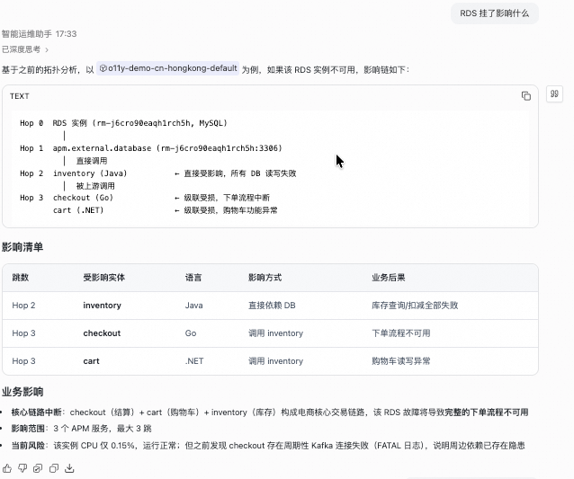

:::

**关键差异**：正例显式指定三层 Relation 链和展开方向，返回精确到 3 个受影响服务 + 跳数 + 影响路径。反例依赖上下文猜测，换个会话就会丢失精度。


## 三、日志查询：LogSet 使用要点

LogSet 定义了一组具有相同属性的日志集合。在 STAROps 智能会话中查日志时，LogSet 通过 DataLink 关联到 EntitySet，决定了"这个实体有哪些日志可查"。

### 关键概念

| 概念 | 含义 | 为什么重要 |
|---|---|---|
| LogSet | 日志集定义，继承 telemetry_data 基础结构 | 一个实体可能关联多个 LogSet（如 stdout 日志 + 审计日志 + 慢查询日志），不指定就可能查到错的 |
| DataLink（LogSet → EntitySet） | 日志集与实体的关联，type = `produce` 或 `related_to` | 决定了"@ 这个实体时能查到哪些日志" |
| StorageLink（LogSet → SLS Logstore） | 日志集的存储后端 | 决定了日志的物理位置和保留策略 |

### 样例 6 — 日志查询要素确认

**正例提问**：

```
服务 checkout 查最近 30 分钟的 stdout 日志，只看 ERROR 级别
```

**实测返回**：STAROps 通过 UModel 定位到 checkout 的日志源信息（logstore: `checkout-application-logs`），按日志级别分布统计后给出结论：最近 30 分钟无 ERROR 级别日志，但存在 1 条 FATAL（Kafka broker 连接被拒绝）和 4 条 WARNING（inventory 库存预留返回失败 / PlaceOrder 失败）。

::: details 查看正例截图

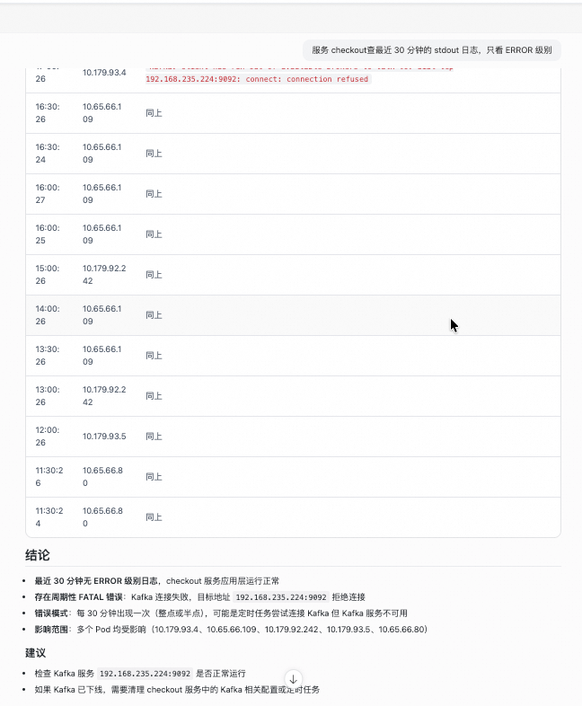

:::

日志级别分布（最近 1h 实测）：

| 级别 | 数量 | 说明 |
|---|---|---|
| info | 7,037 | 正常业务日志 |
| null | 146 | 未标记级别 |
| warning | 4 | PlaceOrder 失败 + inventory 预留失败 |
| fatal | 1 | Kafka broker 连接拒绝 |
| error | 0 | 无 |

**反例提问**：`帮我看看 checkout 有没有报错`

**反例返回**：Agent 自行决定查 1h 日志，返回了 FATAL + WARNING 内容，但没有让您选择 LogSet（stdout vs 审计日志 vs 慢查询）、时间窗口（30 分钟 vs 1 小时）和日志级别过滤条件。

::: details 查看反例截图

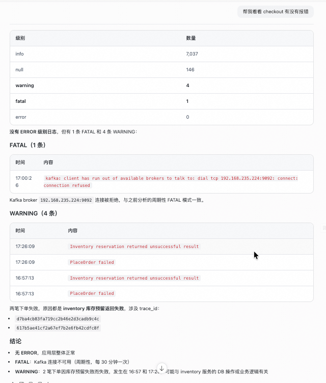

:::

**关键差异**：正例锁定了 LogSet（stdout）、时间窗口（30 分钟）、级别过滤（ERROR），返回的结果范围明确。反例中 Agent 自行选择了 1h 窗口和全级别扫描，如果日志量大，可能返回过多无关数据或遗漏关键时间段。


## 四、链路追踪：TraceSet 使用要点

TraceSet 定义了链路追踪数据的结构，核心字段包括 `trace_id_field`、`span_id_field`、`parent_span_id_field` 和 `protocol`（默认 OpenTelemetry）。

### 什么时候该用 TraceSet 而不是 MetricSet

这是样例 2 暴露的核心问题：**APM 服务层的 MetricSet 指标多为 generator 预聚合的平均值，不直接提供请求级 P99。**

| 要看什么 | 该走哪里 | 为什么 |
|---|---|---|
| 服务级平均延迟趋势 | MetricSet（`avg_request_latency_seconds`） | generator 预聚合的平均序列，查询快、开销低 |
| 请求级 P99 / P99.9 延迟 | TraceSet → 原始 span duration 分位聚合 | 只有原始 span 数据才能算真正的分位数 |
| 单个请求的完整调用链 | TraceSet → 按 trace_id 查询 | 需要 trace_id 定位具体请求 |
| 慢请求 Top N | TraceSet → span duration 排序 | 需要原始 span 级数据 |

### 样例 7 — 链路追踪查询

**正例提问**：

```
@checkout 查最近 1h 的请求级 P95 延迟；走 trace 数据，对 span duration 做 95 分位聚合
```

**实测返回**：STAROps 从 Trace Logstore 查询，对 `serviceName=checkout AND kind=2`（SERVER span）的 span duration 做 `approx_percentile(duration, 0.95)` 聚合，总 span 数 1,389。

::: details 查看正例截图

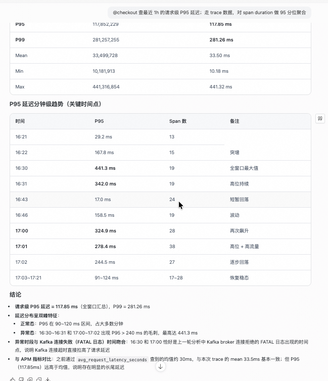

:::

全窗口分位数统计（最近 1h 汇总）：

| 分位数 | 原始值 (ns) | 换算 |
|---|---|---|
| P50 | 14,054,968 | 14.05 ms |
| P75 | 19,416,901 | 19.42 ms |
| P95 | 117,852,229 | 117.85 ms |
| P99 | 281,257,255 | 281.26 ms |
| Mean | 33,499,728 | 33.50 ms |
| Max | 441,316,854 | 441.32 ms |

P95 延迟分钟级趋势显示双峰特征：正常态 P95 在 90-120ms，异常态 P95 > 240ms。异常时段与 Kafka 连接失败（FATAL 日志）时间吻合。

**反例提问**：`@checkout 查 P99 延迟`

**反例返回**：Agent 碰巧走了 TraceSet，返回 P99=162.04ms。但没有声明数据来源是 Trace Logstore 还是 MetricSet，也没有说明是对 span duration 做的分位聚合。

::: details 查看反例截图

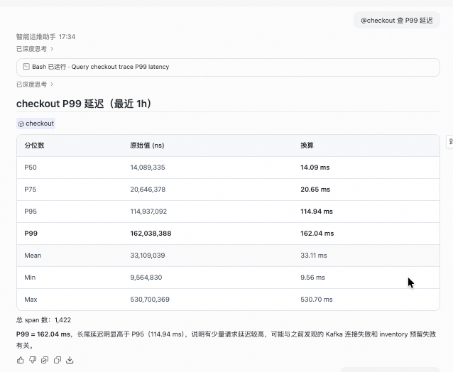

:::

**关键差异**：正例显式声明"走 trace 数据，对 span duration 做分位聚合"，返回结果包含数据源（Trace Logstore）、过滤条件（kind=2 SERVER span）、聚合方式（approx_percentile）、样本量（1,389 spans）。反例虽然碰巧走对了路，但下次查询 Agent 可能从 MetricSet 的 avg 序列算"P99"，两者含义完全不同。


## 五、事件与操作手册：EventSet 和 RunbookSet

### EventSet — 事件语义化

EventSet 定义了告警、变更等事件的集合。RCA 分析时，除了看指标和日志，还需要关联事件来判断"出问题那段时间发生了什么"。

### 样例 8 — 事件关联

**正例提问**：

```
@rm-j6cro90eaqh1rch5h 最近 2 小时 CPU 持续偏高，同时查看该实例在此时间窗口内的变更事件
```

**实测返回**：STAROps 同时查询了 CPU 指标和变更事件。CPU 数据显示 0.12%-0.20%（实际并未偏高），变更事件为"无"。给出了完整的结论表格。

::: details 查看正例截图

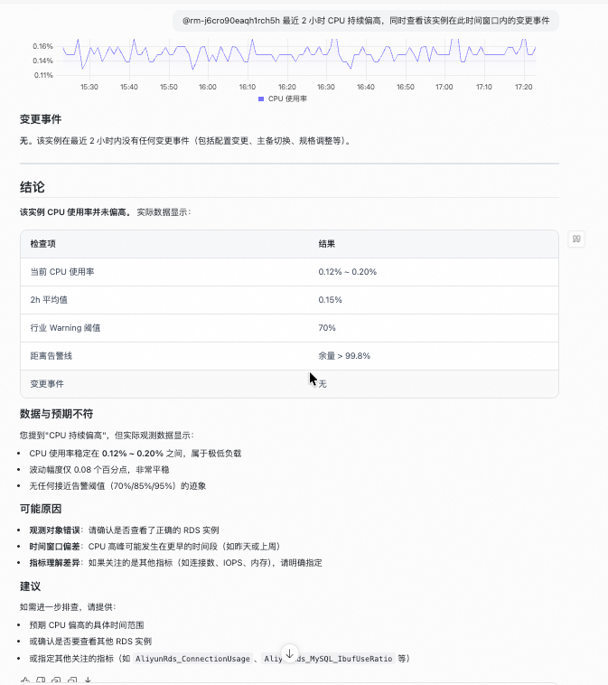

:::

| 检查项 | 结果 |
|---|---|
| 当前 CPU 使用率 | 0.12% - 0.20% |
| 2h 平均值 | 0.15% |
| 行业 Warning 阈值 | 70% |
| 距离告警线 | 余量 > 99.8% |
| 变更事件 | 无 |

**反例提问**：`为什么 RDS CPU 突然飙高？`

**反例返回**：Agent 回复"该 RDS 实例 CPU 并未飙高"，列了 3 个可能原因，但**没有查变更事件**。

::: details 查看反例截图

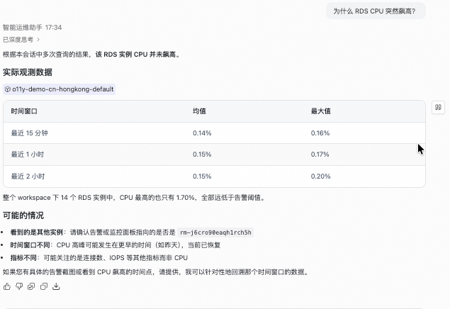

:::

**关键差异**：正例同时查了指标 + 变更事件，即使 CPU 确实偏高，也能通过变更事件找到"2 小时前有一次配置变更"这类线索。反例只从指标层面分析，漏掉了事件维度。

### RunbookSet — 操作手册关联

> RunbookSet 当前处于 **experimental** 阶段。

RunbookSet 定义了实体相关的操作手册集合，包括：

| 组件 | 含义 | 状态 |
|---|---|---|
| `observations` | 观测配置（该看哪些指标/日志/dashboard） | experimental |
| `toolkits` | 工具箱（诊断工具、查询模板） | experimental |
| `skills` | 技能配置（遵循 Agent Skills 规范） | experimental |
| `automations` | 自动化配置（自动修复、自动扩容） | experimental |

RunbookSet 通过 RunbookLink 关联到 EntitySet。当某个实体出问题时，Agent 可以通过 RunbookLink 找到对应的操作手册，按手册执行诊断和修复。


## 六、数据关联：Link 层速览

Link 层是 UModel 的"胶水"——把 Dataset 层的各种模型连接起来，形成完整的语义图。

| Link 类型 | 连接什么 | 使用场景 |
|---|---|---|
| **DataLink** | 数据集（MetricSet / LogSet / TraceSet / EventSet）↔ EntitySet | `@` 实体时，UModel 通过 DataLink 决定能查到哪些数据 |
| **EntitySetLink** | EntitySet ↔ EntitySet | 拓扑分析、影响面分析、RCA（见本文「二、实体拓扑」） |
| **StorageLink** | 数据集 ↔ Storage（Logstore / Metricstore / Prometheus） | 决定数据的物理存储位置 |
| **RunbookLink** | EntitySet ↔ RunbookSet | 出问题时找对应的操作手册 |
| **ExplorerLink** | 数据集 ↔ Explorer（Dashboard） | 跳转到对应的 Dashboard 查看详情 |

Agent 在处理用户查询时，会依次经过：

```
用户 @实体 → EntitySet（定位实体）
         → DataLink（找到关联的数据集）
         → MetricSet / LogSet / TraceSet / EventSet（查询数据）
         → StorageLink（定位存储后端执行查询）
```

做拓扑分析时：

```
用户 @实体 "影响了什么" → EntitySet
                      → EntitySetLink（沿关系链展开）
                      → 相关 EntitySet（受影响的实体）
```


## 已知限制

- **APM 服务层无 P99**：APM 服务层指标多为 generator 预聚合平均，不直接提供 P99。请求级 P99 需走 TraceSet 对原始 span 分位聚合。
- **UModel 不提供业务语义阈值**：异常阈值、采集源、多核归一化等字段 UModel 不定义，需在 prompt 中显式声明来源。
- **拓扑展开依赖 trace 覆盖**：三层链能展开到 `apm.service` 的前提是 trace 采样覆盖了该外部依赖。trace 采样率过低或部分服务未接入会导致 N=0 或 N 偏少。
- **RunbookSet 处于 experimental 阶段**：RunbookSet 的 observations / toolkits / skills / automations 功能尚在迭代，API 和行为可能变化。
- **概念覆盖边界**：本文覆盖 UModel 20 个模型中的 8 个（EntitySet / MetricSet / LogSet / TraceSet / EventSet / RunbookSet / EntitySetLink / DataLink）。EntitySource、ProfileSet、Explorer 等模型在不同使用场景下同等重要，待后续实践补充。

## 常见问题

### 为什么 APM 服务层没有 P99

APM 服务层暴露的是 generator 侧预聚合的平均时间序列（`avg_request_latency_seconds`），目的是控制查询代价。要做长尾分析需走 TraceSet 对原始 span 做分位聚合，不能用"对 avg 序列做 P99"代替"请求级 P99"。

### 拓扑链中 `apm.external.database` 和 `acs.rds.instance` 是不是同一个实体

逻辑上指向同一物理 RDS，但属于不同 EntitySet：`acs.rds.instance` 是云资源视角的实体，`apm.external.database` 是 APM 应用调用视角的外部依赖实体。两者通过 UModel 跨域映射（`same_as` 关系）关联。

### `@` 引用必须用实体的 ID 吗

可以用 ID 也可以用名称，但当存在同名实体时建议用 ID 锁定，避免维度混淆。

### 一个实体有多个 LogSet，怎么选

通过 DataLink 可以查到实体关联的所有 LogSet。查日志时应指定具体的 LogSet 名称（如 stdout 日志、审计日志、慢查询日志），避免混合查询返回无关数据。

### UModel 有多少种模型类型

UModel 由三层共 20 个模型类型组成：Dataset 层 9 种（EntitySet / EntitySource / MetricSet / LogSet / TraceSet / EventSet / ProfileSet / RunbookSet / Explorer）、Link 层 6 种、Storage 层 5 种。本文覆盖其中 8 个最常用的模型。完整模型定义见 [UModel 开源仓库](https://github.com/alibaba/UnifiedModel)。

## 相关入口

- [UModel 开源仓库](https://github.com/alibaba/UnifiedModel)
- [返回 STAROps 最佳实践首页](/starops/starops.html)
- [打开 STAROps Playground](/playground/staropsdemo.html)
- [进入 STAROps 控制台](https://starops.console.aliyun.com)
