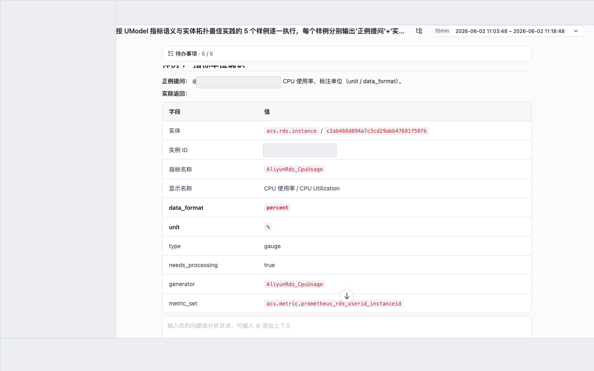
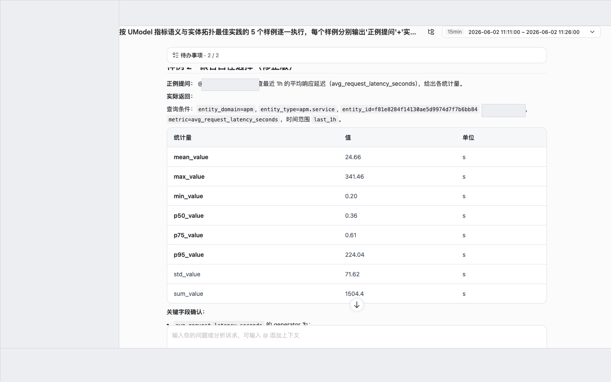
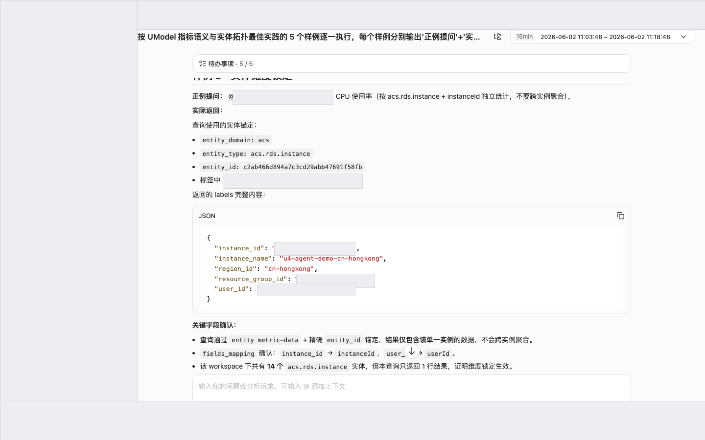
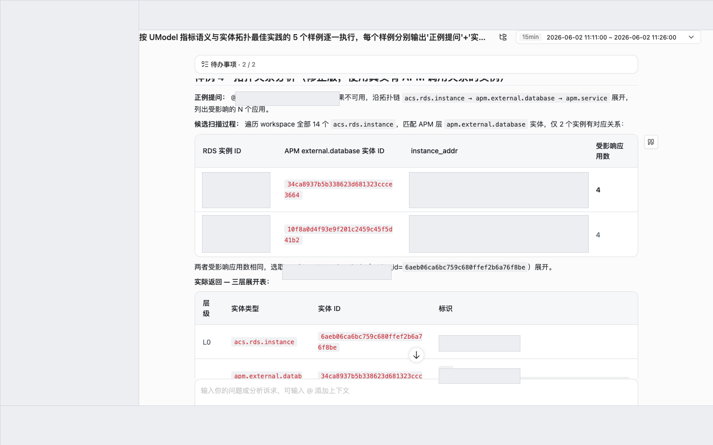
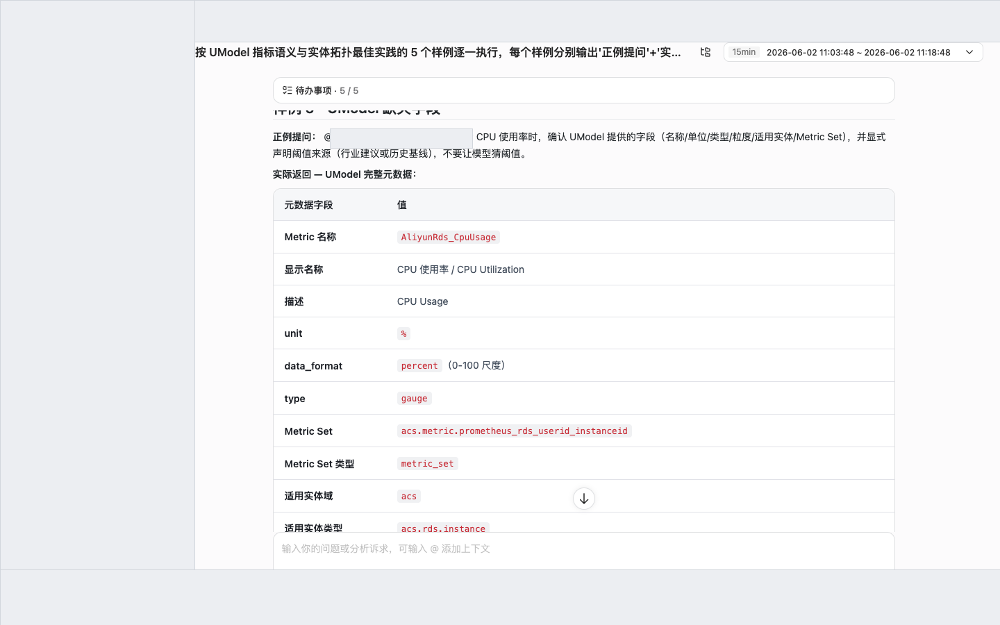

<div class="sls-starops-article-crumb">
  <a href="/doc/starops/starops.html">STAROps</a> <span class="sep">/</span> <span>场景实践</span>
</div>

# UModel 指标语义与实体拓扑

<div class="sls-starops-article-meta">
  <span>分类 · 场景实践</span>
</div>

当您在 STAROps 智能会话中通过 `@` 引用实体并查询指标，或者沿依赖拓扑分析故障影响面时，**指标的单位 / 聚合口径 / 实体归属** 与 **实体间的 Relation 链** 直接决定结论是否能落地。本文给出 5 个正反例样例，覆盖单位确认、聚合口径选择、实体维度锁定、拓扑关系分析、UModel 缺失字段补全 5 类常见提问场景，并附 STAROps 实测回包截图。每个样例都按"正例提问 → 实际返回 → 关键字段确认"三段落呈现，可对照修改自己的提问方式。

## 前提条件

- 已开通 STAROps，且当前账号可创建数字员工与对话。
- 待查询实体（RDS 实例 / APM 应用 / k8s Pod 等）已被 UModel 纳入元数据；缺失实体无法 `@` 引用。
- 涉及拓扑分析时，trace 数据已接入 UModel 且采样率不宜过低。
- 已知道要查询的实体类型与名称（如 `rm-xxx`、`mall-gateway`），切入点优先选具体实体而非抽象集群。

## 安装 Skill

完成本实践会落地一份 SOP Skill（本实践产物是提问范式的对照样例，无可执行业务 Skill）。安装方式任选其一：本地 Agent 走 [`npx skills`](https://www.npmjs.com/package/skills)，STAROps 数字员工下载 tar.gz 后在控制台「技能管理 → 上传技能」上传。

| Skill | 作用 | 本地 Agent（npx） | STAROps 控制台（tar.gz） |
|---|---|---|---|
| `umodel-metric-entity-sop` | 引导 Skill：协助 Agent 按 5 个样例识别提问中容易遗漏的要素（单位 / 聚合口径 / 实体维度 / 拓扑链 / UModel 缺失字段），并将提问对照调整到正例形式。 | `npx skills add aliyun-sls/sls-doc-skills --skill umodel-metric-entity-sop` | [umodel-metric-entity-sop.tar.gz](https://starops-demo.oss-cn-beijing.aliyuncs.com/starops/demo/starops-best-practice/umodel-metric-entity/docs/umodel-metric-entity-sop.tar.gz) |

下文样例 1 到样例 5 的正例提问模板与"反例 → 正例"对照与该 SOP 一一对应。

## 规范要素

### 指标语义（5 个字段）

在 STAROps 提问指标查询时，建议确认每个指标在 UModel 中具备以下 5 个字段；若 UModel 未提供，可在 prompt 中显式声明：

| 要素 | 含义 | 是否必须 |
|---|---|---|
| 单位 | 指标的量纲（百分比 / 核数 / 字节 / 次数 / 秒） | 必须 |
| 统计周期 | 数据采集粒度（60s / 5min） | 必须 |
| 聚合方式 | avg / max / rate 等（注：APM 服务层指标多为 generator 预聚合平均，不直接提供 P99） | 必须 |
| 适用实体 | 指标绑定的实体类型 | 必须 |
| 异常阈值 | 告警线及来源（UModel 不提供，需业务侧补） | 必须 |

### 实体拓扑（3 个概念）

| 要素 | 含义 | 是否必须 |
|---|---|---|
| EntitySet | 实体类型定义（如 `k8s.pod`、`acs.rds.instance`、`apm.service`） | 必须 |
| DataLink | 指标到实体的关联（同一指标可绑定多类实体，需锁定具体维度） | 必须 |
| Relation | 实体间关系（归属 / 调度 / 调用），用于沿链分析影响面 | 必须 |

## 样例 1 - 指标单位确认

正例提问（在 STAROps 会话中替换 `<rds-instance-id>` 为实际实例 ID）：

```
@<rds-instance-id> 查 CPU 使用率，标注单位与 data_format
```

期望返回：明确给出 `value`、`unit=%`、`data_format=percent`，原始值已在 0-100 标度，无需二次换算。

::: details 查看图片



:::

关键字段确认：
- **单位**：`%`；**data_format**：`percent`
- **反例对照**：`查 CPU 高不高` — 模型不确认单位，可能把 0.143 误解读为 14.3%；正例显式取 `data_format` 字段后即可判定原值已是百分比。

## 样例 2 - 聚合口径选择

> UModel APM 服务层指标多为 generator 预聚合的平均值，**不直接提供 P99**；要做长尾分析需走 trace duration 分布或落地到 SLS 上分位聚合。

正例提问：

```
@mall-gateway 查最近 1h 的 avg_request_latency_seconds，列出 mean / min / max / p50 / p75 / p95 关键统计量；这些统计量是基于哪一层数据计算的？
```

期望返回：UModel 直接返回的是 generator 预聚合的平均时间序列（`avg_request_latency_seconds`），上层再对该时间序列做统计量计算得到 mean / max / 分位。**这些分位不是请求级 P99**，而是"对预聚合平均序列再分位"。

::: details 查看图片



:::

关键字段确认（mall-gateway 最近 1h 实测）：

| 统计量 | 数值 | 含义 |
|---|---|---|
| mean | 24.66 s | 时间序列均值，受少数高点拉高 |
| max | 341.46 s | 序列最高的预聚合平均值 |
| min | 0.20 s | 序列最低的预聚合平均值 |
| p50 | 0.36 s | 平均时延的中位数（大多数采样点接近此值） |
| p75 | 0.61 s | 75 分位 |
| p95 | 224.04 s | 95 分位（说明少数采样窗口有显著长尾） |

- **聚合口径**：`avg_request_latency_seconds` 是 generator 预聚合的平均时延，单位 `秒`。
- **想看请求级 P99**：必须切到 trace duration 分布或落地到 SLS 上对原始 span 做分位聚合，**不能直接用本指标的"p99 over time series"代替**。
- **反例对照**：`@mall-gateway 查响应延迟的 P99` — UModel 在该实体上没有 P99 指标，模型容易把"对 avg 序列做 P99"误称为"请求级 P99"，结论失真。

## 样例 3 - 实体维度锁定

正例提问（替换 `<rds-instance-id>` 为实际实例 ID）：

```
@<rds-instance-id> 查 CPU 使用率，按 instanceId 独立统计，不要跨实例聚合
```

期望返回：锁定 `acs.rds.instance` 实体，按 `instanceId` 独立统计，返回的是该实例自身的 CPU 时间序列。

::: details 查看图片



:::

关键字段确认：
- **EntitySet**：`acs.rds.instance`
- **DataLink**：按 `instanceId` 维度独立 group by
- **反例对照**：`查 RDS 集群的 CPU` — 不锁实体，模型可能跨实例 avg，把单实例 CPU 飙高的情况被其他健康实例平均掉，告警判断失真。

## 样例 4 - 拓扑关系分析

正例提问（以下示例使用 `rm-j6cro90eaqh1rch5h`，实际使用时替换为目标 RDS 实例 ID）：

```
@rm-j6cro90eaqh1rch5h 如果该实例不可用，会影响哪些应用？请沿 acs.rds.instance → apm.external.database → apm.service 三层 Relation 链展开，列出受影响应用清单与跳数
```

期望返回：沿 UModel Relation 链一路展开，先找到 `apm.external.database` 中代表该 RDS 的外部依赖实体，再展开到所有调用它的 `apm.service`。

::: details 查看图片



:::

关键字段确认（`rm-j6cro90eaqh1rch5h` 实测三层链）：

| 层 | EntitySet | 实体数 | 说明 |
|---|---|---|---|
| 第 1 层 | `acs.rds.instance` | 1 | `rm-j6cro90eaqh1rch5h` 本身 |
| 第 2 层 | `apm.external.database` | 1 | APM 层将该 RDS 作为外部依赖观测的实体（同一物理对象的 APM 视图） |
| 第 3 层 | `apm.service` | **4** | 直接或间接调用该 RDS 的应用 |

受影响应用清单（共 N=4，按拓扑跳数排列）：

| 跳数 | 应用 | 调用类型 |
|---|---|---|
| 1 | `inventory` | 直接调用该 RDS |
| 2 | `cart` | 经 `inventory` 间接依赖 |
| 2 | `checkout` | 经 `inventory` 间接依赖 |
| 3 | `frontend` | 经 `cart` / `checkout` 间接依赖 |

- **Relation 链**：`acs.rds.instance` → `apm.external.database` →（被调用） `apm.service`。
- **反例对照**：`RDS 挂了影响什么` — 不锁拓扑，模型可能猜"影响所有应用"或漏掉间接依赖；正例沿 Relation 链精确到 N=4 个服务并区分跳数。
- **注意**：APM 层是否能展开到调用方取决于 trace 是否覆盖该 RDS。若选择的 RDS 在 APM 层无对应 `apm.external.database` 实体，三层链只能展开到第 2 层，受影响应用 N=0，结论无意义。

## 样例 5 - UModel 缺失字段

正例提问：

```
@<rds-instance-id> 查 CPU 使用率并判断是否需要告警；同时显式声明阈值来源（行业建议 / 历史基线 / 业务规则）
```

期望返回：返回指标值的同时，明确给出"阈值来源 = 行业建议：RDS CPU > 80% Warning / > 90% Critical"，不要让模型用未声明的内部默认阈值做判断。

::: details 查看图片



:::

关键字段确认：
- **UModel 提供**：指标名称、单位、统计周期、适用实体、Metric Set
- **UModel 不提供**：异常阈值、采集源（Host OS vs Engine 内部）、多核归一化（100% 是单核满载还是全核总满载）
- **反例对照**：直接问"这个 CPU 算高吗" — 模型用内部猜测阈值给答案，无法追溯依据；正例显式声明阈值来源后，告警判断可追溯、可复核。

## UModel 技术元数据 vs 业务语义

UModel 提供以下技术元数据：

| 字段 | 示例值 | 说明 |
|---|---|---|
| 指标名称 | `AliyunRds_CpuUsage` | UModel `metric_name` |
| 单位 | `percent` | `data_format` |
| 数据类型 | `gauge` | 瞬时采样值，非累加计数器 |
| 统计周期 | `60` | 采样标签 `period` |
| 适用实体 | `acs.rds.instance` | 绑定 RDS 实例实体 |
| Metric Set | `acs.metric.prometheus_rds_userid_instanceid` | 归属指标集 |

以下业务语义字段 UModel 未定义，需要结合业务经验或外部配置：

| 缺失字段 | 说明 | 建议来源 |
|---|---|---|
| 异常阈值 | UModel 未提供 Warning / Critical 默认阈值 | 业务告警规则 / 历史基线 / 行业建议 |
| 采集源 | 未说明是 Host OS 级还是 Engine 内部统计 | 数据源文档 |
| 多核归一化 | 未说明 100% 代表单核满载还是所有核总满载 | 云监控文档 |

## 实体域分类与跨域映射

当前 workspace 的实体分为 4 个域：

| 域 | 代表实体 | 说明 |
|---|---|---|
| k8s | `k8s.pod` / `k8s.deployment` / `k8s.service` | Kubernetes 资源 |
| acs | `acs.ecs.instance` / `acs.rds.instance` / `acs.kvstore.instance` | 阿里云服务 |
| apm | `apm.service` / `apm.instance` / `apm.operation` / `apm.external.database` | 应用性能监控 |
| infra | `infra.server` | 基础设施主机 |

不同域的实体可能指向同一物理对象，样例 4 的拓扑链就依赖这种跨域映射：

| APM 域实体 | ACS 域实体 | 关系 |
|---|---|---|
| `apm.external.database` | `acs.rds.instance` | 同一个 RDS 实例 |
| `apm.external.nosql` | `acs.kvstore.instance` | 同一个 Redis 实例 |

## 已知限制

- **APM 服务层无 P99**：UModel APM 服务层指标多为 generator 预聚合平均，不直接提供 P99。请求级 P99 需走 trace duration 分布或在 SLS 上对原始 span 分位聚合。
- **UModel 不提供业务语义阈值**：异常阈值、采集源、多核归一化等字段 UModel 不定义，需在 prompt 中显式声明来源。
- **拓扑展开依赖 trace 覆盖**：样例 4 三层链能展开到 `apm.service` 的前提是 trace 采样覆盖了该外部依赖。trace 采样率过低或部分服务未接入会导致 N=0 或 N 偏少，可在 prompt 末尾补"已知调用方：X、Y"做兜底。
- **不在适用范围内**：UModel 底层建模（实体 / 关系定义本身）属另一治理域，本实践不涉及；纯文档检索（无指标 / 实体语义维度）也不在此流程内。

## 常见问题

### 为什么 UModel APM 服务层没有 P99

UModel 在 APM 服务层暴露的是 generator 侧预聚合的平均时间序列（`avg_request_latency_seconds`），目的是控制查询代价。要做长尾分析需走 trace duration 分布或落地到 SLS 上对原始 span 做分位聚合，不能用"对 avg 序列做 P99"代替"请求级 P99"。

### 拓扑链中 `apm.external.database` 和 `acs.rds.instance` 是不是同一个实体

逻辑上指向同一物理 RDS，但属于不同 EntitySet：`acs.rds.instance` 是云资源视角的实体，`apm.external.database` 是 APM 应用调用视角的外部依赖实体。两者通过 UModel 跨域映射关联，样例 4 的三层链就利用了这层映射。

### 为什么样例 4 要先确认 RDS 在 APM 层有对应实体

如果 RDS 在 APM 层没有对应 `apm.external.database` 实体（即没有应用通过 APM 探针调用过它），三层 Relation 链只能展开到第 2 层，受影响应用 N=0，拓扑分析无意义。这种情况要么换一个真实有调用方的 RDS，要么先补齐 APM 探针覆盖。

### `@` 引用必须用实体的 ID 吗

可以用 ID 也可以用名称，但当存在同名实体时建议用 ID 锁定，避免维度混淆。样例 3 显式按 `instanceId` 独立统计就是为了避免跨实例平均。

### 这 5 个样例可以混合提问吗

可以，但不建议。每个样例聚焦一个提问要点，分开提问能让 Agent 给出聚焦回包；合并提问容易因为多个口径混在一起，导致部分维度被略过。建议先按样例顺序走一遍，熟悉后再合并。

## 相关入口

- [返回 STAROps 最佳实践首页](/starops/starops.html)
- [打开 STAROps Playground](/playground/staropsdemo.html)
- [进入 STAROps 控制台](https://starops.console.aliyun.com)
